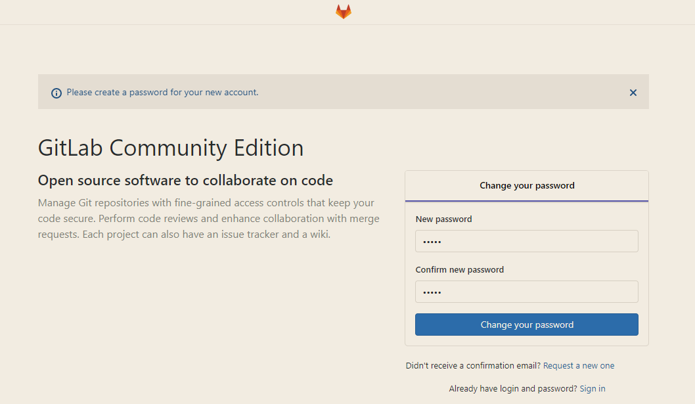

####  

Ubuntu版本18.04

#### 1.安装依赖

```
sudo apt update
sudo apt install ca-certificates curl openssh-server
```

可以选择安装postfix，提供邮件服务

```
sudo apt install postfix
```

#### 2.安装Gitlab

下载安装脚本

```
cd /tmp
curl -LO https://packages.gitlab.com/install/repositories/gitlab/gitlab-ce/script.deb.sh
```

执行脚本，如果不放心可以自行查看，这个脚本主要是添加GitLab软件包存储库

```
sudo bash /tmp/script.deb.sh
```

或者使用清华源

```
#首先信任 GitLab 的 GPG 公钥:

curl https://packages.gitlab.com/gpg.key 2> /dev/null | sudo apt-key add - &>/dev/null

#再修改 
vim /etc/apt/sources.list.d/gitlab-ce.list

#将下面添加进去
deb https://mirrors.tuna.tsinghua.edu.cn/gitlab-ce/ubuntu xenial main
```

安装Gitlab社区版

```
sudo apt install gitlab-ce
```

等待一会就安装完成了

#### 3.配置启动Gitlab

配置Gitlab，具体配置参考文件内部说明

```
sudo vim /etc/gitlab/gitlab.rb
```

重新配置并启动各项服务

```
sudo gitlab-ctl reconfigure
```

查看状态

```
sudo gitlab-ctl status
```

出现下面类似就是正常

```
run: alertmanager: (pid 11974) 95s; run: log: (pid 11644) 139s
run: gitaly: (pid 11863) 97s; run: log: (pid 11040) 237s
run: gitlab-exporter: (pid 11855) 97s; run: log: (pid 11556) 153s
run: gitlab-workhorse: (pid 11829) 98s; run: log: (pid 11397) 171s
run: grafana: (pid 11995) 95s; run: log: (pid 11759) 111s
run: logrotate: (pid 11434) 166s; run: log: (pid 11454) 165s
run: nginx: (pid 11380) 172s; run: log: (pid 11399) 171s
run: node-exporter: (pid 11839) 98s; run: log: (pid 11487) 159s
run: postgres-exporter: (pid 11987) 95s; run: log: (pid 11661) 136s
run: postgresql: (pid 11134) 232s; run: log: (pid 11223) 229s
run: prometheus: (pid 11881) 96s; run: log: (pid 11606) 145s
run: redis: (pid 10962) 244s; run: log: (pid 10974) 242s
run: redis-exporter: (pid 11858) 97s; run: log: (pid 11581) 149s
run: sidekiq: (pid 11347) 179s; run: log: (pid 11359) 178s
run: unicorn: (pid 11317) 186s; run: log: (pid 11337) 183s
```

#### 4.登录web

访问你上面设置的域名，或者对应的ip地址，即可进入界面

第一次进入界面会要求改密码，改完重新登录即可，默认账户root


