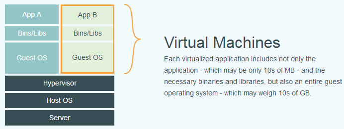
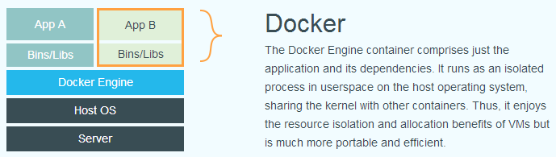

### 概述

#### 传统虚拟化

传统虚拟机技术是虚拟出一套硬件后，在其上运行一个完整操作系统，在该系统上再运行所需应用进程，如常见的虚拟机类型

缺点是资源占用多，冗余步骤多，启动慢



#### Linux容器

容器是一种操作系统层面的虚拟化技术，它不是模拟一个完整的操作系统，而是对进程进行隔离。

对比传统虚拟化，容器内的应用进程直接运行于宿主的内核，容器内没有自己的内核，而且也没有进行硬件虚拟。因此容器要比传统虚拟机更为轻便。

Docker 在容器的基础上，进行了进一步的封装，从文件系统、网络互联到进程隔离等等，极大的简化了容器的创建和维护。使得 Docker技术比虚拟机技术更为轻便、快捷



### 安装

Docker 是一个开源的商业产品，有两个版本：社区版（Community Edition，缩写为 CE）和企业版（Enterprise Edition，缩写为 EE）

#### Ubuntu安装

Ubuntu 18.04 安装 Docker-ce

1.卸载旧版本docker

```
$ sudo apt-get remove docker \
               docker-engine \
               docker.io
```

2.添加使用 HTTPS 传输的软件包以及 CA 证书

```
$ sudo apt-get update

$ sudo apt-get install \
    apt-transport-https \
    ca-certificates \
    curl \
    software-properties-common
```

3.添加国内软件源的GPG密钥

```
$ curl -fsSL https://mirrors.ustc.edu.cn/docker-ce/linux/ubuntu/gpg | sudo apt-key add -


# 官方源
# $ curl -fsSL https://download.docker.com/linux/ubuntu/gpg | sudo apt-key add -
```

4.向 source.list 中添加 Docker 软件源

```
$ sudo add-apt-repository \
    "deb [arch=amd64] https://mirrors.ustc.edu.cn/docker-ce/linux/ubuntu \
    $(lsb_release -cs) \
    stable"


# 官方源
# $ sudo add-apt-repository \
#    "deb [arch=amd64] https://download.docker.com/linux/ubuntu \
#    $(lsb_release -cs) \
#    stable"
```

5.更新 apt 软件包缓存，并安装 docker-ce

```
$ sudo apt-get update

$ sudo apt-get install docker-ce
```

6.启动 Docker CE

```
$ sudo systemctl enable docker
$ sudo systemctl start docker
```

7.建立 docker 组，并将当前用户加入 docker 组

默认情况下，docker 命令只有 root 用户和 docker 组的用户才可以访问 。但出于安全考虑，一般 Linux 系统上不会直接使用 root 用户。因此，更好地做法是将需要使用 docker 的用户加入 docker 用户组。

```
建立 docker 组：
$ sudo groupadd docker

将当前用户加入 docker 组：
$ sudo usermod -aG docker $USER

退出当前终端并重新登录
```

8.测试 Docker 是否安装正确

```
$ docker run hello-world

出现Hello from Docker!大段文字即成功
```

#### 配置国内镜像加速

以 Azure 中国镜像 https://dockerhub.azk8s.cn 为例

1.在 /etc/docker/daemon.json 中写入如下内容（如果文件不存在请新建该文件）

```
{
  "registry-mirrors": [
    "https://dockerhub.azk8s.cn",
    "https://hub-mirror.c.163.com"
  ]
}
```

2.重新启动服务

```
$ sudo systemctl daemon-reload
$ sudo systemctl restart docker
```

3.检查加速器是否生效

执行 $ docker info，如果从结果中看到了如下内容，说明配置成功。

```
Registry Mirrors:
 https://dockerhub.azk8s.cn/
```
