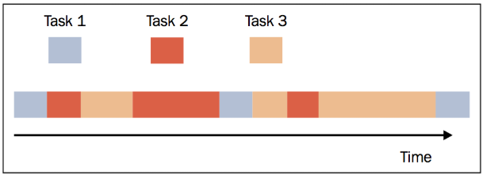

### 概述

然而多线程是竞争型的，调度由CPU决定，有时会显得没那么容易控制；所以python中也实现了一种可以由程序自己来调度的异步方式，叫做协程。

**协程是一种用户态的轻量级线程，又称微线程。**

**协程拥有自己的寄存器上下文和栈，调度切换时，将寄存器上下文和栈保存到其他地方，在切回来的时候，恢复先前保存的寄存器上下文和栈。因此：协程能保留上一次调用时的状态（即所有局部状态的一个特定组合），每次过程重入时，就相当于进入上一次调用的状态，换种说法：进入上一次离开时所处逻辑流的位置。**

简单说协程在执行某个子程序(函数)时，可以指定或者随机地中断，然后去执行其他的子程序(函数)，在合适的时候再返回到中断子程序停止时的状态继续执行。听起像生成器的特性，实际上协程也是基于生成器的。所以协程是通过程序自身的控制，去切换不同任务，实现并发的效果。也就是协程是单线程执行，没有多线程由CPU调度时线程切换的开销，所以效率较高。

再多说直白一点就是：

多线程执行多个任务时，CPU分配线程资源给每个任务，每个任务并行(多核才行，每个单位时间内，一个CPU只能处理一个线程)的执行，但如果任务多了，并且线程有限，CPU会调度线程资源一会执行一个程序，在不同程序间切换。（并且由于python GIL存在，同一时刻只能执行一个线程任务，并行也就成了并发，宏观上也实际是单线程（单核）了）。总结就是多线程由CPU分配调度线程资源给子程序。

而协程的执行不同，它是单一的线程（主线程），将这个线程从开始到结束的时间作为资源分配给子程序，每个子程序能使用这个时间资源可以由我们来控制。同时由于协程具有生成器那样保存状态的特性，遇到阻塞时可以去执行其他的程序，返回来执行时又不会丢失状态，所以可以通过这种异步的方式实现单一线程的并发。



同时因为只有一个线程，也不存在同时写变量冲突，在协程中控制共享资源不加锁，只需要判断状态就好了，所以执行效率比多线程高很多。

通过liaoxuefeng.com上的一个例子来演示下协程：

传统的生产者-消费者模型是一个线程写消息，一个线程取消息，通过锁机制控制队列和等待，但一不小心就可能死锁。

如果改用协程，生产者生产消息后，直接通过yield跳转到消费者开始执行，待消费者执行完毕后，切换回生产者继续生产，效率极高：

```
def consumer():
    r = ''
    while True:
        n = yield r
        if not n:
            return
        print('[CONSUMER] Consuming %s...' % n)
        r = '200 OK'

def produce(c):
    c.send(None)
    n = 0
    while n < 5:
        n = n + 1
        print('[PRODUCER] Producing %s...' % n)
        r = c.send(n)
        print('[PRODUCER] Consumer return: %s' % r)
    c.close()

c = consumer()
produce(c)
```

输出

```
<code class="css">[PRODUCER] Producing 1...
[CONSUMER] Consuming 1...
[PRODUCER] Consumer return: 200 OK
[PRODUCER] Producing 2...
[CONSUMER] Consuming 2...
[PRODUCER] Consumer return: 200 OK
[PRODUCER] Producing 3...
[CONSUMER] Consuming 3...
[PRODUCER] Consumer return: 200 OK
[PRODUCER] Producing 4...
[CONSUMER] Consuming 4...
[PRODUCER] Consumer return: 200 OK
[PRODUCER] Producing 5...
[CONSUMER] Consuming 5...
[PRODUCER] Consumer return: 200 OK</code>
```

注意到`consumer`函数是一个`generator`，把一个`consumer`传入`produce`后：

<li>
首先调用`c.send(None)`启动生成器；
</li>
<li>
然后，一旦生产了东西，通过`c.send(n)`切换到`consumer`执行；
</li>
<li>
`consumer`通过`yield`拿到消息，处理，又通过`yield`把结果传回；
</li>
<li>
`produce`拿到`consumer`处理的结果，继续生产下一条消息；
</li>
<li>
`produce`决定不生产了，通过`c.close()`关闭`consumer`，整个过程结束。
</li>

整个流程无锁，由一个线程执行，`produce`和`consumer`协作完成任务，所以称为协程，而非线程的抢占式多任务。

注意的是，生成器启动或恢复执行一次，将会在yield处暂停。上面的第1步仅仅执行到了yield r，并没有执行到赋值语句 n = yield r ，到了第2步，生成器恢复执行通过send(n)才给consumer中n赋值。

但上面示例并不能体现协程并发的特性，下面由asyncio这内置库来实现

### asyncio (一)

（基于3.5后版本）

asyncio 是用来编写并发代码的库，使用 async/await 语法。

asyncio 被用作多个提供高性能 Python 异步框架的基础，包括网络和网站服务，数据库连接库，分布式任务队列等等。

关于asyncio的一些关键字的说明：

<li>
event_loop 事件循环：程序开启一个无限循环，把一些函数注册到事件循环上，当满足事件发生的时候，调用相应的协程函数
</li>
<li>
coroutine 协程：协程对象，指一个使用async关键字定义的函数，它的调用不会立即执行函数，而是会返回一个协程对象。协程对象需要注册到事件循环，由事件循环调用。
</li>
<li>
task 任务：一个协程对象就是一个原生可以挂起的函数，任务则是对协程进一步封装，其中包含了任务的各种状态
</li>
<li>
future: 代表将来执行或没有执行的任务的结果。它和task上没有本质上的区别
</li>
<li>
async/await 关键字：python3.5用于定义协程的关键字，async定义一个协程，await用于挂起阻塞的异步调用接口。
</li>

#### 创建协程

通过async关键字定义一个协程（coroutine），协程也是一种对象。下面say_after，main就是一个协程

```
import asyncio
import time

async def say_after(delay, what):
    await asyncio.sleep(delay)
    print(what)

async def main():
    print("started ")
    s_time = time.time()
    await say_after(1, 'hello')
    await say_after(2, 'world')
    print("runtime : ",time.time()-s_time)
    print("finished ")

asyncio.run(main())
```

asyncio.run() 函数用来运行一个协程对象，这里我们将main()作为入口函数。await等待一个协程。上面代码段会在等待 1 秒后打印 "hello"，然后 再次 等待 2 秒后打印 "world"。asyncio.sleep表示阻塞多少秒，运行结果如下

```
started
hello
world
runtime :  3.000959634780884
finished
```

可以观察到上面的代码，是同步运行的，两个await say_after之间遇到了阻塞。因为asyncio.run() 只是单纯的运行一个协程，并不会并发运行

#### 运行协程

运行协程对象的方法主要有：

1. 通过asyncio.run(main) 运行一个协程，同步的方式，主要用于运行入口协程

2. 在另一个已经运行的协程中用 `await` 等待它，比如上面运行了main协程，其中等待的say_after协程也会运行

3. 将协程封装成task或future对象，然后挂到事件循环loop上，使用loop来运行。主要方法为loop.run_until_complete。此方法可以异步的并发运行

实际上参考源码asyncio.run本质也是获取loop，运行协程，即协程依靠loop运行

#### 并发协程

asyncio.create_task() 函数用来并发运行多个协程，更改上面的例子

```
import asyncio
import time

async def say_after(delay, what):
    await asyncio.sleep(delay)
    print(what)

async def main():
    print("started ")
    task1 = asyncio.create_task(say_after(1, 'hello'))
    task2 = asyncio.create_task(say_after(2, 'world'))
    s_time = time.time()
    await task1
    await task2
    print("runtime : ",time.time()-s_time)
    print("finished ")

asyncio.run(main())
```

运行输出，比上面快一秒。这里我们使用create_task将协程封装成task对象（会自动的添加到事件循环中），然后我们在main这个入口协程中挂起task1和task2。使用run运行main入口协程，它会自动检测循环事件，并将等待task1和task2两个task执行完成

```
started
hello
world
runtime :  2.0009524822235107
finished
```

asyncio.create_task方法实际是封装了获取事件循环asyncio.get_running_loop()与创建循环任务loop.create_task(coro)的一种高级方法，后面具体会讲这些

#### 可等待对象

跟在await后面的对象都是可等待对象，主要有协程, 任务 和 Future。

- 协程对象：async def 的函数对象
- task任务：将协程包装成的一个任务（task）对象，用于注册到事件循环上
- Future：是一种特殊的低层级可等待对象，表示一个异步操作的最终结果

可等待的意思就是跳转到等待对象，并将当前任务挂起。当等待对象的任务处理完了，才会跳回当前任务继续执行。实际上与yield from功能相同，不同的是await后面是awaitable，yield from后面是生成器对象

yield from的一个示例(来源于[https://zhuanlan.zhihu.com/p/30275154](https://zhuanlan.zhihu.com/p/30275154)这篇协程演进讲的很好)

```
def gen_3():
   yield 3

def gen_234():
   yield 2
   yield from gen_3()
   yield 4

def main():
   yield 1
   yield from gen_234()
   yield 5

for element in main():
   print(element)  

输出
1
2
3
4
5
```

但是对于协程中进行阻塞（Blocking）操作（如IO时）会阻塞掉整个程序，如下面我们使用time.sleep()替代asyncio.sleep()，会发现在timesleep协程时程序阻塞，最后时间为4s

```
import asyncio
import time

async def say_after(delay, what):
    await timesleep(delay)
    return what

async def timesleep(delay):
    time.sleep(delay)

async def main():
    print("started ")
    task1 = asyncio.create_task(say_after(2, 'hello'))
    task2 = asyncio.create_task(say_after(2, 'world'))
    s_time = time.time()
    await task1
    await task2
    print(task1.result(),task2.result())
    print("runtime : ",time.time()-s_time)
    print("finished ")

asyncio.run(main())
```

如果将上面的改为如下

```
async def timesleep(delay):
    # time.sleep(delay)
    await asyncio.sleep(delay)
```

则最后运行时间为2s，这是因为asyncio.sleep()不同于time.sleep()，它其实在内部实现了一个future对象，事件循环会异步的等待这个对象完成

所以

在事件循环中，使用await可以针对耗时的操作进行挂起，就像生成器里的yield一样，函数让出控制权。对于task与future对象，await可以将他们挂在事件循环上，由于他们相比于协程对象增加了运行状态（Pending、Running、Done、Cancelled等），事件循环则可以读取他们的状态，实现异步的操作，比如上面并发的示例。同时对于阻塞的操作(没有实现异步的操作，如request就会阻塞，aihttp则不会)，由于协程是单线程，会阻塞整个程序

### asyncio (二)

#### 事件循环

事件循环是每个 asyncio 应用的核心。 事件循环会运行异步任务和回调，执行网络 IO 操作，以及运行子程序。

简单说我们将协程任务（task）注册到事件循环（loop）上，事件循环（loop）会循环遍历任务的状态，当任务触发条件发生时就会执行对应的任务。类似JavaScript事件循环，当onclick被触发时，就会执行对应的js脚本或者回调。同时当遇到阻塞，事件循环回去查找其他可运行的任务。所以事件循环被认为是一个循环，因为它在不断收集事件并遍历它们从而找到如何处理该事件。

通过以下伪代码理解

```
while (1) {
    events = getEvents();
    for (e in events)
        processEvent(e);
}
```

所有的时间都在 while 循环中捕捉，然后经过事件处理者处理。事件处理的部分是系统唯一活跃的部分，当一个事件处理完成，流程继续处理下一个事件。如果遇到阻塞，循环会去执行其他任务，当阻塞任务完成后再回调（具体如何实现不太清楚，应该是将阻塞任务标记状态或者放进其它列来实现）其实可以参考javascript的事件循环理解，都是单线程的异步操作[http://www.ruanyifeng.com/blog/2013/10/event_loop.html](http://www.ruanyifeng.com/blog/2013/10/event_loop.html)

asyncio 中主要的事件循环方法有：

- **asyncio.get_running_loop()** ：返回当前 OS 线程中正在运行的事件循环对象。
- **asyncio.get_event_loop()** ：获取当前事件循环。 如果当前 OS 线程没有设置当前事件循环并且 set_event_loop() 还没有被调用，asyncio 将创建一个新的事件循环并将其设置为当前循环。
- **asyncio.new_event_loop()** ：创建一个新的事件循环。
- **loop.run_until_complete()** ：运行直到 future ( Future 的实例 ) 被完成。如果参数是 coroutine object ，将被隐式调度为 asyncio.Task 来运行。返回 Future 的结果 或者引发相关异常。
- **loop.create_future()** ：创建一个附加到事件循环中的 asyncio.Future 对象。
- **loop.create_task(coro)** ：安排一个 协程 的执行。返回一个 Task 对象。
- **loop.run_forever() **：运行事件循环直到 stop() 被调用。
- **loop.stop()** ：停止事件循环
- **loop.close()** ：关闭事件循环。

上面的并发例子就可以改成下面形式：

```
import asyncio
import time

async def say_after(delay, what):
    await asyncio.sleep(delay)
    print(what)

def main():
    print("started ")
    s_time = time.time()
    loop = asyncio.get_event_loop() #获取一个事件循环
    tasks = [
        asyncio.ensure_future(say_after(1,"hello")), #asyncio.ensure_future()包装协程或可等待对象在将来等待。如果参数是Future，则直接返回。
        asyncio.ensure_future(say_after(2,"world")),
        loop.create_task(say_after(1,"hello")), #loop.create_task()包装协程为task。
        loop.create_task(say_after(2,"world"))
    ]
    loop.run_until_complete(asyncio.wait(tasks))
    print("runtime : ",time.time()-s_time)
    print("finished ")

main()
```

asyncio.get_event_loop方法可以创建一个事件循环，然后使用 run_until_complete 将协程注册到事件循环，并启动事件循环。asyncio.ensure_future(coroutine) 和loop.create_task(coroutine)都可以创建一个task，run_until_complete的参数是一个futrue对象。当传入一个协程，其内部会自动封装成task，task是Future的子类。asyncio.wait类似与await 不过它可以接受一个list，asyncio.wait()返回的是一个协程。

总结：使用async可以定义协程对象，使用await可以针对耗时的操作进行挂起，就像生成器里的yield一样，函数让出控制权。协程遇到await，事件循环将会挂起该协程，执行别的协程，直到其他的协程也挂起或者执行完毕，再进行下一个协程的执行，协程的目的也是让一些耗时的操作异步化。

#### Task对象

Asyncio是用来处理事件循环中的异步进程和并发任务执行的。它还提供了 asyncio.Task() 类，可以在任务中使用协程。它的作用是，在同一事件循环中,运行某一个任务的同时可以并发地运行多个任务。当协程被包在任务中，它会自动将任务和事件循环连接起来，当事件循环启动的时候，任务自动运行。这样就提供了一个可以自动驱动协程的机制。

如果被包裹的协程要等待一个 future 对象，那么任务会被挂起，等待future的计算结果。当future计算完成，被包裹的协程将会拿到future返回的结果或异常（exception）继续执行。另外，需要注意的是，事件循环一次只能运行一个任务，除非还有其它事件循环在不同的线程并行运行，此任务才有可能和其他任务并行。当一个任务在等待future执行的期间，事件循环会运行一个新的任务。

即Task对象封装协程（async标记的函数），将其挂到事件循环上运行，如果遇到等待 future 对象（await 后面等待的），那么该事件循环会运行其他 Task、回调或执行 IO 操作

相关的主要方法有：

- **asyncio.create_task()** ：高层级的方法，创建Task对象，并自动添加进loop，即get_running_loop()和loop.create_task(coro)的封装
<li>
**asyncio.Task()** ：打包一个协程为Task对象
</li>
<li>
**asyncio.current_task(loop=None)** ：返回当前运行的 Task 实例，如果没有正在运行的任务则返回 None。如果 loop 为 None 则会使用 get_running_loop() 获取当前事件循环
</li>
- **asyncio.all_tasks(loop=None)** ：返回事件循环所运行的未完成的 Task 对象的集合。
- **Task.cancel()** ：请求取消 Task 对象。这将安排在下一轮事件循环中抛出一个 CancelledError 异常给被封包的协程。
- **Task.result()** ：返回 Task 的结果。如果 Task 对象 已完成，其封包的协程的结果会被返回 (或者当协程引发异常时，该异常会被重新引发。)。如果 Task 对象 被取消，此方法会引发一个 CancelledError 异常。如果 Task 对象的结果还不可用，此方法会引发一个 InvalidStateError 异常。

通过网上的一个示例来理解一下，Task与loop之间的工作流程

```
import asyncio

async def compute(x, y):
    print("Compute %s + %s ..." % (x, y))
    await asyncio.sleep(1.0)
    return x + y

async def print_sum(x, y):
    result = await compute(x, y)
    print("%s + %s = %s" % (x, y, result))

loop = asyncio.get_event_loop()
loop.run_until_complete(print_sum(1, 2))
loop.close()
```

流程图如下


期间loop两次访问compute()，第一次是遇到阻塞await(yield from)挂起，第二次是挂起的事件有结果了去取结果，生成器return时会raise StopIteration()异常

通过task.result()获取返回的结果

```
import asyncio
import time

async def say_after(delay, what):
    await asyncio.sleep(delay)
    return what

async def main():
    print("started ")
    task1 = asyncio.create_task(say_after(1, 'hello'))
    task2 = asyncio.create_task(say_after(2, 'world'))
    s_time = time.time()
    await task1
    await task2
    print(task1.result(),task2.result())
    print("runtime : ",time.time()-s_time)
    print("finished ")

asyncio.run(main())
```

建议使用高层级的 asyncio.create_task() 函数来创建 Task 对象，也可用低层级的 loop.create_task() 或 ensure_future() 函数。不建议手动实例化 asyncio.Task() 对象。

#### Future对象 

Future如它的名字一样，是一种对未来的一种抽象，代表将来执行或没有执行的任务的结果。它和task上没有本质上的区别，task是Future的子类。实际上Future包裹协程，添加上各种状态，而task则是在Future上添加一些特性便于挂在事件循环上执行，所以Future就是一个内部底层的对象，平时我们只要关注task就可以了。Future可以通过回调函数处理结果

相关的主要方法有：

- asyncio.isfuture(obj) ：判断对象是不是future对象
- asyncio.ensure_future(obj,loop=None) ：接收一个协程或者future或者task对象，如果是future则直接返回future，其它则返回task
- Future.result() ：返回future结果
- Future.set_result(result) ：将 Future 标记为完成并设置结果
- Future.add_done_callback(callback, *, context=None) ：添加一个在 Future 完成 时运行的回调函数。调用 callback 时，Future 对象是它的唯一参数。

官网的一个例子，体现的是Future的四个状态：Pending、Running、Done、Cancelled。创建future的时候，task为pending，事件循环调用执行的时候当然就是running，调用完毕自然就是done

```
import asyncio

async def set_after(fut, delay, value):
    # Sleep for *delay* seconds.
    await asyncio.sleep(delay)

    # Set *value* as a result of *fut* Future.
    fut.set_result(value)

async def main():
    # Get the current event loop.
    loop = asyncio.get_running_loop()

    # Create a new Future object.
    fut = loop.create_future()

    # Run "set_after()" coroutine in a parallel Task.
    # We are using the low-level "loop.create_task()" API here because
    # we already have a reference to the event loop at hand.
    # Otherwise we could have just used "asyncio.create_task()".
    loop.create_task(
        set_after(fut, 1, '... world'))

    print('hello ...')

    # Wait until *fut* has a result (1 second) and print it.
    print(await fut)

asyncio.run(main())
```

如果注释掉fut.set_result(value)，那么future永远不会done

绑定回调，future与task都可以使用add_done_callback方法，因为task是future子类

```
import time
import asyncio

async def say_after(delay, what):
    await asyncio.sleep(delay)
    return what

def callback(future):
    print('Callback: ', future.result())


coroutine = say_after(2,"hello")
loop = asyncio.get_event_loop()
task = asyncio.ensure_future(coroutine)
task.add_done_callback(callback)
loop.run_until_complete(task)
```

### 总结

实际上官网在3.5后建议使用高层的封装如:asyncio.run(),asyncio.create_task()等，忽略底层的一些实现，虽然方便使用，但是对asyncio的流程理解帮助不大，还是要看底层的一些实现。

总的来说主要重点如下:

1. 协程在asyncio里就是 async定义的函数 
1. await将可等待对象(协程，future，task)挂起，异步或者同步地等待它们完成
1. task对象与future对象没有多大的区别，它们都有四个状态，用于异步的实现
1. 对于没有异步实现的阻塞操作，程序会被阻塞，使用实现异步的库(aiohttp,aiodns,aioredis等等 [https://github.com/aio-libs](https://github.com/aio-libs) 这里列出了已经支持的内容，并在持续更新)
