**一．beacon帧主要结构**

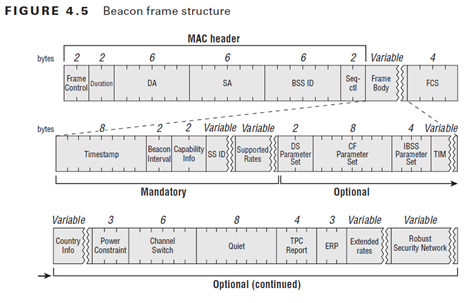

**二．MAC  header**

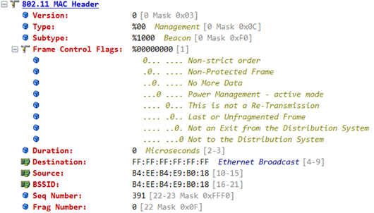

**1.Version**：版本号，目前为止802.11只有一个版本，所以协议编号为0

**2.Type**：定义802.11帧类型，802.11帧分为管理帧（00），控制帧（01），数据帧（10）

**3.Subtype**：定义帧的子类型，如管理帧中又分为很多类型的帧：具体见附表一

**4. Frame Control Flags**帧控制字段

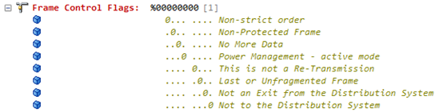

注意：这部分在omnipeek中解析出来的顺序与实际帧中的排序不同，实际中应该是上图中从下至上排列的，我们这里暂时按照omnipeek的来解释

（1）.Order（排序字段）：长度为1比特。当在一个non-QoS数据帧中置为1时，表示该数据帧采用strictly ordered service class 传输一个MSDU或其片段

（2）.受保护帧字段：长度为1比特。置为1时，表示帧体字段（Frame Body Field）字段已经被加密封装算法所加密。且该字段只有在数据帧以及认证管理帧中被置为1

（3）.更多数据字段：长度为1比特。只有在当数据类型帧直接从一个CF-Pollable站点发送到响应一个CF-Poll的pc，该字段才会被置为1表示该STA只有有一个额外的缓冲MSDU用于响应随后的CF-Poll传输。就是用于省电模式下的字段。一般其他帧置为0.

（4）.功耗管理字段：1比特。该字段用于表示STA的功率管理模式。置为1表示运行为PS模式，0表示STA运行为active模式。在AP传输的帧中，该字段被一般设为0

（5）.重试字段：1比特。该字段用于表示在任何一个帧重传的数据或管理帧中被设为1，对与其他帧设置为0。接受STA使用该字段来消除重复的帧。

（6）.更多分段字段：1比特。该字段在所有当前MSDU, MPDU后以及分片的数据或管理帧中被设置为1。而含有完整MSDU,MPDU以及含有一个MSDU或A-MSDU的最后一分片的MPDU中被设置为0.

（7）.from DS字段：置为1表示该帧是DS(分布式系统)向BSS发送的帧

（8）.to DS字段：置为1表明该帧是BSS向DS发送的帧

** **

**5. Duration字段**：16比特。根据不同的帧类型和子类型，帧是否在竞争自由期（CFP）内传输，以及发送STA的QOS功能，该字段的内容也不相同。beacon帧中一般置为0

**6. Destination**:目的地址

**7. Sourse**：源地址

**8. BSSID**：基本服务集标识，长度为48比特。该字段唯一确定每一个BSS。在一个基础结构的BSS中，该字段为目前BSS的AP中的STA使用的mac地址。

**9. Sequence number**：序列号字段，长度为12比特。用以表示A-MSDU或MPDU的序列号

**10. Fragment number**：分段号字段，4比特。表示一个MSDU或MPDU的每个分段的标号。分段号在MSDU或M-MPDU的第一个或唯一的分段中设置为0.

**三．802.11 Management  Beacon**

一个802.11ac协议的beacon帧主体部分含有以下的内容，之所以选择最新的ac的帧（左图）和n2.4g的帧（右图），因为ac和n也是在b g n a基础上扩加的，所以ac帧里也包含以前协议的内容，为了方便学习，我也会在介绍各个部分的时候讲清这个部分最早是出现在哪个协议中的。

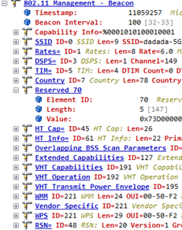

左图ac右图n2.4g

**1. Timestamp（时戳）位**：8比特，可用来同步BSS 中的工作站BSS 的主计时器会定期发送目前已作用的微秒数。当计数器到达最大值时，便会从头开始计数。（对一个长度64bit、可计数超过580,000 年的计数器而言，很难会遇到有从头开始计数的一天。

**2. Beacon Interval**: 2比特。AP每隔一段时间就会发出一个Beacon（信标）信号用来宣布802.11网络的存在。此字段用来设定Beacon信号之间相隔多少时间单位。时间单位通常缩写为TU，代表1024微秒(microsecond)，相当于1毫秒(millisecond)。Beacon通常会被设定为100个时间单位，相当于每100毫秒，也就是0.1秒传送一次Beacon信号。

**3. Capability Info**：长度 16个bit的Capability Information 性能信息位，发送Beacon信号的时候，它被用来通知各方，该网络具备哪种性能。Capability information 位也可以使用在 Probe Request 与Probe Response 帧。在本位中，每个 bit各自代表一个旗标，对应到网络所具备的某种特殊功能。工作站会使用这些公告数据来判断自己是否支持该 BSS 所有的功能。没有实现性能公告中所有功能的工作站，就无法加入该 BSS 。

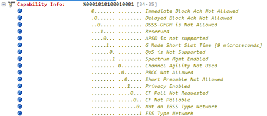

DSSS-OFDM：此bit若设定为 1，代表使用 802.11g 的DSSS-OFDM 帧构建（frame construction）选项。

Short Slot Time ：此bit若设定为 1，代表使用 802.11所支持的较短的时槽

short Preamble （短同步信号）：802.11b 规格新增此位的目的，是为了支持高速直接序列扩频物理层( high-rate DSSS PHY）。将之设定为 1，代表此网络目前使用短同步信号（short preamble ），0 代表不使用此选项，并且在该 BSS 中禁止使用短同步信号。802.11g 规定使用短同步信号，因此在依循 802.11g 标准所建置的网络中，此位必然设定为 1 。

** **

**4. SSID**：该字段出现Beacon, probe requests, probe responses,association request & re-association requests. 帧中。Element ID为0则为ssid。SSID的长度介于0至32字节之间

**5. Supported Rates**：该字段出现在 Beacons, Probe Req, Probe Res, Association Req, Association Res, Reassociation Req and  Reassociation Response.帧中。是802.11网络可以使用 Supported Rates（所支持的冻率）信息元素指定其所支持的速率。当移动工作站试图加入网络，会先检视该网络所使用的数据速率。有些速率是强制性的，每部工作站都必须支持，有些则是选择性的。每个速率用七个低效bit来代表，最高效 bit则是用来表示该数据速率是否为强制性。如果是强制性速率，最高效 bit为1 ；非强制性速率则为 0 。

802.11a中是 6.9.12.18.24.36.48.54Mbps;

802.11b中是 1.2.5.5.11Mbps

802.11g中是 1.2.5.5.11. 6.9.12.18Mbps

802.11n 2.4g是1.2.5.5.11. 6.9.12.18Mbps；5G是：6.9.12.18.24.36.48.54Mbps;

802.11ac是6.9.12.18.24.36.48.54Mbps;

 

**6. DSPS（Direct Sequence Parameter Set）**：直接序列参数集合。802.11直接序列（Direct-sequence）网络只有一个参数：网络所使用的信道数。

**7. TIM（Traffic Indication Map）数据待传信息**：基站会为处于休睡状态的工作站暂存帧。每隔一段时间基站就会尝试传递这些暂存帧给休眠中的工作站。如此安排的理由是，启动发送器比启动接收器所耗费的电力还要多。802.11的设计者预见未来将会有以电池供电的移动工作站；定期发送暂存帧给工作站的这个决定，主要是为了延长设备的电池使用时间。将 TIM（数据待传指示信息）信息元素送到网络上，指示有哪些工作站需要接收待传数据，只是此过程的一部分。

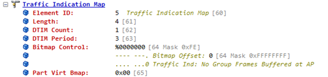

DTIM Count（DTIM计数）：此位的长度为一个字节，代表下一个DTIM（数据待传指示传递信息）帧发送前，即将发送的Beacon帧数。DTIM帧用来表示所暂存的广播与组播帧即将被发送。并非所有Beacon帧均为 DTIM帧。

DTIM Period（DTIM期闲）：此位的长度为一个字节，代表两个DTIM帧之间的 Beacon interval数。0 值目前保留未用。DTIM会由此期间倒数至0。

Bitmap Control（bit对映控制）与 Partial Virtual Bitmap（部分虚拟bit对映）

 

**8. Country（国家）**802. 11 规格书原本是针对主要工业化国家现有的管制规定所设计。为了避免每新增一个国家就得重新修订规格，因此在规格书中加入新的规定，让网络能够提供管制规范给新加入的工作站。这一机制的核心，就是 Country 信息元素

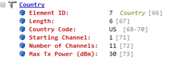

Country String（国家字串，三个字节） ：由三个字符所构成的 ASCII 字串，代表工作站的使用国家。前两个字符即 ISO 国码（例如US代表美国）。有些国家对室内与室外有不同的管制规定，第三个字符即是用来区别两者。如果室内外的管制规定相同，第三个字符则为空白。如果只想指定室内或室外管制规定，可以分别将第三个字符设为I或O。

First Channel Number （第一信道编号，一个字节）：第一信道编号即是符合功率限制的最低信道。

Number of Channels（信道数，一个字节）：符合功率限制的频段大小，是由信道数来指定。

Maximum Transmit Power（最大传输功率，一个字节）：最大传输功率，以dBm为单位。

注意：5g与2.4g由于PHY层的不同，所以这个字段里表示的也不同，此处我截得是2.4g的图，5g的表示的信道比较多，可以自己抓包看

 

**9. ERP扩展物理层**：802.11g 定义了扩展速率物理层（extended rate PHY，简称ERP）。为了兼容早期产品，另外定义了ERP信息元素。所以这个字段只会在802.11g 802.11n（2.4g）里才会有，同理下面Extended Supported Rates也是只有这两个才会有

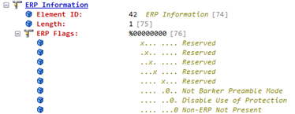

Non-ERP present （无 ERP信息） 当比较老旧、非802.11g 的工作站与网络连接，就会设定此 bit。如果监测到相邻网络无法使用 802.11g，也会设定此bit。

Use Protection（使用防护机制） 当网络中出现无法以802.11g 数据速率运作的工作站，此防护 bit就会被设定为1 。如此一来就可以兼容比较老旧的工作站

Barker Preamble Mode（Barker 同步信号模式）

 

**10. Extended Supported Rates（扩展支持速率）**：主要在802.11g与802.11n（2.4g）中，速率有24.36.48.54

**11. Element ID =70为未来保留**；未使用（Reserved; unused）

**12. HT Capability Info**：高吞吐量功能信息：802.11n的mac层给802.11的mac层加入了高吞吐量单元。所有新加的802.11n功能都是通过管理帧中的HT单元才得以实现

**13. HT Operation info**：高吞吐量操作信息，主要表示一些802.11n的信息

**14. Overlapping BSS Scan Parameters（重叠BSS扫描参数）**：是当BSS（基本服务集）中的AP使用重叠BSS扫描参数参数来指示BSS成员在执行OBSS扫描操作时使用的值。这部分只在802.11n与ac 20MHz带宽时才会出现，与20MHZ/40MHZ信道共存有关。

**15. Extended Capabilities**（扩展功能）

**16. VHT Capabilities**：802.11ac中加入的字段，用于管理ac的功能。并且在802.11n开启turbo qam后也会有这个字段

**17. VHT Operation**：802.11ac中操作信息

**18. VHT Transmit Power Envelope**：发射功率包络，只有在802.11ac才有。使AP能够限制每个可用信道带宽传送发射功率。就是设置限制20或40或80MHz等带宽的发射功率

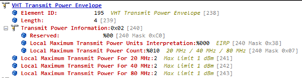

**19. WMM**：Wi-Fi多媒体，WMM是一种无线QoS协议，是802.11e协议的一个子集。用于保证高优先级的报文有优先的发送权利，从而保证语音、视频等应用在无线网络中有更好的质量。

**20. Vendor Specific 特定供应商**：这个字段与下一个WPS字段为同一个Element ID，所以这两个字段同属于WPS功能字段，跟WPS（WSC）有关。而omnipeek的解析出来的报文可能有显示错误。可以尝试wireshark解析。有关的协议为802.11u。这个是厂商自定的OUI

**22. WPS**：当路由上开启WPS功能时，会在beacon帧中宣告这个字段

**21. Mobility Domain information**：支持802.11r的AP，如果开启802.11r，则在beacon帧中会包含MDIE（Mobility domain）。其中MD ID（图中Identifier）用于表示移动域，具有相同MD ID的AP才能够进行漫游；FT Capability字段Fast BSS Transition over DS位表示快速漫游的类型，置1为over_the_DS，置0为over_the_Air

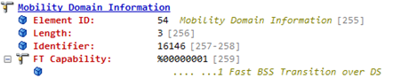

**22. RSN（固安网络）**：用于指示站点的认证密码，加密密码和其他RSN能力的RSN信息元素。

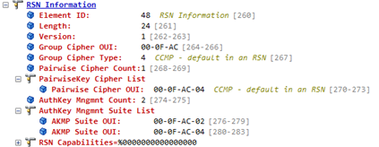

前部分是密码锁集合选项(cipher suite selector) 长度为四个字节，由厂商的 OUl （Group cipher OUI）以及代表密码锁的编号（Group cipher type）所组成。802.11i所使用的 OUI 为00-OF-AC，为 802.11工作小组所拥有。Group cipher type=2 为TKIP，Group cipher type=4 为CCMP

Pairwgse Cipher Suites (count＋list) 〔成对密码锁集合（计数＋列表）〕

Authentication and Key Management (AKM) suites (count ＋list) 〔身份认证与密钥管理集合（计数＋列表）〕开启漫游后有两个OUI

RSN Capabilities（RSN性能） 此位的长度为两个字节用来描述发送端的能力，其后的 bit保留未用，必须设定为 0。其中比较主要的就是Pre-authentication（事先身份认证） 基站可以设定此bit，代表它可以和网络中其他基站进行事先身份认证，以便安全地转移连接事宜。否则，此 bit会被设定为 0 。

[beacon帧字段结构最全总结（一）beacon基本结构](https://www.cnblogs.com/fengf233/p/10919335.html%20)

[beacon帧字段结构最全总结（二）HT字段总结](https://www.cnblogs.com/fengf233/p/10919436.html%20)

[beacon帧字段结构最全总结（三）VHT字段总结](https://www.cnblogs.com/fengf233/p/10929751.html%20)
