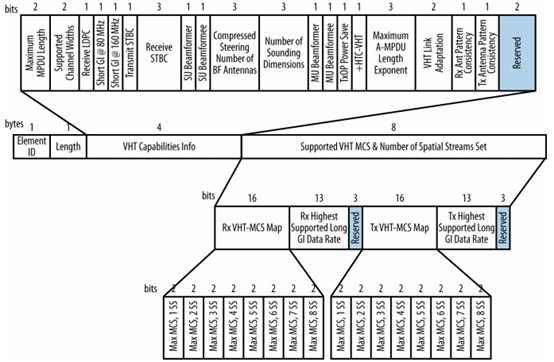
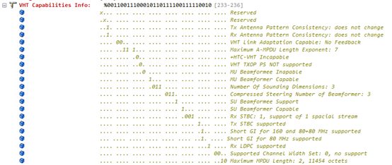
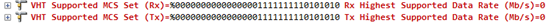
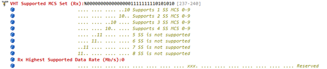
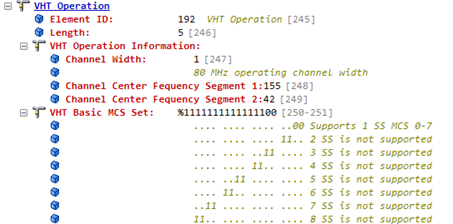

**VHT Capabilities**

802.11ac作为IEEE 无线技术的新标准，它借鉴了802.11n的各种优点并进一步优化，除了最明显的高吞吐特点外，不仅可以很好地兼容802.11a/n的设备，同时还提升了多项用户体验。802.11ac 主要技术特征：由于802.11n在MAC层已经很优异了，因此802.11ac在MAC层上的改进并不多，主要通过PHY层来提升其基础速率。更密的调制模式256qam，更宽的信道带宽，更多的空间流，MU-MIMO等等

**1. Receive and Transmit Antenna Pattern Consistency接收和发送天线模式一致性**；如果发射机的天线方向图没有改变，这些位将被设置为1关联完成后，否则为0。 最常见的原因之一要改变的天线方向图是波束形成。

**2. VHT Link Adaptation capable**该字段用于链路自适应反馈，以使用显式反馈来选择用于链路的最合适的MCS。

**3. Max A-MPDU Length Exponent**：11ac中的A-MPDU与11n中类似，不同之处在于Maximum A-MPDU Length Exponent由11n中的两位扩大至3位，所以11ac支持的最大A-MPDU聚合长度为2^(13+7)-1=1048575Bytes。

VHT A-MPDU factor与A-MPDU长度 的对应关系：

0 -> 8191；1 -> 16383；2 -> 32767；3 -> 65535；4 -> 131071；5 -> 262143；6 -> 524287；7 -> 1048575

**4. +HTC-VHT capable**该值设置为1，表示发射机能够接收VHT变体HT控制字段。

**5. VHT TxOP Power-Save**：AP可以将该位设置为1，以在VHT传输突发期间启用省电操作，或者将0禁用它们。

**6. Multi-User (MU) Beamformer (1 bit) and Beamformee (1 bit)**：多用户波束形成，beamformer是发送端，Beamformee是接收端，设置为1表示启用

**7. Compressed Steering Number of Beamformer (BF) Antennas (3 bits) and Number of Sounding Dimensions (**3 bits)这些字段用于波束成形的通道测量过程指示可以参与通道测量的最大天线数。这些跟波束形成有关。

**8. Single-User (SU) Beamformer (1 bit) and Beamformee (1 bit)**：单用户波束成形，1为支持，0为不支持

**9.Rx STBC & Tx STBC**：表示是否支持STBC以及支持的最多空间流

**10. Short GI for 80 (1 bit) and Short GI for 160 & 80+80 (1 bit)**：这原理跟802.11n的一样

**11.Rx LDPC**的支持字段，1表示该设备支持接受LDCP编码的帧，0表示不支持

**12. Supported Channel Width set (2 bits)**：这个字段表明是否支持160MHz。0表示不支持；1表示仅支持160MHz；2表示同时支持160MHz和80+80MHz

**13. Maximum MPDU Length**：最大MPDU长度，跟A-MPDU不同这是单个MPDU的长度；0表示3,895 bytes；1表示7,991 bytes；2表示11,454 bytes

**14. VHT Supported MCS Set** (Rx & Tx) 在Capabilities元素之后是支持的MCS Set元素，如下所示它分为两个相同的两半，上半部分描述接收能力和下半部分描述传输能力。

每个分为两个字段VHT-MCS Map和Highest Supported Data Rate

VHT-MCS Map中，每条空间流0表示支持MCS0~7；1（01）表示支持MCS0~8；2（10）表示支持MCS0~9；

3（11）表示保留

Highest Supported Data Rate中有13位bit表示支持的最大速率，算法是最小单位1Mbps乘以这13位表示的10进制数；比如80MHz 2条空间流即速率为867Mbps，此时这13位表示为0001101100011（867），但是在我抓的包中没有显示此字段数据，不知道为什么

VHT Operation Information

**1.Channel Width**：表示信道带宽，设为0表示20MHz或40MHz当前；设置为1表示80MHz；2表示160MHz；

设为3表示80+80MHz

**2.Channel Center Frequency 1**：这个字段只用于80MHz和160MHz时，表示当前中心信道；当是80+80时，则表示其中频段低的中心信道

**3. Channel Center Frequency 2**：这个字段只用于80+80，表示用于传输的第二个中心信道

**4.VHT Basic MCS Set**：表示BSS中支持的基本MCS

[beacon帧字段结构最全总结（一）beacon基本结构](https://www.cnblogs.com/fengf233/p/10919335.html%20)

[beacon帧字段结构最全总结（二）HT字段总结](https://www.cnblogs.com/fengf233/p/10919436.html%20)

[beacon帧字段结构最全总结（三）VHT字段总结](https://www.cnblogs.com/fengf233/p/10929751.html%20)
