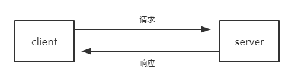
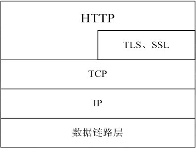
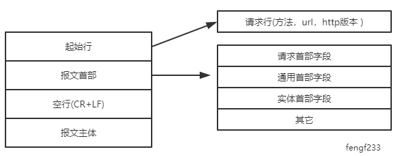
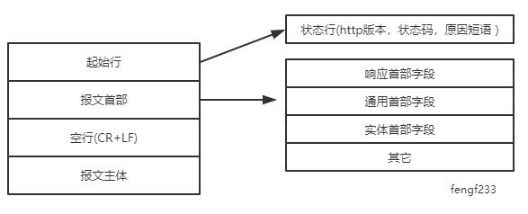
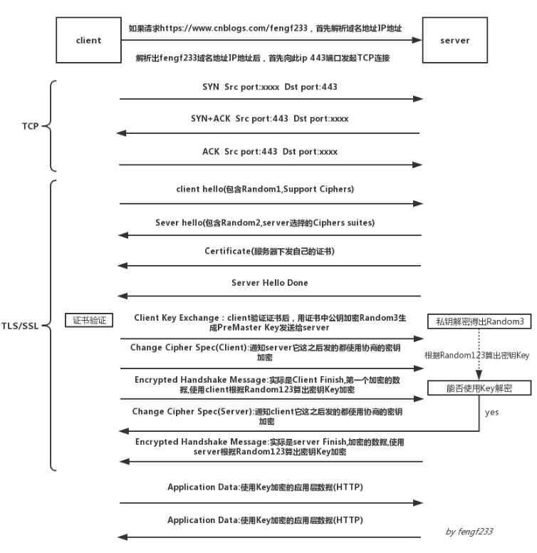
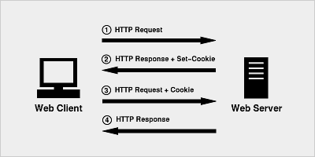

### 概述

1.HTTP协议是一种应用层的传输协议，用于客户端和服务器之间的通信

2.HTTP协议处于TCP/IP模型中的应用层，基于TCP传输协议，常用端口80

3.当使用TLS加密TCP的载荷(即HTTP内容)时，这个就是目前常见的HTTPS，常用端口443

协议栈结构如下

4.HTTP传输的资源:网络上一切内容即资源，包括:html css js 图片 视频等

5.HTTP协议版本历史：

- HTTP/0.9：这个名字是后来取的，人们把HTTP/1.0之前的版本统称为HTTP/0.9，HTTP/0.9时代并没有作为正式标准被建立。
- HTTP/1.0：该版本作为标准正式公布于1996年5月，至今仍广泛用于服务器端。
- HTTP/1.1：1997年1月公布，是至今为止最主流的HTTP协议版本。
- HTTP/2.0：是HTTP协议自1999年HTTP 1.1发布后的首个更新，主要基于SPDY协议

6.WEB上常见组件：

- 用户代理（user agent）：就是客户端，如浏览器，以及web机器人、爬虫等
- 源服务器（origin server）：就是Web服务器，但不一定时一个服务器，可能是集群
- 代理（Proxies）：代理位于客户端和服务器之间，接收所有客户端的HTTP请求，并把这些请求转发给服务器（可能会对请求进行修改之后转发）。根据不同作用也分为几种代理服务器：缓存,过滤,负载均衡,认证,日志记录
- 网关（gateway）：特殊的服务器，主要将HTTP转换成其它协议
- 隧道（tunnel）：就是一个连接通道，用于在http信道上发送非http协议的资源

7.HTTP特性：

- HTTP是无状态，有会话的，在同一个TCP连接中，两个执行成功的请求之间是没有关系的。但使用Cookies可以创建有状态的会话，让每次请求都能共享相同的上下文信息，达成相同的状态。
- HTTP是可扩展的，在 HTTP/1.0 中出现的 HTTP headers 让协议扩展变得非常容易。只要服务端和客户端就新 headers 达成语义一致，新功能就可以被轻松加入进来。
- HTTP是基于TCP可靠连接的，可以实现长连接与管道机制，即可以TCP连接默认不关闭，可以被多个请求复用（长连接），以及在同一个TCP连接里，可以同时发送多个请求（管道机制）。

### URL

URL（统一资源定位符）是URI（统一资源标识符）的一个子集，结构如下：

**协议protocol**: 表示当前使用的协议，如HTTP,HTTPS,FTP,WS(websocket)

**主机host**:表示server主机在网络上的地址，可以是ip或者域名

**端口post**:表示服务进程使用或监听的端口（传输层）,一般http使用80端口，https使用443端口

**资源路径path**:网络资源在服务器中的指定路径

**查询query:**由?表示查询，后面跟键值对参数，每个参数由&隔开

**片段fragment**:指定到达网页中不同的片段位置，类似书签，不会与请求一起发送到服务器

### HTTP报文

HTTP报文主要分为请求报文与响应报文，结构如下

**请求报文**

**响应报文**

#### 起始行

报文的第一行就是起始行，在请求报文中表示要做什么，在响应报文中表示出现了什么情况

**1.请求行**

请求方法

**GET**：GET方法用于获取服务器的资源数据.

**HEAD**：HEAD方法请求一个与GET请求的响应相同的响应，但没有响应主体.

**POST**：POST方法用于向服务器端发送数据

**PUT**：PUT方法用于向服务器端修改、插入数据

**DELETE**：DELETE方法删除指定的资源。

**CONNECT**：CONNECT方法建立一个到由目标资源标识的服务器的隧道。

**OPTIONS**：OPTIONS方法用于请求服务器告知其支持什么功能

**TRACE**：TRACE方法沿着到目标资源的路径执行一个消息环回测试。

**PATCH**：PATCH方法用于对资源应用部分修改。

**2.状态行**

状态码主要分为5大类:

<li>
100-199 信息性状态码
</li>
<li>
200-299 成功状态码 
</li>
<li>
300-399 重定向状态码 
</li>
<li>
400-499 客户端错误状态码 
</li>
<li>
500-599 服务端错误状态码
</li>

常见的有：

<li>
100 Continue ：这个临时响应表明，迄今为止的所有内容都是可行的，客户端应该继续请求，如果已经完成，则忽略它。
</li>
<li>
101 Switching Protocol ：该代码是响应客户端的 Upgrade 标头发送的，并且指示服务器也正在切换的协议，如websocket。
</li>
<li>
200 OK：请求成功，实体的主体部分包含了所请求的资源
</li>
<li>
204 Not Content ：正常响应，没有实体
</li>
<li>
206 Partial Content ：范围请求，返回部分数据，响应报文中由Content-Range指定实体内容
</li>
<li>
301 Moved Permanently： 永久重定向，被请求的资源已永久移动到新位置
</li>
<li>
302 Found： 临时重定向，请求的资源现在临时从不同的 URI 响应请求
</li>
<li>
303 See Other：和302类似，但必须用GET方法
</li>
<li>
304 Not Modified：状态未改变， 配合(If-Match、If-Modified-Since、If-None_Match、If-Range、If-Unmodified-Since)
</li>
<li>
307 Temporary Redirect：临时重定向，不该改变请求方法
</li>
<li>
400 Bad Request： 请求报文语法错误
</li>
<li>
401 unauthorized ：需要用户认证
</li>
<li>
403 Forbidden：服务器拒绝访问对应的资源
</li>
<li>
404 Not Found： 服务器上无法找到资源
</li>
<li>
500 Internal Server Error：服务器遇到了不知道如何处理的情况
</li>
<li>
503 Service Unavailable：服务器处于超负载或正在停机维护
</li>

原因短语就是给人看的简单解释语句

#### 通用首部

通用首部指的是请求报文与响应报文都会使用的首部

|首部字段名|说明
|------
|Cache-Control|控制缓存的行为
|Connection|逐挑首部、连接的管理
|Date|创建报文的日期时间
|Pragma|报文指令
|Trailer|报文末端的首部一览
|Transfer-Encoding|指定报文主体的传输编码方式
|Upgrade|升级为其他协议
|Via|代理服务器的相关信息
|Warning|错误通知

#### 请求首部

请求首部是客户端往服务端发送请求报文中使用的首部字段，用于补充请求的附加信息，客户端信息，对响应内容相关的优先级信息等

|首部字段名|说明
|------
|Accept|用户代理可处理的媒体类型
|Accept-Charset|优先的字符集
|Accept-Encoding|优先的内容编码
|Accept-Language|优先的语言（自然语言）
|Authorization|Web认证信息
|Expect|期待服务器的特定行为
|From|用户的电子邮箱地址
|Host|请求资源所在服务器
|If-Match|比较实体标记（ETag）
|If-Modified-Since|比较资源的更新时间
|If-None-Match|比较实体标记（与 If-Macth 相反）
|If-Range|资源未更新时发送实体 Byte 的范围请求
|If-Unmodified-Since|比较资源的更新时间(与 If-Modified-Since 相反)
|Max-Forwards|最大传输逐跳数
|Proxy-Authorization|代理服务器要求客户端的认证信息
|Range|实体的字节范围请求
|Referer|对请求中 URI 的原始获取方
|TE|传输编码的优先级
|User-Agent|HTTP 客户端程序的信息

#### 响应首部

响应首部就是服务端向客户端返回响应报文中使用的字段，用于补充响应的附加信息，服务器信息，以及对客户端的一些要求等

|首部字段名|说明
|------
|Accept-Ranges|是否接受字节范围请求
|Age|推算资源创建经过时间
|ETag|资源的匹配信息
|Location|令客户端重定向至指定 URI
|Proxy-Authenticate|代理服务器对客户端的认证信息
|Retry-After|对再次发起请求的时机要求
|Server|HTTP 服务器的安装信息
|Vary|代理服务器缓存的管理信息
|WWW-Authenticate|服务器对客户端的认证信息

#### 实体首部 

实体首部字段是包含在请求报文与响应报文中实体部分使用的首部，用于补充实体相关信息

|首部字段名|说明
|------
|Allow|资源可支持的 HTTP 方法
|Content-Encoding|实体主体适用的编码方式
|Content-Language|实体主体的自然语言
|Content-Length|实体主体的大小（单位：字节）
|Content-Location|替代对应资源的 URI
|Content-MD5|实体主体的报文摘要
|Content-Range|实体主体的位置范围
|Content-Type|实体主体的媒体类型
|Expires|实体主体过期的日期时间
|Last-Modified|资源的最后修改日期时间

### HTTPS

由于HTTP的内容在网络上实际是明文传输，并且也没有身份验证之类的安全措施，所以容易遭到挟持与攻击

HTTPS是通过SSL(安全套接层)和TLS(安全传输协议)的组合使用，加密TCP载荷即HTTP报文内容，同时通过不对称密钥方式认证身份，保证传输的安全可靠

即：HTTP+加密+认证+完整性保护=HTTPS

HTTPS在进行传输HTTP报文数据前，需要经过TLS握手，完成加密，大致流程如下：

详细过程可以参考另一篇文章:[https://www.cnblogs.com/fengf233/p/11775415.html](https://www.cnblogs.com/fengf233/p/11775415.html)

### 保持会话

#### Session

首先HTTP是无状态，即这一次请求跟上一次请求是没有关联的，虽然这种无状态行为能减小服务器压力，但是在某些需要保持用户登录或者保持上下文的情况(如网站购物等，如果没有保持状态服务器就不知道谁买的)就会很不方便，所以创建了一种session机制，用来保持状态。

主要方法就是客户端向服务器端请求后，服务端生成session，并向客户端发送一个session标识，此标识指向服务端保存的session。之后，客户端再次请求的时候，就会带上此session标识，服务端识别后，就会指向上次保存的session，以此实现保持状态的会话。

即：

#### Cookie

HTTP Cookie（也叫Web Cookie或浏览器Cookie）是服务器发送到用户浏览器并保存在本地的一小块数据，它会在浏览器下次向同一服务器再发起请求时被携带并发送到服务器上。

Cookie主要用于以下三个方面：

- 会话状态管理（如用户登录状态、购物车、游戏分数或其它需要记录的信息）
- 个性化设置（如用户自定义设置、主题等）
- 浏览器行为跟踪（如跟踪分析用户行为等）

cookie的属性主要有：

<li>
domain : cookie的域
</li>
<li>
allh : 那些主机可以使用此cookie
</li>
<li>
path ：那些路径能使用cookie
</li>
<li>
secure : 是否在发送https报文的时候使用cookie
</li>
<li>
expires ： 过期时间
</li>
<li>
name ： cookie的名字
</li>
<li>
value : cookie的值
</li>

cookie的使用原理：

用户第一次请求服务器时，服务器返回一个带Set-Cookie（Set-Cookie1）首部的报文，值为键值对，描述了cookie的名字、值、域、路径等信息，然后客户端接下来每次访问服务器的时候都会带上一个Cookie首部的报文，它的值刚好是前面响应报文返回的名字键值对，从而达到验证用户身份的信息。

cookie和session：

从上面可以看出管理session只是cookie的一个作用，只需要在Set-Cookie时设置sessionID（session标志）即可。

#### Token

使用session管理登录信息的时候，上面说过，服务端会根据用户cookie中所带的sessionID去"查询"保存在服务端本地的对应session，来保持登录状态。但是，当用户量非常大的时候，频繁的"查询"（一般是查询保存session的数据库）操作会消耗大量资源。所以出现了一种令牌机制，就是Token

Token的定义：Token是服务端生成的一串字符串，以作客户端进行请求的一个令牌，当第一次登录后，服务器生成一个Token便将此Token返回给客户端，以后客户端只需带上这个Token前来请求数据即可，无需再次带上用户名和密码。

Token与session不同的是：

- Token只需要第一步服务端验证令牌是不是合法，再根据令牌中的用户信息返回用户数据，查询数据库只有一步
- session是第一先根据sessionID查询是否有保存的session，如果有再根据session中的用户信息返回用户数据，查询数据库会有两步，而且无论是否合法的用户都会去查询数据库

Token组成：

- uid: 用户唯一身份标识
- time: 当前时间的时间戳
- sign: 签名, 使用 hash/encrypt 压缩成定长的十六进制字符串，以防止第三方恶意拼接
- 固定参数(可选): 将一些常用的固定参数加入到 token 中是为了避免重复查库

Token存放：token在客户端一般存放于localStorage，cookie，或sessionStorage中。

Token验证的过程:

- 用户通过用户名和密码发送请求。
- 程序验证。
- 程序返回一个签名的token给客户端。
- 客户端储存token,并且每次用于每次发送请求。
- 服务端验证token并返回数据。

### HTTP安全

**1.跨站脚本攻击**

跨站脚本攻击（Cross-Site Scripting， XSS）是指通过存在安全漏洞的 Web 网站注册用户的浏览器内运行非法的 HTML 标签或者 JavaScript 代码的一种攻击方式。动态创建的 HTML 可能存在安全漏洞。

该攻击可能造成以下影响：

- 利用虚假输入表单骗取用户个人信息
- 利用脚本窃取用户的 Cookie 值，被害者在不知情的情况下，帮助攻击者发送恶意请求
- 显示伪造的文章或者图片

**2.SQL 注入攻击**

- 非法查看或篡改数据库内的数据
- 规避认证
- 执行和数据库服务器业务关联的程序等

**3.会话劫持**

会话劫持（Session Hijack）是指攻击者通过某种手段拿到了用户的会话 ID，并非法使用此会话 ID 伪装成用户，达到攻击的目的。

具备认证功能的 Web 应用，使用会话 ID 的会话管理机制，作为管理认证状态的主流方式。会话 ID 中记录客户端的 Cookie 等信息，服务器端将会话 ID 与认证状态进行一对一匹配管理。

攻击者可能通过以下方式获得会话 ID：

- 通过非正规的生成方法推测会话 ID
- 通过窃听或 XSS 攻击盗取会话 ID
- 通过会话固定攻击（Session Fixation）强行获取会话 ID

通常情况下攻击者在发现网站存在的 XSS 攻击漏洞之后，会注入一段 JavaScript 代码，通过document.cookie盗取到会话 ID，之后植入到自己的浏览器，就可以伪装成被盗窃的用户访问被攻击的网站。

**4.跨站点请求伪造**

跨站点请求伪造（Cross-Site Request Forgeries，CSRF）攻击是指攻击者通过设置好的陷阱，强制对已完成认证的用户进行非预期的个人信息或设定信息等某些状态更新，属于被动攻击。

跨站点请求伪造可能会造成以下影响：

- 利用已通过认证的用户权限更新设定信息等
- 利用已通过认证的用户权限购买商品
- 利用已通过认证的用户权限在留言板上留言

**5.DoS 攻击**

DoS 攻击（Denial of Service Attack）是一种让运行中的服务呈停止状态的攻击。有时也叫作停止服务攻击或者拒绝服务攻击。DoS 攻击的对象不仅限于 Web 网站，还包括网络设备及服务器等。

DoS 主要有以下两种攻击方式：

- 集中利用访问请求造成资源过载，资源用尽的同时，实际上服务也就呈停止状态
- 通过攻击安全漏洞是服务停止

HTTP的内容很多很杂，涉及的安全内容也非常多，但作为现今互联网的载体，基本是必懂的基础，这里记录了一些来源于书上网上以及自己的总结

参考：

1.《图解HTTP》

2.《HTTP权威指南》

3.  [mozilla HTTP教程](https://developer.mozilla.org/zh-CN/docs/Web/HTTP)

4.  [彻底理解cookie，session，token](https://www.cnblogs.com/moyand/p/9047978.html)
