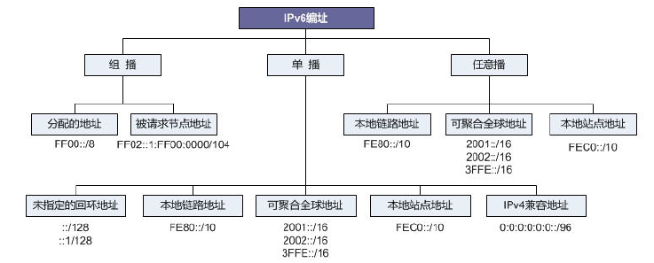
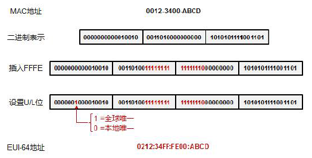
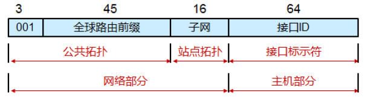
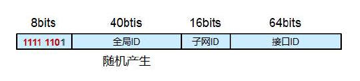
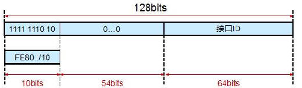
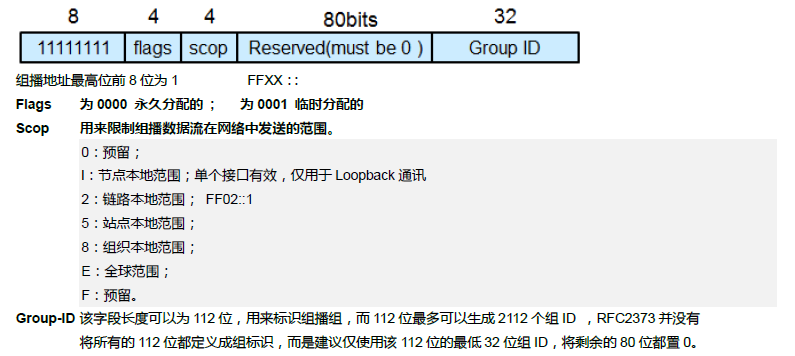
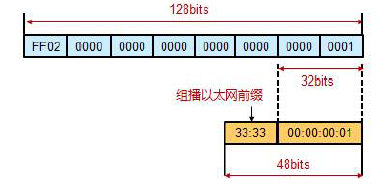
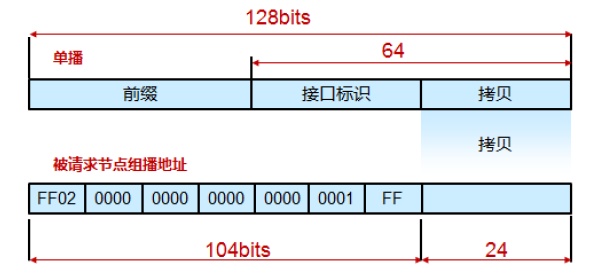
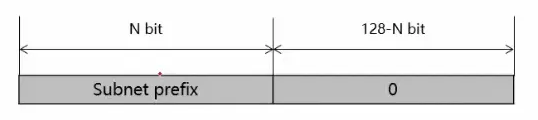

**1.地址基础**

IPv6地址由被划分为8个16位块的128位组成。 然后将每个块转换为由冒号符号分隔的4位十六进制数字。

```
2001:0000:3238:00E1:0063:0000:0000:FEFB
```

每一块多个前导的0可以省略，一个块全为0可以简写为一个0，,多个块为连续0的话可以简写为::

```
2001:0:3238:E1:0063::FEFB
```

URL中ipv6地址必须加[]

```
http://[2001:0:3238:E1:0063::FEFB]:80
```

IPv6分为三种地址类型：



**单播地址**：在单播寻址模式下，IPv6接口(host)在网段中唯一标识。 IPv6数据包包含源IP地址和目标IP地址。 主机接口配备有在该网络段中唯一的IP地址。当网络交换机或路由器接收到注定到单个主机的单播IP分组时，它发出其连接到该特定主机的输出接口之一 。

**多播(组播)地址**：IPv6组播模式与IPv4相同。 目的地为多个主机的数据包在特殊的多播地址上发送。 所有对该组播信息感兴趣的主机需要首先加入该组播组。 加入组的所有接口接收组播数据包并对其进行处理，而对组播数据不感兴趣的其他主机则忽略组播信息。

**任播地址**：IPv6引入了一种新型的寻址，称为Anycast寻址。 在此寻址模式下，多个接口(host)被分配相同的任播IP地址。 当主机希望与配备有任播IP地址的主机通信时，它发送单播消息。 在复杂的路由机制的帮助下，在路由成本方面，该单播消息被递送到最接近发送方的主机。

IPv6不使用广播地址，广播地址的功能由多播地址代替。

**2.单播地址**

IPv6大致由前缀，子网ID，接口ID组成

前缀：相当于v4地址中的网络ID接口ID：相当于v4地址中的主机ID

IPv6有三种不同类型的单播地址方案。 地址的后半部分(最后64位)始终用于接口ID。 系统的MAC地址由48位组成并以十六进制表示。 MAC地址被认为是在世界范围内唯一分配的。 接口ID利用MAC地址的这种唯一性。 主机可以使用IEEE的扩展唯一标识符(EUI-64)格式自动配置其接口ID。 首先，主机将其自己的MAC地址划分为两个24位的半部分。 然后16位十六进制值0xFFFE被夹在这两个MAC地址的两半之间，产生EUI-64接口ID。



从左数起的第7位，是U位，使用EUI-64格式的地址IPv6地址，U/L位为1，则地址是全球唯一的，如果为0，则为本地唯一

**可聚合全球单播**

一般从运营商处申请到的IPv6地址空间为/48，三个最高有效位始终设置为001，再由自己根据需要进一步规划：



**本地站点地址Site-local address**

类似IPv4中的私有地址。

该地址以FEC0：：/10为前缀。也就是说最高10 bits固定为1111111011，紧跟在后面的是连续38 bits 的0。因此，对于站点本地地址来说，前48bits 总是固定的。在接口ID和高位48bits特定前缀之间有16bits 子网ID字段，供机构在内部构建子网。站点本地地址不是自动生成的，是手工配置的。

站点本地地址只能够在本地或者私有环境中使用，不能访问公网。

RFC 1884 定义了fec0::/10 地址块用于site-local地址,这些地址只能够在私有的IPv6站点内使用，但是草案对Site描述不清楚导致路由规则的混乱，因此RFC3879弃用了该地址块。

**<em id="__mceDel">**</em>**唯一本地地址 Unique Local Address**

ULA，唯一本地地址，概念上相当于私有IP，仅能够在本地网络使用，在IPv6 Internet上不可被路由。

上面提到的站点本地地址由于起初的标准定义模糊而被弃用，而后RFC又重新定义了唯一本地地址以满足本地环境中私有IPv6地址的使用。

在RFC4193中标准化了一种用来在本地通信中取代站点本地单播地址的类型。ULA拥有固定前缀FC00::/7，分为两块：FC00::/8暂未定义，FD00::/8定义如下：



**链路本地IPv6 单播地址**

类似于windows系统中IPv4的169.254.0.0/16地址（link-local IPv4 address）****

它的有效范围仅仅在所处链路上。以FE80::/10为前缀，11-64位为0，外加一个64bits的接口标识（一般是EUI-64）。



**特殊地址**


如表所示，地址0:0:0:0:0:0:0:0/128不指定任何内容，称为未指定地址。 简化后，所有的0被压缩为:: / 128。

在IPv4中，地址0.0.0.0与网络掩码0.0.0.0表示默认路由。 相同的概念也适用于IPv6，地址0:0:0:0:0:0:0:0，网络掩码全0表示默认路由。 应用IPv6规则后，此地址压缩为:: / 0。

IPv4中的环回地址由127.0.0.1到127.255.255.255系列表示。 但在IPv6中，只有0:0:0:0:0:0:0:1/128表示环回地址。 环回地址后，可以表示为:: 1/128。

**2.组播地址**

IPv6 多播（组播）地址是一组接口的标识符(典型在不同节点上)。一个接口可以属于任何数目的多播组。

组播地址最高位前8位固定为全1，也就是FFXX::/8



永久分配的多播地址的含义独立于范围值。

例如，如果给NTP服务器组分配一个组ID 为101(16进制)的永久多播地址，那么

FF01:0:0:0:0:0:0:101意味着在相同接口(即，相同节点)上的所有NTP服务器(作为发送者)。FF02:0:0:0:0:0:0:101意味着在相同链路上的所有NTP服务器(作为发送者)。FF05:0:0:0:0:0:0:101意味着在相同站点内的所有NTP服务器(作为发送者)。FF0E:0:0:0:0:0:0:101意味着在互联网中的所有NTP服务器。

**常见的组播地址**

所有节点地址：

 FF01:0:0:0:0:0:0:1     FF01::1FF02:0:0:0:0:0:0:1     FF02::1上述多播地址标识范围1(接口本地)或范围2(链路本地)内的所有IPv6节点组。所有路由器地址：

FF01:0:0:0:0:0:0:2     FF01::2FF02:0:0:0:0:0:0:2     FF02::2FF05:0:0:0:0:0:0:2     FF05::2上述多播地址标识范围1(接口本地)、范围2(链路本地)或范围5(站点本地)内的所有IPv6路由器组。

**IPv6组播地址的MAC地址映射**

****

**被请求节点组播地址Solicited-node**

在IPv6组播地址中，有一种特别的组播地址，叫做Solicited-node地址(被请求节点组播地址)。Solicited-node地址是一种特殊用途的地址．主要用于重复地址检测（DAD）和替代IPv4中的ARP。Solicited-node地址由前缀FF02::1:FF00:0 / 104和ipv6单播地址的最后24位组成。一个IPv6单播地址对应一个Solicited-node地址。Solicited-node地址有效范围为本地链路范围。地址格式： FF02:0:0:0:0:1:FFXX:XXXX，具体的对应关系如下：



**3.任播地址**

IPv6任播地址分配给多于一个接口(属于不同节点)。任播地址具有这样的性质：发送到任播地址的分组，被按照路由协议的测量距离，路由到有该任播地址的最近的接口。任播地址是根据单播地址空间分配的，使用任何已定义的单播地址格式。

**4.节点及路由器必须具备的IPv6地址**


---------------------------------------------------------------------------------------------------------------------------------------------------------------------------

摘自[**IPv6****简单走两步认识认识IPv6地址**](https://forum.huawei.com/enterprise/zh/forum.php?mod=viewthread&tid=412485)

参考 IPv6学习笔记基础版-红茶三杯

参考 RFC4291

---------------------------------------------------------------------------------------------------------------------------------------------------------------------------
