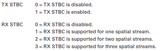

**一.HT Capabilities**

**HT Capabilities：**802.11n的mac层给802.11的mac层加入了高吞吐量单元。所有新加的802.11n功能都是通过管理帧中的HT单元才得以实现，总体如下

抓包中显示，可见对HT的解析，omnipeek还是可行的

 

 

**（一）HT Capability Info**

不同的软件解析出来顺序可能不同，wireshark更贴近现实，而omnipeek则是顺序相反，不过解析的内容都是一样的

**1．L-SIG TXOP保护**： Legacy Signal Transmission Opportunity（传统信号域传输机会）。在L-SIG TXOP保护方式下，HT帧的L-SIG域包含一个时间值（此时间值应等于MAC帧头中的MAC持续时间值），要求传统设备直到这个时间结束后再进行正常收发。传统设备因无法接收在L-SIG持续时间范围内开始的PPDU，故在L-SIG TXOP内，传统接收机不会收到任何帧。若11n下支持L-SIG TXOP保护，HT Capability Info中的L-SIG TXOP Protection位应该置1，0代表不支持。

**2.设置40MHz的非容忍位**：如果BSS中有设备不支持40MHz，我们可以将此位设置为1，表示将阻止任何40MHz信道操作在该BSS，也就是不能使用40MHz

**3.对PSMP的支持**：多路轮询节能模式（power save multiple poll）,置为1表示支持这个模式

**4. Maximum A-MSDU Length**：最大A-MSDU长度0=3839 bytes, 1 =7935 bytes

**5. HT Delayed BlockAck**：延时块确认，如果接收机能容纳多个数据块，则意味着接收机可以支持延迟back此时可以设置为1为支持延时块确认

**6. RX STBC**：STA能够使用STBC（时空分组编码）接收PPDU（表示协议数据单元），STBC在802.11n中是个可选的技术，用以在接收端提高信号强度，要使用STBC需要发射机和接受机同时支持STBC。STBC的出现是为不能用MIMO技术的接受机提供一种提高信号强度的方法

**7. TX STBC**：STA能够使用STBC传输PPDU

**8.40MHz支持SGI(短保护间隔)**：设置为1表示40MHz带宽下支持SGI（Short Guide Interval）用于在11n系统下缩短物理层头部开销，将原有的GI从800ns缩短为400ns，提高吞吐量。

**9.40MHz支持SGI**：设置为1表示20MHz带宽下支持SGI

**10. HT Greenfield（绿地模式）**：当设置为1时，STA能够接收HT Greenfield PPDU。在该模式中传统设备无法解读HT传输，也就导致无法与传统设备关联。

**11. SM Power Save**（spatial multiplexing power save）空间复用节能模式，SMPS为支持多个发射机的设备提供了这样一种功能，即在保留一台发射机工作的情况下，暂时关闭其他发射机，从而达到节能的目的，下面提供了设置值与意义

**12. Supported Channel Width**：支持的信道带宽，0 为 only 20MHz, 1 为both 20MHz & 40MHz support.

**13. LDPC Coding Capability,**低密度就校验是802.11nMCS速率的可选编码,LDPC是BCC（二进制卷积编码）的一种替代方法，用以将信噪比提高到6dB。发射机和接受机都必须同时支持LDPC，否则至只能用BCC。在噪声较为严重的信道条件下，LDPC可改进通信的性能和可靠性。1为支持LDPC

**（二）A-MPDU Parameters 参数字段**

**1. Minimum MPDU Start Spacing最小MPDU开始间隔**：指定在开始传输一个MPDU并开始传输下一个MPDU之间经过的最小时间量。 以下值显示此子字段的编码（在上述捕获中，显示值为6表示8微秒）

0 = no restriction（无限制）

1 = 1/4 s

2 = 1/2 s

3 = 1 s

4 = 2 s

5 = 4 s

6 = 8 s

7 = 16 s

**2. Maximum A-MPDU Length**：在关联期间由STA用于定义STA可以接收的最大A-MPDU长度。 该子字段的值是0-3之间的间隔，从以下公式计算的字节长度。

2^(13 + Maximum A-MPDU Length Exponent)  1，

当Maximum A-MPDU Length Exponent 分别为0.1.2.3时0=8191 (8K),  1=16383 (16K), 2=32767 (32K) & 3=65535 (64K)

**（三）Supported MCS set支持速率集设置**

MCS（Modulation and Coding Set，调制编码率） Index规定每种MCS下的物理层速率，11n中由于允许不同的空间流采用不同的调制方式，导致11n中共有77组MCS Index。通常厂商实现都采取了每路空间流相同调制编码的形式，因此77组MCS中只有前32组生效（即MCS0~MCS31）。MCS速率集可以从HT Capability Info中的Supported MCS Set field来读取，每一位代表一个MCS速率的支持情况。如下图所示则表示4路空间流均支持MCS0~31

所以对应的空间流数与MCS关系为下表

Spatial Streams           MCS list

1                          MCS0~MCS7

2                          MCS8~MCS15

3                          MCS16~MCS23

4                          MCS24~MCS31

**（四）HT Extended Capabilities扩展功能**

**RD Responder**：反向协议（reverse direction protocol）:反向协议是可选功能，用来为这样一种网络流量模式减少传输时间并增加效率：发射自信号源的传输后面通常跟着一个返回传输；比如，一个TCP SEND后面会跟着一个TCP ACK。RDP允许为原始传输和随后的响应保留介质。这样，响应设备就可以通过使用原始发射机分配的资源来传输响应，而不需要进行仲裁。

**（五）Tx Beamforming Capabilities-TxBF发送波束成形**

波束形成是802.11n中的一个可选功能，以改善无线客户端设备的性能。TxBF许需要客户端和AP都支持所用的指定类型的波束形成，有三种类型的波束形成：

**1.传统波束形成（Universal）**：传统波束形成是为传统客户端提供的。传统波束形成是这样一种技术：调整发射信号，使相同信号的多个副本同相到达接收机，从而在接收端产生相长干涉并生成一个合并信号，该信号的强度要几倍与任何信号。但是802.11n标准不对传统波束形成提供协议支持，所以协议中并没有标志是否支持传统波束形成的字段。

**2.隐式波束形成（Implicit）**：该类型只在支持隐式波束形成的设备之间才有作用。它依赖于发射机和接收机之间信道特征的相互作用。他从接受机发出的探测数据包中手机到了信道状态信息。隐式波束形成并不具备提供信道状态信息反馈功能。设备所支持的波束形成类型在这个字段做出了宣告

**3.显式波束形成（Explicit）**：利用显式波束形成，802.11n协议为客户端提供了一种与发射机就信道状态信息（channel state information，CSI）进行通信的方法，该发是的发射机可以根据接收机的信道条件优化波束形成的信号的性能。TxBF用来表示对显性波束形成的支持

**（六）ASEL Capabilities (Antenna Selection Capability天线选择功能)**

天线选择能力用于具有更多天线电路的系统，比无线射频链。 这不是设备的常见配置，因此，这些字段没有广泛使用。具体可以看cisco802.11无线网络部署指南P49有讲到。

**二．HT Operations Info**

HT Operation IE被用在在AP的传输中以通知客户端设备当前的网络状态。它包含在Beacon,Probe Response, and (Re)Association Response frames.中

**（一）HT Info Element 1**

**1. Secondary Channel Offset (2 bits)第二信道偏移设置**：因为802.11n中40MHZ是通过一个20MHz主信道向上或向下绑定一个不重叠辅助20MHz信道来实现的，所以这个字段可设置AP通过什么方式来实现40MHz：

设置为1表示第二信道是向上偏执；设为3（11）表示第二信道向下偏至；设为0表示当前没有第二信道

**2. STA Channel Width (1 bit) 定义可用于传输给STA的信道带宽**。设置为0表示只能使用20MHz；设置为1表示允许在支持的通道宽度集中使用任何通道宽度。所以我们从这两个字段可以判断出当前802.11n是使用20还是40MHz带宽

**3. RIFS Mode ( 1 bit)减短帧间间隔**，reduced interframe space，用于11n中，指站点占用信道后进行连续传输时各帧之间的间隔，用于等待接收端解调完成，可以减小帧间间隔的开销。RIFS比SIFS短，用于替代SIFS以提高连续传输效率。设置为1表示启用，0为禁用

**4.PSMP**（Power Save Multi-Poll）

**5.shortest  service interval**

**（二）HT Info Element 2**

**1. HT Protection**：HT保护。因为802.11n有三种模式：传统模式（非HT），混合模式（传统和HT），绿地模式（Greenfield 仅HT）。这些模式导致802.11n与之前802.11a/b/g兼容的问题。是什么导致兼容问题的呢？这就要说道前导码，前导码是位于数据帧起始处的一组bit组，接收者可以据此同步并准备接收实际的数据。前导码模式有两种：长前导码和短前导码。短前导码：选择短前导码能使网络同步性能更好，一般选择短前导码；长前导码：在网络中需要兼容一些比较老的客户端网卡时，可以选择长前导码进行兼容。但在802.11n中增加了HT高吞吐量的前导码类型，使得以前传统设备无法识别。所以有了三种模式，以支持传统设备，如下图

而HT保护是指放置HT绿地和传统设备破坏彼此之间的通信，还可以避免使用40MHz带宽通信的传输破坏只有使用20MHz带宽的设备存在时的通信等。字段设置如下表
<td valign="top" width="64">模式</td><td valign="top" width="113">保护类型</td><td valign="top" width="391">描述</td>

保护类型
<td valign="top" width="64">0</td><td valign="top" width="113">无</td><td valign="top" width="391">仅HT设备连接到BSS，所有这些HT设备支持相同的信道宽度</td>

无
<td valign="top" width="64">1</td><td valign="top" width="113">保护非HT设备</td><td valign="top" width="391">由AP监听但不连接到AP的非HT设备</td>

保护非HT设备
<td valign="top" width="64">2</td><td valign="top" width="113">保护20MHz</td><td valign="top" width="391">连接到20MHZ设备的40MHzBSS</td>

保护20MHz
<td valign="top" width="64">3</td><td valign="top" width="113">保护混合HT</td><td valign="top" width="391">连接到BSS的非HT设备</td>

保护混合HT

**2. Non Greenfield HT STAs present**：AP指示是否有任何不具有HT-greenfield能力的HT STA有关联。 确定非AP STA何时应使用HTgreenfield保护。

置为0表示所有与HT-greenfield相关的HT STA都可以使用HT-greenfield功能。置为1表示不具有HT-greenfield能力的一个或多个HT STA相关联或一个或多个HT对等网络STA无HT-greenfield能力

**3. Transmit Burst Limit**:发送突发限制：无限制

**4. OBSS Non-HT STAs Present**指示是否希望通过OBSS使用对非HT STA的保护。置为1表示使用OBSS对非HT STA的保护。0为不使用

**（三）HT Info Element 3**

**1. Dual Beacon** ：Dual Beacon，Dual CTS，以及STBC Beacon（每个占1bit），这些模式在Beacon帧使用STBC方式发送时使用。这是相对不常见的，因为它可能使非STBC站难以理解这些Beacon帧。

若11n下支持Dual Beacon，则字段中的Dual Beacon位应该置1，0表示不支持。

**2. Dual CTS Protection**置1支持，0表示不支持。

**3. STBC Beacon**指示包含此元素的beacon是主要信标还是STBC beacon。1为STBC beacon ； 0为主要beacon；当实现STBC时，接收到的信号可以提高高达8dB， 信号强度增加8 dB可以产生多达69％的范围。 这种增加的范围将仅适用于STBC帧

**4. L-SIG TXOP** Protection Full Support：L-SIG TXOP，传统信号域传输机会，Legacy Signal Transmission Opportunity。

在L-SIG TXOP保护方式下，HT帧的L-SIG域包含一个时间值（此时间值应等于MAC帧头中的MAC持续时间值），要求传统设备直到这个时间结束后再进行正常收发。传统设备因无法接收在L-SIG持续时间范围内开始的PPDU，故在L-SIG TXOP内，传统接收机不会收到任何帧。

站点在关联请求和探针应答帧中标识出是否支持L-SIG TXOP保护方式功能。因为传统设备无法在接收某MAC帧的过程中改变接收状态，所以TXOP截断不能与L-SIG TXOP保护方式混合使用。这样避免了传统设备由于遮蔽效应处于的不利地位。若11n下支持L-SIG TXOP保护则应该置1，0代表不支持。

**5.PCO（Phased Coexistence ）相位共存**。是为了防止20MHz与40MHz转换是发生碰撞，在40MHz，如果存在20MHz的客户端，则需要为两个20MHz信道提供信标，提供保护机制。这字段不常用

HT Operation info中的最后一个字段是基本MCS集。 该字段具有与HT Capabilities支持的MCS Set字段中的RX MCS位掩码子字段相似的格式。 与显示AP支持的MCS的RX MCS Set子字段不同，Basic MCS Set字段仅显示BSS内所有HT STA支持的MCS值。

[beacon帧字段结构最全总结（一）beacon基本结构](https://www.cnblogs.com/fengf233/p/10919335.html%20)

[beacon帧字段结构最全总结（二）HT字段总结](https://www.cnblogs.com/fengf233/p/10919436.html%20)

[beacon帧字段结构最全总结（三）VHT字段总结](https://www.cnblogs.com/fengf233/p/10929751.html%20)
