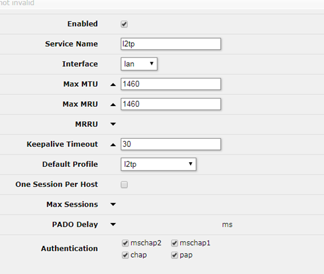

**1.安装routeros**

vdi格式 ：VirtualBox默认创建的硬盘文件格式

vmdk格式：VMware创建的虚拟硬盘文件格式

ova格式：开放虚拟化格式

这里我们使用virtual box来创建

下载ova镜像，选择ova文件，直接导入到vbox

导入完成后，在设置中更改网络。最好选择桥接两张不同的网卡，一个做WAN，一个做LAN

**2.配置routeros**

安装完成后进入命令行界面 默认账户admin 密码空

使用 interface set ether1 name=lan 来设置接口对应的名称，方便之后管理

可以使用interface print detail查看详细的接口信息

命令可以使用tab键补全

安上图设置好LAN WAN接口，需要确定LAN WAN对应实际的网卡是不是正确，请按照interface print detail里mac来查看

RouterOS命令行与cisco这些路由设备比较像，用/可以返回上一级命令

然后使用ip address add address=192.168.10.1/24 interface=lan （IP只是例子）来设置lan接口的ip地址，

最好与PC同一个网段，用来访问RouterOS的管理界面,WAN的地址可以先不设置，或设置为外部的网络地址

以上基础的配置完成了，接下来进入管理界面配置

使用浏览器访问192.168.10.1或者使用官网的winbox访问192.168.10.1，这里直接使用网页访问

访问直接进入以下界面

用户名密码与命令行一样

在quick set里面可以设置RouterOS的网络，就像普通的路由器那样去设置就行

至此，routeros基本设置就完成了，下面介绍搭建使用ROS搭建DHCP PPPoe L2TP PPTP

**3.搭建DHCP**

在ip-pool中增加一个地址池

进入IP->DHCP Server，add new，添加一个DHCP server，interface选择lan，Address Pool选择刚刚建的DHCP Pool其他默认，APPLY OK

进入IP->DHCP Server->Network，根据需求配置

到此步骤，DHCP服务就配置好了，在DHCP界面d或e控制dhcp开关

**4.搭建pppoe**

增加一个地址池，最好与LAN接口ip不同网段

添加PPPoE属性  进入PPP->Profiles，add new，配置如下，其余默认

进入PPPoE server配置服务器，配置如下，具体参数可自行设定

进入secret配置PPPoE账户,密码pppoe

至此PPPoE服务器搭建完毕,router会虚拟出一个pppoe接口

**5.搭建PPTP L2TP server**

配置PPTP和L2TP与PPPoE配置方法相同，先各自建立一个地址池和账号

再添加配置Profiles

配置server 在PPP  interface PPTP server

L2TP的配置如下:

搭建完如图

**6.通过配置firewall来使PPPoe PPTP L2TP客户端来连接WAN端的外网**

****

配置后

