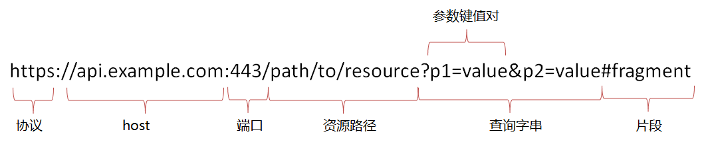

### 1.URL简介

URL（统一资源定位符）是URI（统一资源标识符）的一个子集，结构如下：



**协议protocol**: 表示当前使用的协议，如HTTP,HTTPS,FTP,WS(websocket)

**主机host**:表示server主机在网络上的地址，可以是ip或者域名

**端口post**:表示服务进程使用或监听的端口（传输层）,一般http使用80端口，https使用443端口

**资源路径path**:网络资源在服务器中的指定路径

**查询query:**由?表示查询，后面跟键值对参数，每个参数由&隔开

**片段fragment**:指定到达网页中不同的片段位置，类似书签，不会与请求一起发送到服务器

### 2.URL路由

#### 1.根URL

当使用django创建一个project时候，会创建project/urls.py，这个文件就是默认的根URL路由文件，默认内容如下

```
from django.contrib import admin
from django.urls import path

urlpatterns = [
    path('admin/', admin.site.urls),
]
```

可以在project/setttings.py中的ROOT_URLCONF配置项修改根URL配置

#### 2.URL路由处理过程

用户的请求进入django后（注意URL只是匹配path部分，参数会通过其它方法传递）

(1)找到ROOT_URLCONF的根URL配置文件

(2)从上往下匹配根URL配置文件中的urlpatterns项

(3)如果urlpatterns项有include()来转发路由，则转发到对应的URL配置去匹配

(4)如果匹配到URL，则调用其映射的视图，处理请求消息

(5)没有匹配到，或者过程中抛出了异常，则调用对应的错误处理视图

#### 3.路由转发

根URL配置只是django处理请求的入口，通常不会使用它处理所有URL，一般会在各APP中创建urls.py的APP子路由，由根URL配置统一调配

```
#--project/urls.py

from django.urls import include, path

urlpatterns = [
    # ... 省略...
    path('app1/', include('app1.urls')),
    # ... 省略 ...
]

#--app1/urls.py

from django.urls import path
from . import views
urlpatterns = [
    #匹配app1/的url
    path('', views.index),  
    #匹配app1/test1/的url
    path('test1/', views.test1)
]
```

当Django遇到include时，它会去掉URL中匹配的部分并将剩下的字符串发送给include的URLconf做进一步处理，也就是转发到子路由去

### 3.Path()方法

#### 1.参数

****path(route, view, kwargs=None, name=None)****

```
from django.urls import include, path

urlpatterns = [
    path('index/', views.index, name='main-view'),
    path('bio/<username>/', views.bio, name='bio'),
    path('articles/<slug:title>/', views.article, name='article-detail'),
    path('articles/<slug:title>/<int:section>/', views.section, name='article-section'),
    path('weblog/', include('blog.urls')),
    ...
]
```

route:匹配的URL字符串，该字符串可能包含尖括号（<username>如上所示）以捕获URL的一部分并将其作为关键字参数发送到视图。尖括号可以包括转换器规范（如int部分<int:section>），其限制匹配的字符并且还可以改变传递给视图的变量的类型。

view:视图函数或者django.urls.include()

kwargs:允许将其他参数传递给视图函数或方法

#### 2.Path转换器

默认情况下，Django内置下面的路径转换器：

- str：匹配任何非空字符串，但不含斜杠`/`，如果你没有专门指定转换器，那么这个是默认使用的；
- int：匹配0和正整数，返回一个int类型
- slug：可理解为注释、后缀、附属等概念，是url拖在最后的一部分解释性字符。该转换器匹配任何ASCII字符以及连接符和下划线，比如 building-your-1st-django-site；
- uuid：匹配一个uuid格式的对象。为了防止冲突，规定必须使用破折号，所有字母必须小写，例如075194d3-6885-417e-a8a8-6c931e272f00 。返回一个UUID对象；
- path：匹配任何非空字符串，重点是可以包含路径分隔符/。这个转换器可以帮助你匹配整个url而不是一段一段的url字符串。

#### 3.自定义转换器

其实就是写一个类，并包含下面的成员和属性：

- 类属性regex：一个字符串形式的正则表达式属性；
- to_python(self, value) 方法：value是由类属性 regex 所匹配到的字符串转化为希望的数据类型，返回到对应的视图函数中。
- to_url(self, value)方法：将Python数据类型转换为一段url的方法，上面方法的反向操作，通常用于url反向引用。

然后将这个在URLconf中注册

```
#可以新建一个converters.py文件，与urlconf同目录，写个下面的类
class FourDigitYearConverter:
    regex = '[0-9]{4}'

    def to_python(self, value):
        return int(value)

    def to_url(self, value):
        return '%04d' % value

#在URLconf 中注册

from django.urls import register_converter, path

from . import converters, views

register_converter(converters.FourDigitYearConverter, 'yyyy')

urlpatterns = [
    path('articles/2003/', views.special_case_2003),
    path('articles/<yyyy:year>/', views.year_archive),
    ...
]
```

#### 4.re_path()

****re_path(route, view, kwargs=None, name=None)****

re_path()类似django老版本的url()方法，route可以使用正则表达式来匹配。

进行匹配时，将正则表达式中捕获的组传递给视图 - 如果组已命名，则作为命名参数，否则作为位置参数。值以字符串形式传递，不进行任何类型转换。

命名式分组语法为 (?P<name>pattern) ，其中name为名称， pattern为待匹配的模式

使用re_path()前需要从 django.urls import re_path

```
from django.urls import include, re_path

urlpatterns = [
    re_path(r'^index/$', views.index, name='index'),
    re_path(r'^bio/(?P<username>\w+)/$', views.bio, name='bio'),
    re_path(r'^weblog/', include('blog.urls')),
    ...
]
```

### 4.参数传递

URL尾斜杠问题:

例如foo.com/bar 和 foo.com/bar/ 是两条不同的 URL，如果path('bar/',views.bar)，则foo.com/bar不会匹配，因为没有尾斜杠。

但是实际在浏览器中访问foo.com/bar却会调用views.bar方法，这是因为django默认如果请求URL与URLconf中的任何模式都不匹配且它不以斜杠结尾，则会向相同的URL发出HTTP重定向并附加斜杠。请注意，重定向可能导致POST请求中提交的任何数据丢失。

这个功能可以通过设置中APPEND_SLASH = False来关闭，但是该选项又没有默认在setting.py中(需要 CommonMiddleware安装)。。。所以django提倡设计url路由时加上尾斜杠
