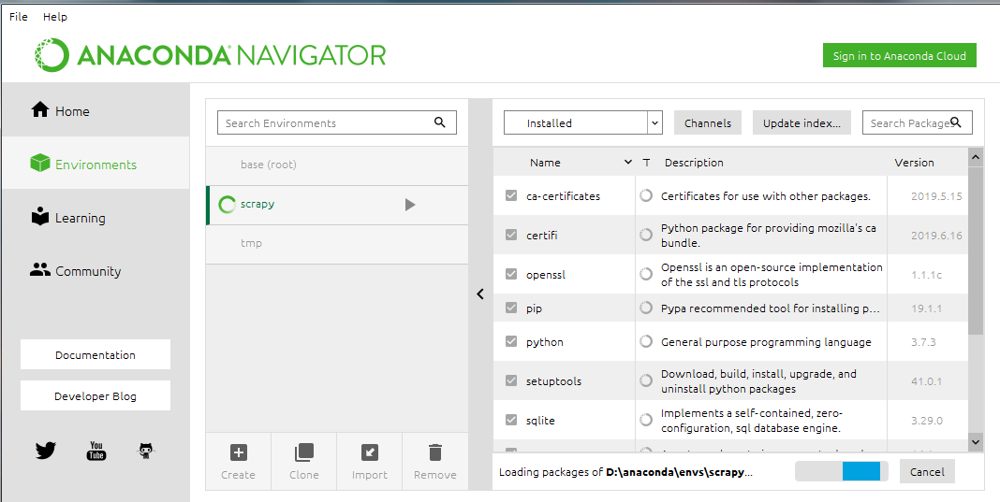
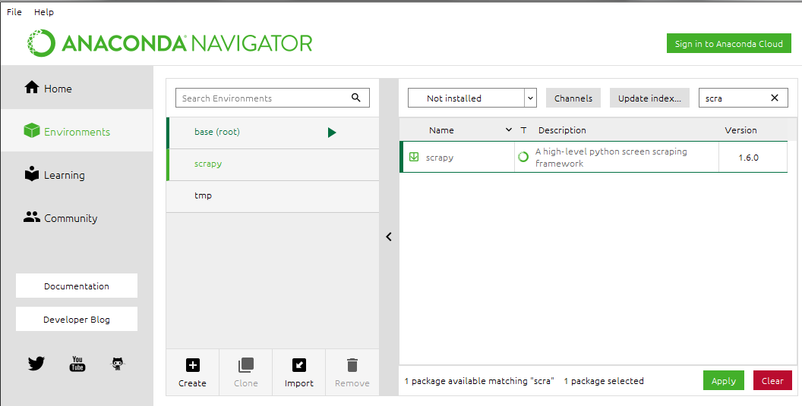

### 一.安装scrapy

由于scrapy依赖较多，建议使用虚拟环境

**windows下pip安装（不推荐）**

1.安装virtualenv

```
pip install virtualenv
```

2.在你开始项目的文件中创建虚拟环境

```
virtualenv --no-site-packages venv

#这个是创建一个比较纯净的环境，与全局的packages隔绝，即原版环境。
```

3.进入虚拟环境

```
#linux环境
source venv/bin/activate

#windows
.\venv\Scripts\activate
```

4.安装scrapy

```
pip install scrapy
```

大概率这里会报错，提示Twisted没有安装

解决办法是,先确定python的版本与32位还是64位，到这个网站[https://www.lfd.uci.edu/~gohlke/pythonlibs/#twisted](https://www.lfd.uci.edu/~gohlke/pythonlibs/#twisted)下载Twisted的whl安装

比如我python 3.6 64位就是Twisted‑19.2.1‑cp36‑cp36m‑win_amd64.whl

```
pip install Twisted‑19.2.1‑cp36‑cp36m‑win_amd64.whl
```

安装Twisted成功后再pip install scrapy，一般就会成功，**但是这里仅仅是安装成功了而已，实际运行的时候各种报错，所以不建议win环境下这种方式安装**

**Anaconda安装**

Anaconda本体安装略

1.创建Anaconda的虚拟环境(创建的虚拟环境都在Anaconda安装目录env下)

```
#查看当前虚拟环境
conda env list

#创建虚拟环境
conda create -n your_env_name python=X.X（2.7、3.6等)

#激活虚拟环境
Linux:  source activate your_env_name(虚拟环境名称)
Windows: activate your_env_name(虚拟环境名称)

#进入虚拟环境后提示符前有(your_env_name),此时安装包都是在虚拟环境中安装
conda install [package]或pip install

#没进入虚拟环境可以这样装
conda install -n your_env_name [package]即可安装package到your_env_name中

#退出环境
Linux: source deactivate
Windows: deactivate
```

2.使用Anaconda Navigator管理库与虚拟环境

Anaconda自带的界面管理



这个软件实际就是上面那些命令的可视化

3.安装scrapy

```
conda install scrapy
```

或者在Navigator中直接搜索scrapy安装



**Ubuntu安装scrapy**

```
#安装pip

sudo apt-get install python3-pip

#安装依赖

sudo apt-get install python3 python3-dev python-pip libxml2-dev libxslt1-dev zlib1g-dev libffi-dev libssl-dev

#安装scrapy

sudo pip3 install scrapy
```

### 二.Scrapy流程

1.创建项目

```
scrapy startproject tutorial
```

创建后的目录结构如下

```
tutorial/
    scrapy.cfg            #部署配置文件
    tutorial/             #项目的目录
        __init__.py
        items.py          #item文件,数据的容器,有点类似ORM的model
        middlewares.py    #中间件
        pipelines.py      #pipelines文件,用来操作处理数据
        settings.py       #项目的设置文件
        spiders/          #放置spider代码的目录
            __init__.py
```

2.在创建spiders文件下创建个xxx_spider.py 文件（文件名字可以写清楚点）,这里以官网文档的测试网址为例http://quotes.toscrape.com

```
spiders/quotes_spider.py


import scrapy


class QuotesSpider(scrapy.Spider):
    name = "quotes"

    def start_requests(self):
        urls = [
            'http://quotes.toscrape.com/page/1/',
            'http://quotes.toscrape.com/page/2/',
        ]
        for url in urls:
            yield scrapy.Request(url=url, callback=self.parse)

    def parse(self, response):
        quotes = response.css('span.text::text').getall()
        for quote in quotes:
            print(quote)
```

(1)首先导入scrapy库

(2)创建类继承scrapy.Spider

(3)类属性name是指在运行scrapy时需要指定的名字，必须是唯一的

(4)定义start_requests()方法，表示需要抓取得网页，返回给scrapy.Request去请求

(5)scrapy.Request在处理完请求后，会将Response对象传给回调函数处理[``](https://docs.scrapy.org/en/latest/topics/request-response.html#scrapy.http.TextResponse)

(6)parse()定义的一个解析函数，是scrapy.Request中指定的回调函数，传入的Response对象在这里面处理

(7)response对象css方法使用css选择器来选择元素，返回一个列表的对象SelectorList，对象Selector可以继续查找，跟BS4中的元素对象类似（span.text表示class为text的span标签）

(8)::text不是规范的css选择器，是scrapy中特有的，用于提取标签里面的数据

(9).getall()是对象Selector的方法，用于返回所有结果的列表

3.运行爬虫

```
scrapy crawl quotes
```

这里quotes就是刚刚我们爬虫文件的name

4.scrapy框架的简单流程


(1)开始爬虫，Scrapy引擎从spiders中获取请求（即URL通过spiders 中间件处理过的请求）

(2)Scrapy引擎将获取的请求通过调度器中间件存入调度器

(3)调度器决定需要下载的请求，告知引擎，Scrapy引擎获取这些待下载请求

(4)Scrapy引擎将待下载请求通过下载中间件发给下载器，由下载器处理

(5)下载器下载完毕后生成响应对象又通过下载中间件传给引擎，然后引擎再通过爬虫中间件将响应传给spiders处理

(6)以上从发出请求到收到响应实际就是示例中yield scrapy.Request(url=url, callback=self.parse)的实现

(7)spiders收到响应后，使用回调函数处理响应，如果结果不需要再请求，可以将数据传至Item Pipeline处理；如果还有新的请求就会重复以上步骤直至无请求

### 三.高级一点点

1.start_requests简写

2.sub url的爬取

从响应中获取了sub url后,按如上scrapy流程，只需将sub url传入scrapy.Request即可，官网实例如下:

```
import scrapy


class QuotesSpider(scrapy.Spider):
    name = "quotes"
    start_urls = [
        'http://quotes.toscrape.com/page/1/',
    ]

    def parse(self, response):
        for quote in response.css('div.quote'):
            yield {
                'text': quote.css('span.text::text').get(),
                'author': quote.css('small.author::text').get(),
                'tags': quote.css('div.tags a.tag::text').getall(),
            }

        next_page = response.css('li.next a::attr(href)').get()
        if next_page is not None:
            next_page = response.urljoin(next_page)
            yield scrapy.Request(next_page, callback=self.parse)
```

(1)parse中yield一个字典是可以返回给pipelines处理

(2)li.next a::attr(href) 选择表示<li class="next">标签下子元素<a>的href属性值，这里::attr与::text类似，不同是筛选元素属性的值

(3)response.urljoin()是构建完整URL的一个方法

(4)将next page的url传给scrapy.Request继续处理，得到response后，继续调用self.parse直到没有下一页

(5)yield是一个类似return 的关键字，迭代一次遇到yield的时候就返回yield后面或者右面的值。而且下一次迭代的时候，从上一次迭代遇到的yield后面的代码开始执行

3.response.follow方法

上面处理sub url使用的是先提取URL，再进行传递

response.follow()则是简化提取URL流程的方法，可以自动获取URL，比如上面可以优化为

```
#传入相对url
next_page = response.css('li.next a::attr(href)').get()
        if next_page is not None:
            yield response.follow(next_page, callback=self.parse)

#传入href的selector对象
for href in response.css('li.next a::attr(href)'):
    yield response.follow(href, callback=self.parse)

#传入a的selector对象
for a in response.css('li.next a'):
    yield response.follow(a, callback=self.parse)
```

### 四.小实战

爬取dytt最新的电影以及下载地址,spiders代码如下

```
import scrapy


class DyttSpider(scrapy.Spider):
    name = "dytt"
    start_urls = [
        'https://www.dytt8.net/',
    ]

    def parse(self, response):
        movies = response.css('div.co_content8')[0].css('td.inddline[height="22"]')[1:]
        for movie in movies:
            movie_href = movie.css("a::attr(href)")[1].get()
            yield response.follow(movie_href,callback = self.movieparse)

    def movieparse(self,response):
        yield {
            'movie_name':response.css("div.title_all font::text").get(),
            'download_link':response.css('table td[bgcolor="#fdfddf"] a::text').get()
        }
```

运行以及保存数据为csv

```
scrapy crawl dytt -o dytt.csv
```
