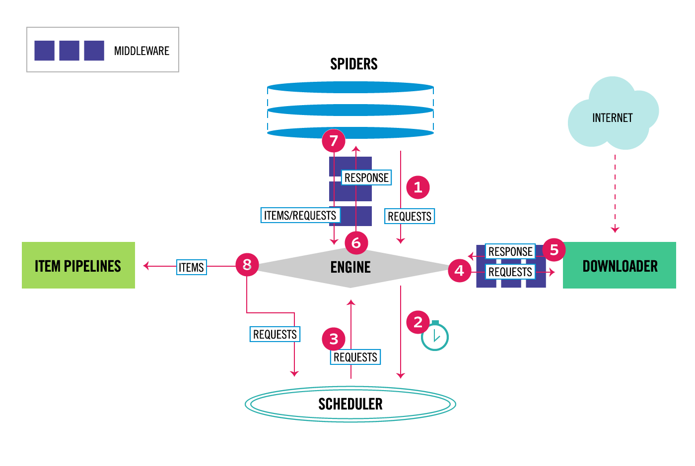

### 概述

查看scrapy官网的框架图，可以看出中间件处于几大主要组件之间，类似于生产流水线上的加工过程，将原料按照不同需求与功能加工成成品



其中4，5处于下载器与引擎之间的就是下载中间件，而spider与引擎之间的就是spider中间件。目前scrapy主要的中间件就这两个

### 下载中间件

下载器中间件是介于Scrapy的request/response处理的钩子框架，是用于全局修改Scrapy request和response的一个轻量、底层的系统。

主要作用:

- 在Scrapy将请求发送到网站之前修改,处理请求,如：更换代理ip，header等
- 在将响应传递给引擎之前处理收到的响应，如：响应失败重新请求，或将失败的做一定处理再返回给引擎
- 忽略一些响应或者请求

#### 默认下载中间件

```
{
    'scrapy.downloadermiddlewares.robotstxt.RobotsTxtMiddleware': 100,
    'scrapy.downloadermiddlewares.httpauth.HttpAuthMiddleware': 300,
    'scrapy.downloadermiddlewares.downloadtimeout.DownloadTimeoutMiddleware': 350,
    'scrapy.downloadermiddlewares.defaultheaders.DefaultHeadersMiddleware': 400,
    'scrapy.downloadermiddlewares.useragent.UserAgentMiddleware': 500,
    'scrapy.downloadermiddlewares.retry.RetryMiddleware': 550,
    'scrapy.downloadermiddlewares.ajaxcrawl.AjaxCrawlMiddleware': 560,
    'scrapy.downloadermiddlewares.redirect.MetaRefreshMiddleware': 580,
    'scrapy.downloadermiddlewares.httpcompression.HttpCompressionMiddleware': 590,
    'scrapy.downloadermiddlewares.redirect.RedirectMiddleware': 600,
    'scrapy.downloadermiddlewares.cookies.CookiesMiddleware': 700,
    'scrapy.downloadermiddlewares.httpproxy.HttpProxyMiddleware': 750,
    'scrapy.downloadermiddlewares.stats.DownloaderStats': 850,
    'scrapy.downloadermiddlewares.httpcache.HttpCacheMiddleware': 900,
}
```

如果我们要添加自定义的下载中间件，需要在settings.py中激活DOWNLOADER_MIDDLEWARES。同时想取消默认的一些中间件，也可以设置为None。注意的是激活DOWNLOADER_MIDDLEWARES并不会覆盖DOWNLOADER_MIDDLEWARES_BASE，而是继续串联起来

```
DOWNLOADER_MIDDLEWARES = {
    'myproject.middlewares.CustomDownloaderMiddleware': 543,
    'scrapy.downloadermiddlewares.useragent.UserAgentMiddleware': None,
}
```

各默认中间件的可以参考[https://doc.scrapy.org/en/latest/topics/downloader-middleware.html#built-in-downloader-middleware-reference](https://doc.scrapy.org/en/latest/topics/downloader-middleware.html#built-in-downloader-middleware-reference)

#### 自定义下载中间件

在创建项目后，再项目文件夹中有一middlewares.py文件，里面自动生成了两个中间件示例或者说模板。我们如果要自定义中间件的话，可以在给的示例上修改，或者新建类实现方法，或者继承已有的中间件重写方法

以下是下载中间件可以实现的方法，在自定义中间件时，可以根据需求实现

**1.process_request(self, request, spider)**

- 如果其返回 None ，会将处理过后的request丢给中间件链中的下一个中间件的process_request()方法处理，直到丢到下载器，由下载器下载
- 如果其返回 Response 对象，Scrapy将不会调用任何其他的 process_request() 或 process_exception() 方法，也不会丢到下载器下载；直接将其返回的response丢到中间件链的process_response()处理。可以通过**scrapy.http.Response**构建Response 
- 如果其返回 Request 对象，Scrapy则停止调用process_request方法并重新调度返回的request。当新返回的request被执行后， 相应地中间件链将会根据下载的response被调用。
- 如果其raise一个 IgnoreRequest 异常，则安装的下载中间件的 process_exception() 方法会被调用。如果没有任何一个方法处理该异常， 则request的errback(Request.errback)方法会被调用。如果没有代码处理抛出的异常， 则该异常被忽略且不记录(不同于其他异常那样)。

- 如果其返回一个 Response (可以与传入的response相同，也可以是全新的对象)， 该response会被在链中的其他中间件的 process_response() 方法处理。
- 如果其返回一个 Request 对象，则中间件链停止， 返回的request会被重新调度下载。处理类似于 process_request() 返回request所做的那样。
- 如果其抛出一个 IgnoreRequest 异常，则调用request的errback(Request.errback)。 如果没有代码处理抛出的异常，则该异常被忽略且不记录(不同于其他异常那样)。


- 如果其返回 None ，Scrapy将会继续处理该异常，接着调用已安装的其他中间件的 process_exception() 方法，直到所有中间件都被调用完毕，则调用默认的异常处理。
- 如果其返回一个 Response 对象，则已安装的中间件链的 process_response() 方法被调用。Scrapy将不会调用任何其他中间件的 process_exception() 方法。
- 如果其返回一个 Request 对象， 则返回的request将会被重新调用下载。这将停止中间件的 process_exception() 方法执行，就如返回一个response的那样。


参数:

　　crawler（Crawlerobject）- 使用此中间件的爬网程序

#### 设置随机UA中间件

```
user_agent_list = [
    "Mozilla/5.0 (Windows NT 6.1; WOW64) AppleWebKit/537.1 "
    "(KHTML, like Gecko) Chrome/22.0.1207.1 Safari/537.1",
    "Mozilla/5.0 (X11; CrOS i686 2268.111.0) AppleWebKit/536.11 "
    "(KHTML, like Gecko) Chrome/20.0.1132.57 Safari/536.11",
    "Mozilla/5.0 (Windows NT 6.1; WOW64) AppleWebKit/536.6 "
    "(KHTML, like Gecko) Chrome/20.0.1092.0 Safari/536.6",
    "Mozilla/5.0 (Windows NT 6.2) AppleWebKit/536.6 "
    "(KHTML, like Gecko) Chrome/20.0.1090.0 Safari/536.6",
    "Mozilla/5.0 (Windows NT 6.2; WOW64) AppleWebKit/537.1 "
    "(KHTML, like Gecko) Chrome/19.77.34.5 Safari/537.1",
    "Mozilla/5.0 (X11; Linux x86_64) AppleWebKit/536.5 "
    "(KHTML, like Gecko) Chrome/19.0.1084.9 Safari/536.5"
]

class UserAgent_Middleware():
    def process_request(self, request, spider):
        ua = random.choice(user_agent_list)
        request.headers['User-Agent'] = ua
```

或者使用faker大魔王

```
from faker import Faker

class UserAgent_Middleware():

    def process_request(self, request, spider):
        f = Faker()
        ua = f.firefox()
        request.headers['User-Agent'] = ua
```

#### 设置代理中间件

```
proxy_list=[
    "http://180.76.154.5:8888",
    "http://14.109.107.1:8998",
    "http://106.46.136.159:808",
    "http://175.155.24.107:808",
    "http://124.88.67.10:80",
    "http://124.88.67.14:80",
    "http://58.23.122.79:8118",
    "http://123.157.146.116:8123",
    "http://124.88.67.21:843",
    "http://106.46.136.226:808",
    "http://101.81.120.58:8118",
    "http://180.175.145.148:808"]
class proxy_Middleware(object):

    def process_request(self,request,spider):
        proxy = random.choice(proxy_list)
        request.meta['proxy'] = proxy
```

至于代理池，可以自己爬取，或者github上查找，或者编写一套可替换可检查可用性的代理池脚本存在文件或者数据库中

#### 集成selenium

```
from selenium import webdriver
from scrapy.http import HtmlResponse
import time

class SeleniumMiddleware(object):
    def __init__(self):
        self.driver = webdriver.Chrome()

    def process_request(self, request, spider):
        self.driver.get(request.url)
        time.sleep(2)
        body = self.driver.page_source
        return HtmlResponse(self.driver.current_url,
                           body=body,
                           encoding='utf-8',
                           request=request)
```

当然不是每一个spider都要用selenium，那样会很慢，可以在spider里的custom_settings单独激活这个中间件，selenium的用法会在其他文章讲述

#### 重试中间件

```
from scrapy.downloadermiddlewares.retry import RetryMiddleware
from scrapy.utils.response import response_status_message


class CustomRetryMiddleware(RetryMiddleware):
    

    def process_response(self, request, response, spider):
    
        if request.meta.get('dont_retry', False):
            return response
        if response.status in self.retry_http_codes:
            reason = response_status_message(response.status)
            #如果返回了[500, 502, 503, 504, 522, 524, 408]这些code，换个proxy试试
            proxy = random.choice(proxy_list)
            request.meta['proxy'] = proxy
            return self._retry(request, reason, spider) or response
            
        return response
    
    #RetryMiddleware类里有个常量，记录了连接超时那些异常
    #EXCEPTIONS_TO_RETRY = (defer.TimeoutError, TimeoutError, DNSLookupError,
    #                       ConnectionRefusedError, ConnectionDone, ConnectError,
    #                       ConnectionLost, TCPTimedOutError, ResponseFailed,
    #                       IOError, TunnelError)
    def process_exception(self, request, exception, spider):
        if isinstance(exception, self.EXCEPTIONS_TO_RETRY) and not request.meta.get('dont_retry', False):
            #这里可以写出现异常那些你的处理            
            proxy = random.choice(proxy_list)
            request.meta['proxy'] = proxy
            time.sleep(random.randint(3, 5))
            return self._retry(request, exception, spider)
    #_retry是RetryMiddleware中的一个私有方法，主要作用是
    #1.对request.meta中的retry_time进行+1 
    #2.将retry_times和max_retry_time进行比较，如果前者小于等于后者，利用copy方法在原来的request上复制一个新request，并更新其retry_times，并将dont_filter设为True来防止因url重复而被过滤。
    #3.记录重试reason
```

### spider中间件

主要作用：

- 处理spider的异常
- 对item在进入管道之前操作
- 根据引擎传入的响应，再进入回调函数前先处理

#### 默认spider中间件

```
{
    'scrapy.spidermiddlewares.httperror.HttpErrorMiddleware': 50,
    'scrapy.spidermiddlewares.offsite.OffsiteMiddleware': 500,
    'scrapy.spidermiddlewares.referer.RefererMiddleware': 700,
    'scrapy.spidermiddlewares.urllength.UrlLengthMiddleware': 800,
    'scrapy.spidermiddlewares.depth.DepthMiddleware': 900,
}
```

同理，激活中间件

```
SPIDER_MIDDLEWARES = {
    'myproject.middlewares.CustomSpiderMiddleware': 543,
    'scrapy.spidermiddlewares.offsite.OffsiteMiddleware': None,
}
```

#### 自定义spider中间件

**1.process_spider_input(self, response, spider)**

对于通过spider中间件并进入spider的每个响应，都会调用此方法进行处理。

- 如果它返回None，Scrapy将继续处理此响应，执行所有其他中间件，直到最后，响应被交给spider进行处理。
- 如果它引发异常，Scrapy将不会调用任何其他spider中间件的process_spider_input()，将调用请求errback(如果有的话)，否则它将进入process_spider_exception()链

参数： 　　response（Responseobject） - 正在处理的响应　　spider（Spiderobject） - 此响应所针对的spider

**2.process_spider_output(self, response, result, spider)**

在处理完响应之后，使用Spider返回的结果调用此方法。

参数： 　　response（Responseobject） - 从spider生成此输出的响应　　result（可迭代的Request，dict或Item对象） - spider返回的结果　　spider（Spiderobject） - 正在处理其结果的spider

**3.process_spider_exception(self, response, exception, spider)**

当spider或process_spider_output() 方法（来自先前的spider中间件）引发异常时，将调用此方法。

- 如果它返回None，Scrapy将继续处理此异常，执行process_spider_exception()以下中间件组件中的任何其他组件，直到没有剩余中间件组件并且异常到达引擎（它被记录并丢弃）。
- 如果它返回一个iterable，那么process_spider_output()管道将从下一个spider中间件开始启动，并且不会process_spider_exception()调用其他任何一个 。


参数： 　　response（Responseobject） - 引发异常时正在处理的响应　　exception（异常对象） - 引发异常　　spider（Spiderobject） - 引发异常的spider

**4.process_start_requests(self, start_requests, spider)**

当spider运行到start_requests()的时候，爬虫中间件的process_start_requests()方法被调用

它接收一个iterable（在start_requests参数中）并且必须返回另一个可迭代的Request对象。

参数： start_requests（可迭代Request） - 开始请求spider（Spiderobject） - 启动请求所属的spider

**5.from_crawler(cls, crawler)**

这个类方法通常是访问settings和signals的入口函数

#### spider中间件总结

1.spider开始start_requests()的时候，spider中间件的process_start_requests()方法被调用

2.下载response成功后，返回到spider 回调函数parse前，调用process_spider_input()

3.当spider yield scrapy.Request()或者yield item的时候，spider中间件的process_spider_output()方法被调用。

4.当spider出现了Exception的时候，spider中间件的process_spider_exception()方法被调用。

### 中间件与spider的关系流程图


