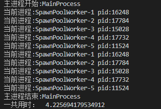
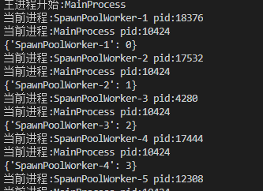

### 概述

由于python中全局解释器锁（GIL）的存在，所以python多线程并不能有效利用CPU多核的性能（相当于单核并发）实现多线程多核并行，所以在对CPU密集型的程序时处理效率较低，反而对IO密集型的才有效率的大幅度提高。

如果想要充分地使用多核CPU的资源，需要使用多进程，python中提供multiprocessing实现。

**CPU密集型**：主要特点是需要进行大量的计算，消耗CPU资源，比如计算圆周率、对视频进行高清解码等等，全靠CPU的运算能力。这种计算密集型任务虽然也可以用多任务完成，但是任务越多，花在任务切换的时间就越多，CPU执行任务的效率就越低，所以，要最高效地利用CPU，计算密集型任务同时进行的数量应当等于CPU的核心数。

**IO密集型**：主要涉及到网络、磁盘IO的任务都是IO密集型任务，这类任务的特点是CPU消耗很少，任务的大部分时间都在等待IO操作完成（因为IO的速度远远低于CPU和内存的速度）。对于IO密集型任务，任务越多，CPU效率越高，但也有一个限度。常见的大部分任务都是IO密集型任务，比如Web应用。

所以python在多线程处理CPU密集型程序时可以选择多进程实现，有效的利用多核提升效率；而IO密集型的由于99%的时间都花在IO上，花在CPU上的时间很少，所以多线程也能提高很大效率

### Process对象

multiprocessing.Process类类似于threading.Thread，涉及参数以及属性方法如下

**multiprocessing.Process(group=None, target=None, name=None, args=(), kwargs={}, *, daemon=None)**

参数

- group 应该始终是 None，它仅用于兼容 threading.Thread
- target 是由 run() 方法调用的可调用对象，它默认为 None ，意味着什么都没有被调用
- name 是进程名称
- args 是目标调用的参数元组
- kwargs 是目标调用的关键字参数字典
- daemon 表是否为守护进程，为 True 或 False

方法

- run() 表示进程活动的方法。
- start() 启动进程活动。每个进程对象最多只能调用一次
- join([timeout])  如果可选参数 timeout 是 None （默认值），则该方法将阻塞，直到调用 join() 方法的进程终止。简单说哪个子进程调用了join方法，主进程就要等该子进程执行完后才能继续向下执行
- is_alive() 返回进程是否还活着

属性

- pid 返回进程ID
- name 进程的名称
- daemon 进程的守护标志，一个布尔值
- exitcode 子进程退出代码。如果进程尚未终止，这将是 None 。

### 创建多进程

类似与多线程，创建方式都是差不多的

1.通过函数方式创建

```
import multiprocessing
import time


def run(sec):
    print('这是进程名字', multiprocessing.current_process().name)
    print('这是进程PID', multiprocessing.current_process().pid)
    time.sleep(sec)


if __name__ == '__main__':

    print('这是主进程名字：', multiprocessing.current_process().name)
    print('这是主进程PID：', multiprocessing.current_process().pid)
    s_time = time.time()
    p1 = multiprocessing.Process(target=run, args=(1,))
    p2 = multiprocessing.Process(target=run, args=(2,))
    p3 = multiprocessing.Process(target=run, args=(3,))
    p1.start()
    p2.start()
    p3.start()
    p1.join()
    p2.join()
    p3.join()
    print('主进程结束', multiprocessing.current_process().name)
    print('一共用时', time.time()-s_time)
```

2.通过类来创建

```
import multiprocessing
import time


class MyProcess(multiprocessing.Process):

    def __init__(self, sec):
        super(MyProcess, self).__init__()
        self.sec = sec

    def run(self):
        print('这是进程名字', multiprocessing.current_process().name)
        print('这是进程PID', multiprocessing.current_process().pid)
        time.sleep(self.sec)


if __name__ == '__main__':

    print('这是主进程名字：', multiprocessing.current_process().name)
    print('这是主进程PID：', multiprocessing.current_process().pid)
    s_time = time.time()
    p1 = MyProcess(1)
    p2 = MyProcess(2)
    p3 = MyProcess(3)
    p1.start()
    p2.start()
    p3.start()
    p1.join()
    p2.join()
    p3.join()
    print('主进程结束', multiprocessing.current_process().name)
    print('一共用时', time.time()-s_time)
```

### 进程间通信

进程是资源（CPU、内存等）分配的最小单位，每个进程有独立的地址空间与系统资源，每启动一个新的进程相当创建全局变量的一份副本，子进程里的数据修改无法影响到主进程以及其他子进程中的数据，不同子进程之间的数据也不能共享，这是多进程与多线程最明显的区别

示例如下

```
import multiprocessing
import time

tmp = 0

class MyProcess(multiprocessing.Process):

    def __init__(self, q):
        super(MyProcess, self).__init__()
        self.q = q

    def run(self):
        global tmp
        tmp = tmp+self.q
        print('进程%s,tmp值为%d'%(multiprocessing.current_process().name,tmp))


if __name__ == '__main__':

    p1 = MyProcess(1)
    p2 = MyProcess(2)
    p1.start()
    p2.start()
    p1.join()
    p2.join()
    print('主进程%s,tmp值为%d'%(multiprocessing.current_process().name,tmp))
```

输出为：

**进程MyProcess-1,tmp值为1****进程MyProcess-2,tmp值为2****主进程MainProcess,tmp值为0**

所以多进程之间数据独立，通过id(tmp)也可以看出。但是对文件file这种存储在硬盘中的资源读写操作，或者一些通过multiprocessing 下 Value, Array创建的共享变量，对于这些资源进程之间会存在竞争，如果要避免多进程访问这种共享资源出现冲突，会使用进程锁的方式

共享内存的创建如下，具体方法这里省略

```
from multiprocessing import Process, Value, Array

def f(n, a):
    n.value = 3.1415927
    for i in range(len(a)):
        a[i] = -a[i]

if __name__ == '__main__':
    num = Value('d', 0.0)
    arr = Array('i', range(10))

    p = Process(target=f, args=(num, arr))
    p.start()
    p.join()

    print(num.value)
    print(arr[:])
```

#### 进程锁

进程锁可以避免因为多个进程访问共享资源而发生冲突，这里的共享资源不是像多线程中那样的全局变量，上面已经说了普通的全局变量不会在进程间共享，而是系统中的文件或者console输出这类系统的资源，还有特别的能在进程间通信的共享内存资源，这些能被进程竞争。

这里以文件为例，因为同一时间，只能有一个进程，对文件进行写入操作，这是操作系统的设定。同时由操作系统随机决定哪个进程来写入操作

```
from multiprocessing import Process, Lock   # 导入进程锁

def f1(l,num):
    l.acquire()    # 加锁
    f = open("file.txt", "a+")
    i = 10000
    while i > 0:
        f.write("hello word %s\n" % i)
        i -= 1
    print("process", num)
    f.close()
    l.release()   # 释放锁


def f2(l,num):
    l.acquire()    # 加锁
    f = open("file.txt", "a+")
    i = 10000
    while i > 0:
        f.write("hello best word %s\n" % i)
        i -= 1
    print("process", num)
    f.close()
    l.release()   # 释放锁


if __name__ == "__main__":
    lock = Lock()     # 定义锁
    p1 = Process(target=f1, args=(lock, 1,))
    p2 = Process(target=f2, args=(lock, 2,))
    p1.start()
    p2.start()
    p1.join()
    p2.join()
```

没有加锁的时候，会发现文档中一个进程写到一半，另一个进程的数据也写入，是乱序的（可以将锁去掉试试，这里不给出代码了）

加了锁后就会是正常一个进程写完，再另一个进程继续写入

#### 进程队列Queue

Queue是多进程安全的队列，可以使用Queue实现多进程之间的数据传递。

与线程中使用的队列Queue区别：

1.from queue import Queue：是一种队列模型数据结构，类似于普通列表，有先进先出模式，堆栈模式，优先级模式等

2.from multiprocessing import Queue：是多进程并发的Queue队列，用于解决多进程间的通信问题。可以将对象序列化传递再进程间，普通Queue实现不了。

主要方法还是get()与put()

**put(obj[, block[, timeout]])**：将对象放入队列。如果blocked为True（默认值），并且timeout为正值，该方法会阻塞timeout指定的时间，直到该队列有剩余的空间。如果超时，会抛出Queue.Full异常。如果blocked为False，但该Queue已满，会立即抛出Queue.Full异常。

**get([block[, timeout]])**：从队列取出一个对象，如果blocked为True（默认值），并且timeout为正值，那么在等待时间内没有取到任何元素，会抛出Queue.Empty异常。如果blocked为False，有两种情况存在，如果Queue有一个值可用，则立即返回该值，否则，如果队列为空，则立即抛出Queue.Empty异常。

**close()：** 指示当前进程将不会再往队列中放入对象。一旦所有缓冲区中的数据被写入管道之后，后台的线程会退出。这个方法在队列被gc回收时会自动调用。

```
from multiprocessing import Process,Queue

class book():
    Storage = False

    def __init__(self,name):
        self.name = name
    
    def storagebook(self):
        Storage = True
        print("%s has storaged"%self.name)

def worker1(q):
    n = 1
    while n < 10:
        q.put(book("book-%d"%n))
        n+=1

def worker2(q):
    while True:
        #qsize()返回队列长度
        if q.qsize() != 0:
            q.get().storagebook()
        else:
            break

if __name__ == "__main__":
    q = Queue()
    p1 = Process(target=worker1, args=(q,))
    p2 = Process(target=worker2, args=(q,))
    p1.start() #这里先启动生产书的进程
    p2.start()
    p1.join()
    p2.join()
```

#### 管道Pipe

通过multiprocessing.Pipe([duplex])会返回(conn1, conn2)一对Connection对象，代表一个管道的两个端。

Connection对象方法主要有：

- **send(obj)** 将一个对象发送到连接的另一端，可以用 recv() 读取。发送的对象必须是可以序列化的，过大的对象 ( 接近 32MiB+ ，这个值取决于操作系统 ) 有可能引发 ValueError 异常。
- **recv()** 返回一个由另一端使用 send()发送的对象。该方法会一直阻塞直到接收到对象。 如果对端关闭了连接或者没有东西可接收，将抛出 EOFError 异常。
- **close()** 关闭连接对象。当连接对象被垃圾回收时会自动调用。
- **poll([timeout])** 返回连接对象中是否有可以读取的数据。如果未指定 timeout ，此方法会马上返回。如果 timeout 是一个数字，则指定了最大阻塞的秒数。如果 timeout 是 None  ，那么将一直等待，不会超时。

```
from multiprocessing import Process,Pipe

class book():
    Storage = False

    def __init__(self,name):
        self.name = name
    
    def storagebook(self):
        Storage = True
        print("%s has storaged"%self.name)

def worker1(p):
    n = 1
    while n < 10:
        p.send(book("book-%d"%n))
        n+=1
    p.close()

def worker2(p):
    while True:
        if p.poll():  #判断还有没有数据
            p.recv().storagebook()
        else:
            break

if __name__ == "__main__":
    conn1, conn2 = Pipe(duplex=False)
    p1 = Process(target=worker1, args=(conn2,))
    p2 = Process(target=worker2, args=(conn1,))
    p1.start() #这里先启动生产书的进程
    p2.start()
    p1.join()
    p2.join()
```

### 进程池Pool

可以使用multiprocessing.Pool实现简单的多进程任务，进程池事先划分系统资源，并将资源分配给池中的进程，这些进程是创建Pool对象时已经创建及初始化好了的。当我们想创建新的进程任务时，新建的任务就可以直接取得Pool中的进程资源，而不用动态的从系统获取新的资源。如果进程池中没有可用的进程资源时，程序就会等待。

- apply(): 直到得到结果之前一直阻塞。同步操作
- apply_async(): 这是 apply() 方法的一个变体，返回的是一个result对象。这是一个异步的操作，在所有的子类执行之前不会锁住主进程。
- map(): 这是内置的 map() 函数的并行版本。在得到结果之前一直阻塞，此方法将可迭代的数据的每一个元素作为进程池的一个任务来执行。
- map_async(): 这是 map() 方法的一个变体，返回一个result对象。如果指定了回调函数，回调函数应该是callable的，并且只接受一个参数。当result准备好时会自动调用回调函数（除非调用失败）。回调函数应该立即完成，否则，持有result的进程将被阻塞。

#### 简单使用进程池

```
import multiprocessing
from multiprocessing import Process, Pool
import time


def func(sec):
    time.sleep(sec)
    print('当前进程:%s pid:%d' % (multiprocessing.current_process().name,
                              multiprocessing.current_process().pid))


if __name__ == '__main__':
    print('主进程开始:%s' % multiprocessing.current_process().name)
    s_time = time.time()
    p = Pool(5)      # 创建pool对象，5表示池中创建5个进程
    for i in range(10):
        p.apply_async(func, args=(2,))

    p.close()  # 关闭进程池，防止将任何其他任务提交到池中。需要在join之前调用，否则会报ValueError: Pool is still running错误
    p.join()    # 等待进程池中的所有进程执行完毕

    print('主进程结束:%s' % multiprocessing.current_process().name)
    print('一共用时： ', time.time()-s_time)
```

打印结果如下



可以看到我们创建的任务实际是用进程池里面的进程资源

#### 使用callback

进程池中回调函数callback作用是：进程池中任何一个任务一旦处理完了，就立即告知主进程，主进程则调用一个函数去处理该结果，该函数即回调函数

使用callback的好处是可以将耗时的任务放在子进程中，等子进程有结果时再去通知主进程处理，实际就是异步操作的实现

把上面的例子改一下

```
import multiprocessing
from multiprocessing import Process, Pool
import time


def func(sec):
    time.sleep(1)  # sleep一秒是为了模拟阻塞的情况
    print('当前进程:%s pid:%d' % (multiprocessing.current_process().name,
                              multiprocessing.current_process().pid))
    return {multiprocessing.current_process().name: sec}


def func2(res):
    print('当前进程:%s pid:%d' % (multiprocessing.current_process().name,
                              multiprocessing.current_process().pid))
    print(res)


if __name__ == '__main__':
    print('主进程开始:%s' % multiprocessing.current_process().name)
    s_time = time.time()
    p = Pool(5)      # 创建pool对象，5表示池中创建5个进程
    for i in range(10):
        p.apply_async(func, args=(i,), callback=func2)  # 使用callback

    p.close()  # 关闭进程池，防止将任何其他任务提交到池中。需要在join之前调用，否则会报ValueError: Pool is still running错误
    p.join()    # 等待进程池中的所有进程执行完毕

    print('主进程结束:%s' % multiprocessing.current_process().name)
    print('一共用时： ', time.time()-s_time)
```

打印结果如下



#### AsyncResult对象

由Pool.apply_async()和Pool.map_async()返回的result实例对象的类，主要方法有

- 
- get():返回结果，如果有必要则等待结果到达。timeout是可选的。如果在指定时间内还没有到达，将引发multiprocessing.TimeoutError。
- ready():如果调用完成，返回True
- successful():如果调用完成且没有引发异常，返回True，如果在结果就绪之前调用此方法，引发AssertionError异常
- wait([timeout]):等待结果变为可用。

示例如下

```
import multiprocessing
from multiprocessing import Process, Pool
import time


def func(sec):
    time.sleep(sec)
    print('当前进程:%s pid:%d' % (multiprocessing.current_process().name,
                              multiprocessing.current_process().pid))
    return {multiprocessing.current_process().name: sec}

if __name__ == '__main__':
    print('主进程开始:%s' % multiprocessing.current_process().name)
    s_time = time.time()
    p = Pool(5)      # 创建pool对象，5表示池中创建5个进程
    result = []
    for i in range(10):
        result.append(p.apply_async(func, args=(i,)))

    p.close()  # 关闭进程池，防止将任何其他任务提交到池中。需要在join之前调用，否则会报ValueError: Pool is still running错误
    p.join()    # 等待进程池中的所有进程执行完毕
    for res in result:
        print(res.get()) #get()获取返回值

    print('主进程结束:%s' % multiprocessing.current_process().name)
    print('一共用时： ', time.time()-s_time)
```

与使用callback不同的是，这个需要子进程都结束后，才能在主进程中处理

#### map用法

进程池中map()方法等价于内置函数map(func, *iterables)，也是一种创建进程任务的简化方法

内置函数map()是对iterables依次执行func(item)，将执行结果组成一个 List 返回（python2是list，python3是map对象）

进程池中map()则是返回list，而map_async()返回的是AsyncResult的变体，要通过get()得到list

```
import multiprocessing
from multiprocessing import Process, Pool
import time


def func(sec):
    time.sleep(sec)
    print('当前进程:%s pid:%d' % (multiprocessing.current_process().name,
                              multiprocessing.current_process().pid))
    return {multiprocessing.current_process().name: sec}


if __name__ == '__main__':
    print('主进程开始:%s' % multiprocessing.current_process().name)
    s_time = time.time()
    p = Pool(5)
    result = p.map_async(func, range(10))  # map创建任务

    p.close()
    p.join()
    for res in result.get():  # map对象使用get方法返回list
        print(res)
    print(result.get())
    print('主进程结束:%s' % multiprocessing.current_process().name)
    print('一共用时： ', time.time()-s_time)
```

参考:[https://docs.python.org/zh-cn/3/library/multiprocessing.html](https://docs.python.org/zh-cn/3/library/multiprocessing.html) 以及部分网上资料
