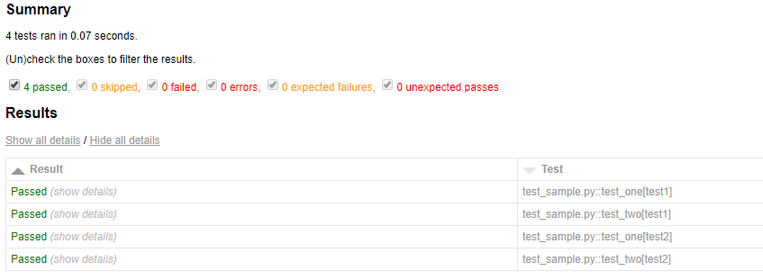
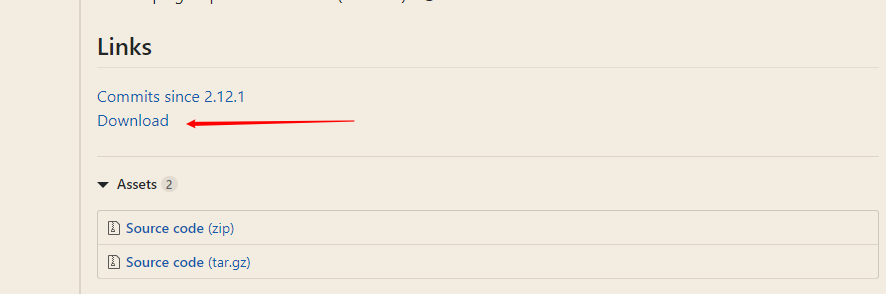
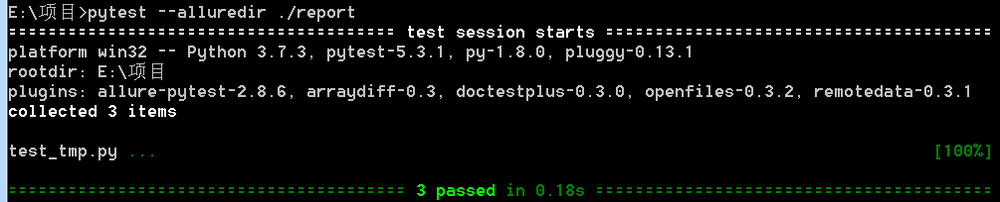
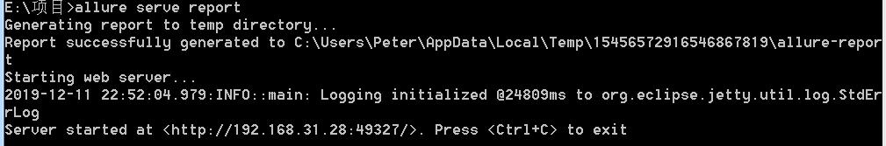
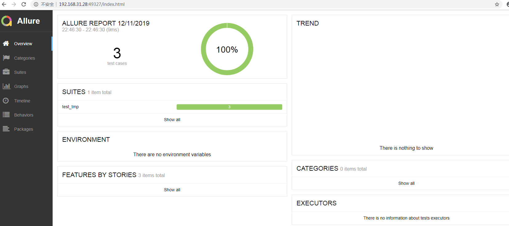

### 简介

安装

```
pip install pytest
```

简单上手，创建个test_sample.py文件

```
def func(x):
    return x + 1

def test_answer():
    assert func(3) == 5
```

运行测试，直接在当前文件夹运行pytest

```
collected 1 item

test_sample.py F                                                     [100%]

================================= FAILURES =================================
_______________________________ test_answer ________________________________

    def test_answer():
>       assert func(3) == 5
E       assert 4 == 5
E        +  where 4 = func(3)

test_sample.py:6: AssertionError
============================ 1 failed in 0.12s =============================
```

以类来封装用例

```
# content of test_class.py
class TestClass:
    def test_one(self):
        x = "this"
        assert "h" in x

    def test_two(self):
        x = "hello"
        assert hasattr(x, "check")
```

运行可以使用pytest [file_path]指定文件，-q是静默模式，不会打印用例输出

```
$ pytest -q test_class.py
.F                                                                   [100%]
================================= FAILURES =================================
____________________________ TestClass.test_two ____________________________

self = <test_class.TestClass object at 0xdeadbeef>

    def test_two(self):
        x = "hello"
>       assert hasattr(x, "check")
E       AssertionError: assert False
E        +  where False = hasattr('hello', 'check')

test_class.py:8: AssertionError
1 failed, 1 passed in 0.12s
```

用例设计原则

- 文件名以test_*.py文件和*_test.py
- 以test_开头的函数
- 以Test开头的类
- 以test_开头的方法
- 所有的包pakege必须要有__init__.py文件

### 执行用例

1.执行某个目录下所有的用例

```
pytest 文件名/
```

2.执行某一个py文件下用例

```
pytest 脚本名称.py
```

3.-k 按关键字匹配

```
pytest -k "MyClass and not method"
```

这将运行包含与给定字符串表达式匹配的名称的测试，其中包括Python使用文件名，类名和函数名作为变量的运算符。 上面的例子将运行TestMyClass.test_something但不运行TestMyClass.test_method_simple

4.按节点运行

每个收集的测试都分配了一个唯一的nodeid，它由模块文件名和后跟说明符组成来自参数化的类名，函数名和参数，由:: characters分隔。

运行.py模块里面的某个函数

```
pytest test_mod.py::test_func
```

运行.py模块里面,测试类里面的某个方法

```
pytest test_mod.py::TestClass::test_method
```

5.标记表达式

```
pytest -m slow
```

将运行用@ pytest.mark.slow装饰器修饰的所有测试，slow是自己命名的标记，可以自定义

```
import pytest

@pytest.mark.finished
def test_send_http():
    pass  


def test_something_quick():
    pass
```

运行测试时使用-m选项可以加上逻辑

```
>pytest -m "finished and commit"   //匹配finished和commit运行

>pytest -m "finished and not merged"  //finished运行，merged不运行
```

6.从包里面运行

```
pytest --pyargs pkg.testing
```

这将导入pkg.testing并使用其文件系统位置来查找和运行测试。

7.在第一个（或N个）失败后停止

```
pytest -x            # stop after first failure
pytest --maxfail=2    # stop after two failures
```

8.跳过测试

使用pytest.mark.skip标记需要跳过的用例

```
@pytest.mark.skip(reason="not finished")
def test_send_http():
    pass 
```

也支持使用 pytest.mark.skipif 为测试函数指定被忽略的条件

```
@pytest.mark.skipif(finishflag==Fasle,reason="not finished")
def test_send_http():
    pass 
```

9.脚本调用执行

```
直接使用

pytest.main()

像命令行一样传递参数

pytest.main(["-x", "mytestdir"])
```

### 用例编写

#### 断言

```
def f():
    return 3

def test_function():
    assert f() == 4
```

断言中添加消息

```
assert a % 2 == 0, "value was odd, should be even"
```

#### 预设与清理

与unittest中的setup和teardown类似，pytest也有这样的环境清理方法，主要有

<li>
模块级（setup_module/teardown_module）开始于模块始末，全局的
</li>
<li>
函数级（setup_function/teardown_function）只对函数用例生效（不在类中）
</li>
<li>
类级（setup_class/teardown_class）只在类中前后运行一次(在类中)
</li>
<li>
方法级（setup_method/teardown_method）开始于方法始末（在类中）
</li>
<li>
类里面的（setup/teardown）运行在调用方法的前后
</li>

```
import pytest

class TestClass:
    
    def setup_class(self):
        print("setup_class：类中所有用例执行之前")

    def teardown_class(self):
        print("teardown_class：类中所有用例执行之前")

    def setup_method(self):
        print("setup_method:  每个用例开始前执行")

    def teardown_method(self):
        print("teardown_method:  每个用例结束后执行")

    def setup(self):
        print("setup: 每个用例开始前执行")

    def teardown(self):
        print("teardown: 每个用例结束后执行")

    def test_one(self):
        print("执行第一个用例")

    def test_two(self):
        print("执行第二个用例")

def setup_module():
    print("setup_module：整个.py模块只执行一次")

def teardown_module():
    print("teardown_module：整个.py模块只执行一次")

def setup_function():
    print("setup_function：每个方法用例开始前都会执行")

def teardown_function():
    print("teardown_function：每个方法用例结束前都会执行")

def test_three():
        print("执行第三个用例")
```

使用pytest -s test_sample.py运行，-s参数是为了显示用例的打印信息，下面是输出，可以看出几个方法之间的优先级

```
test_sample.py setup_module：整个.py模块只执行一次
setup_class：类中所有用例执行之前
setup_method:  每个用例开始前执行
setup: 每个用例开始前执行
执行第一个用例
.teardown: 每个用例结束后执行
teardown_method:  每个用例结束后执行
setup_method:  每个用例开始前执行
setup: 每个用例开始前执行
执行第二个用例
.teardown: 每个用例结束后执行
teardown_method:  每个用例结束后执行
teardown_class：类中所有用例执行之前
setup_function：每个方法用例开始前都会执行
执行第三个用例
.teardown_function：每个方法用例结束前都会执行
teardown_module：整个.py模块只执行一次
```

注意：setup_method和teardown_method的功能和setup/teardown功能是一样的，一般二者用其中一个即可；函数里面用到的setup_function/teardown_function与类里面的setup_class/teardown_class互不干涉

#### 参数化

使用pytest.mark.parametrize(argnames, argvalues)可以实现函数的参数化

```
@pytest.mark.parametrize('text',['test1','test2','test3'])
def test_one(text):
    print(text)
```

argnames就是形参名称，argvalues就是待测的一组数据

### 固件fixture

#### 基本使用

固件Fixture是一些函数，pytest 会在执行测试函数之前（或之后）加载运行它们。主要是为一些单独测试用例需要预先设置与清理的情况下使用的。

不同于上面的setup和teardown的就是，可以自定义函数，可以指定用例运行，使用方法如下

```
@pytest.fixture()
def text():
    print("开始执行")          #使用pytest.fixture()装饰一个函数成为fixture

def test_one():
    print("执行第一个用例")

def test_two(text):          #用例传入fixture函数名，以此来确认执行
    print("执行第二个用例")
```

使用yield可以实现固件的拆分运行，yield前在用例前执行，yield后再用例后执行

```
@pytest.fixture()
def text():
    print("开始执行")
    yield                 #yield 关键词将固件分为两部分，yield 之前的代码属于预处理，会在测试前执行；yield 之后的代码属于后处理，将在测试完成后执行
    print("执行完毕")

def test_one():
    print("执行第一个用例")

def test_two(text):
    print("执行第二个用例")
```

#### 统一管理

固件可以直接定义在各测试脚本中，就像上面的例子。更多时候，我们希望一个固件可以在更大程度上复用，这就需要对固件进行集中管理。Pytest 使用文件 conftest.py 集中管理固件。

不用显式调用 conftest.py，pytest 会自动调用，可以把 conftest 当做插件来理解

```
./conftest.py

@pytest.fixture()
def text():
    print("开始执行")
    yield
    print("执行完毕")

./test_sample.py

def test_one():
    print("执行第一个用例")

def test_two(text):
    print("执行第二个用例")
```

#### 作用域

fixture可以通过 scope 参数声明作用域，比如

- function: 函数级，每个测试函数都会执行一次固件；
- class: 类级别，每个测试类执行一次，所有方法都可以使用；
- module: 模块级，每个模块执行一次，模块内函数和方法都可使用；
- session: 会话级，一次测试只执行一次，所有被找到的函数和方法都可用。

```
./conftest.py

@pytest.fixture(scope="module")
def text():
    print("开始执行")
    yield
    print("执行完毕")

./test_sample.py

def test_one(text):
    print("执行第一个用例")

def test_two(text):
    print("执行第二个用例")
```

执行情况

```
test_sample.py 开始执行
执行第一个用例
.执行第二个用例
.执行完毕
```

如果对于类使用作用域，需要使用 pytest.mark.usefixtures（对函数和方法也适用）

```
./conftest.py

@pytest.fixture(scope="class")
def text():
    print("开始执行")
    yield
    print("执行完毕")

./test_sample.py

@pytest.mark.usefixtures('text')
class TestClass:

    def test_one(self):
        print("执行第一个用例")

    def test_two(self):
        print("执行第二个用例")
```

#### 自动运行

将fixture的autouse参数设置为True时，可以不用传入函数，自动运行

```
./conftest.py

@pytest.fixture(scope="module",autouse=True)
def text():
    print("开始执行")
    yield
    print("执行完毕")

./test_sample.py

def test_one():
    print("执行第一个用例")

def test_two():
    print("执行第二个用例")
```

#### 参数化

使用fixture的params参数可以实现参数化

```
./conftest.py

@pytest.fixture(scope="module",params=['test1','test2'])
def text(request):
    print("开始执行")
    yield request.param
    print("执行完毕")

./test_sample.py

def test_one(text):
    print("执行第一个用例")
    print(text)

def test_two(text):
    print("执行第二个用例")
```

固件参数化需要使用 pytest 内置的固件 request，并通过 request.param 获取参数。

结果如下

```
test_sample.py 开始执行
执行第一个用例
test1
.执行第二个用例
.执行完毕
开始执行
执行第一个用例
test2
.执行第二个用例
.执行完毕
```

### 生成报告

#### HTML报告

安装pytest-html

```
pip install pytest-html
```

使用方法是，直接在命令行pytest命令后面加--html=<文件名字或者路径>.html参数就可以了

```
pytest --html=report.html
```

结果如下



上面生成的报告包括html和一个assets文件（里面是报告CSS样式），如果要合成一个文件可以添加下面的参数

```
pytest --html=report.html --self-contained-html
```

#### XML报告

使用命令可以生成XML格式报告

```
pytest --junitxml=report.xml
```

#### allure报告

1.首先安装java环境

下载JDK  [http://www.oracle.com/technetwork/java/javase/downloads/index.html](http://www.oracle.com/technetwork/java/javase/downloads/index.html) 

安装对应系统的包，如windowsx64是xxx-windows-x64.exe

一路下一步安装就可以了

然后在环境变量中添加下面变量

```
变量名：JAVA_HOME
变量值：C:\Program Files (x86)\Java\jdk1.8.0_91        // 要根据自己的实际路径配置

变量名：CLASSPATH
变量值：.;%JAVA_HOME%\lib\dt.jar;%JAVA_HOME%\lib\tools.jar;      //记得前面有个"."

变量名：Path
变量值：%JAVA_HOME%\bin;%JAVA_HOME%\jre\bin;
```

然后再cmd中运行 **java -version**、**java**、**javac** 几个命令没有报错即可

2.安装allure

下载allure 会跳转到github，找到link下载



解压包后进入bin文件，复制路径并添加到环境变量Path中


3.pytest使用

安装插件

```
pip install allure-pytest 

如果timeout就加   --index-url https://pypi.douban.com/simple  用豆瓣源
```

进入测试py文件目录，运行

```
pytest --alluredir ./report
```

运行完成后生成report文件，-alluredir后面跟的是文件路径，可以自定义



使用allure查看报告，直接启动allure server后面加报告路径就行

```
allure serve report(报告文件夹名)
```

等一会就生成报告





参考：

[https://learning-pytest.readthedocs.io/zh/latest/index.html](https://learning-pytest.readthedocs.io/zh/latest/index.html)

[https://docs.pytest.org/en/latest/contents.html](https://docs.pytest.org/en/latest/contents.html)
