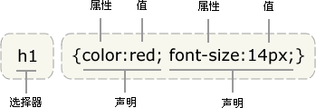
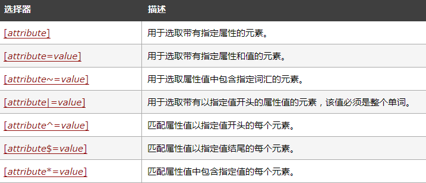

**一.简介**

CSS 指层叠样式表 (**C**ascading **S**tyle **S**heets) 

样式定义如何显示 HTML 元素

分为**外部样式表，内部样式表，内联样式**

**外部样式表:**当样式需要被应用到很多页面的时候，外部样式表将是理想的选择。使用外部样式表(.css文件)，可以通过更改一个文件来改变整个站点的外观。

```
<head>
<link rel="stylesheet" type="text/css" href="mystyle.css">
</head>
```

**内部样式表：**当单个文件需要特别样式时，就可以使用内部样式表。可以在 head 部分通过 <style> 标签定义内部样式表。

```
<head>

<style type="text/css">
body {background-color: red}
p {margin-left: 20px}
</style>
</head>
```

**内联样式:**当特殊的样式需要应用到个别元素时，就可以使用内联样式。 使用内联样式的方法是在相关的标签中使用样式属性。样式属性可以包含任何 CSS 属性。

```
<p style="color: red; margin-left: 20px">
This is a paragraph
</p>
```

**内联样式）Inline style > （内部样式）Internal style sheet >（外部样式）External style sheet > 浏览器默认样式** 

**二.语法**

CSS 规则由两个主要的部分构成：选择器，以及一条或多条声明:



选择器通常是需要改变样式的 HTML 元素。

每条声明由一个属性和一个值组成。

属性（property）是希望设置的样式属性（style attribute）。每个属性有一个值。属性和值被冒号分开。

**CSS选择器**

选择器除了元素选择器外还有id选择器，类选择器，属性选择器等等
|序号|选择器|含义
|1.|*|通用元素选择器，匹配任何元素
|2.|E|标签选择器，匹配所有使用E标签的元素
|3.|.info|class选择器，匹配所有class属性中包含info的元素
|4.|#footer|id选择器，匹配所有id属性等于footer的元素

**1.元素选择器**

最常见的 CSS 选择器是元素选择器。换句话说，文档的元素就是最基本的选择器。

如果设置 HTML 的样式，选择器通常将是某个 HTML 元素，比如 p、h1、em、a，甚至可以是 html 本身

```
html {color:black;}
h1 {color:blue;}
h2 {color:silver;}
```

可以多个元素一起设置

```
h2,h1,p {color:gray;}
```

**2.类选择器**

通过元素class属性来选择应用样式

选择所有同类的元素

```
*.class {color:red;}
或
.class {color:red;}
注意class应为类名
```

结合元素来指定选择

```
p.important {color:red;}
h1.important {color:blue;}

注意class这里名为important
```

**3.id选择器**

与类选择器类似，不过是通过id来匹配

```
*#id {font-weight:bold;}
或
#intro {font-weight:bold;}
注意id应为id名，与类区别于前面是#号
```

id选择器也可以与类选择器一样，能结合元素来独立选择，

```
实例：
<p id="intro">This is a paragraph of introduction.</p>
<p id="intro">This is a paragraph of introduction.</p>
p#intro {font-weight:bold;}
```

**4.属性选择器**

属性选择使用[]来标记，例如

```
#所有还有title属性
*[title] {color:red;}

#只对有 href 属性的锚（a 元素）应用样式
a[href] {color:red;}

#根据多个属性进行选择
a[href][title] {color:red;}

#选择有特定属性值的元素
a[href="url"] {color: red;}
```



CSS选择器在selenium定位元素也非常有用

**其它选择器详细参考[这里](http://www.w3school.com.cn/cssref/css_selectors.asp)，更详细的用法参考[这里](http://www.ruanyifeng.com/blog/2009/03/css_selectors.html)**

**三.css样式**

具体参考[http://www.w3school.com.cn/cssref/index.asp](http://www.w3school.com.cn/cssref/index.asp)

背景样式：[http://www.w3school.com.cn/css/css_background.asp](http://www.w3school.com.cn/css/css_background.asp)

文本样式：[http://www.w3school.com.cn/css/css_text.asp](http://www.w3school.com.cn/css/css_text.asp)

字体样式：[http://www.w3school.com.cn/css/css_font.asp](http://www.w3school.com.cn/css/css_font.asp)

链接样式：[http://www.w3school.com.cn/css/css_link.asp](http://www.w3school.com.cn/css/css_link.asp)

列表样式：[http://www.w3school.com.cn/css/css_list.asp](http://www.w3school.com.cn/css/css_list.asp)

表格样式：[http://www.w3school.com.cn/css/css_table.asp](http://www.w3school.com.cn/css/css_table.asp)

轮廓：[http://www.w3school.com.cn/css/css_outline.asp](http://www.w3school.com.cn/css/css_outline.asp)

摘于[https://www.runoob.com/css/css-tutorial.html](https://www.runoob.com/css/css-tutorial.html)与[http://www.w3school.com.cn/css/index.asp](http://www.w3school.com.cn/css/index.asp)
