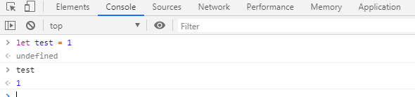

### 一.简介

JavaScript（缩写：JS）是一门高级的、解释型的动态编程语言。用于 HTML或web应用，可被浏览器直接执行。

完整的JavaScript包括以下几个部分：

- ECMAScript，描述了该语言的语法和基本对象
- 文档对象模型（DOM），描述处理**网页内容**的方法和接口
- 浏览器对象模型（BOM），描述与**浏览器**进行交互的方法和接口

JavaScript的基本特点如下：

- 是一种解释性脚本语言（代码不进行预编译）。
- 主要用来向HTML页面添加**交互行为**。
- 可以直接嵌入HTML页面，但写成单独的js文件有利于结构和行为的分离。

JavaScript常用来完成以下任务：

- 嵌入动态文本于HTML页面
- 对浏览器事件作出响应
- 读写HTML元素
- 在数据被提交到服务器之前验证数据
- 检测访客的浏览器信息
- 控制cookies，包括创建和修改等

### 二.用法

**1.嵌入HTML**

HTML 中的脚本必须位于 <script> 与 </script> 标签之间。

脚本可被放置在 HTML 页面的 <body> 和 <head> 部分中。

```
<!DOCTYPE html>
<html>
<head>
<script>
document.write("hello world");
</script>
</head>
<body>
.
<script>
document.write("hello world");
</script>
.
</body>
</html>
```

如果  <script>  放在 body 中，建议放在底部。因为浏览器会按照代码在文件中的顺序解析 HTML。如果先加载的 JavaScript 期望修改其下方的 HTML，那么它可能由于 HTML 尚未被加载而失效。所以，要将 JavaScript 代码放在 body 中，应置于 HTML 页面底部。

**2.外部js脚本**

也可以把脚本保存到外部文件中。外部文件通常包含被多个网页使用的代码。

外部 JavaScript 文件的文件扩展名是 .js。外部文件不使用 <script> 标签，直接写 javascript 代码。

如需使用外部文件，请在 <script> 标签的 "src" 属性中设置该 .js 文件：

```
<!DOCTYPE html>
<html>
<body>
<script src="xx.js"></script>
</body>
</html>
```

**3.在console调试**

可以进入浏览器中console，如chrome F12 进入console，以命令行的形式输入js命令



**4.事件触发**

把 JavaScript 代码放入函数中，在事件发生时调用该函数。

```
<button type="button" onclick="myFunction()">按钮</button>
<script>
function myFunction()
{
    alert("hello");
}
</script>
```

### 三.变量

JavaScript 使用关键字 **var** 来定义变量， 使用等号来为变量赋值

也可以使用**let**,**const**来定义，这三者的区别是：var与let涉及块级作用域，let 命令只在所在的代码块 **{}** 内有效，具体参考[这里](https://www.runoob.com/js/js-let-const.html)；const定义一个只读常量

一般用var即可，let更推荐

```
var a;   //声明
var a = 10;  //初始化
a = 20 ;   //赋值
```

注意: 在JavaScript中，所有代码指令都会以分号结尾 (`;`) 

JavaScript中**数据类型**主要有:

<th scope="row">变量</th><th scope="col">解释</th><th scope="col">示例</th>
|------
<th scope="row">String</th>|字符串（一串文本）。字符串的值必须将用引号（单双均可，必须成对）扩起来。|var name = "John";字符访问:name[0] name[1]

字符串（一串文本）。字符串的值必须将用引号（单双均可，必须成对）扩起来。

字符访问:name[0] name[1]
<th scope="row">Number</th>|数字。JavaScript 只有一种数字类型。数字可以带小数点，也可以不带|let x1=34.00;   let x2=34;  

数字。JavaScript 只有一种数字类型。数字可以带小数点，也可以不带
<th scope="row">Boolean</th>|布尔值（真 / 假）。 `true`/`false` 是 JS 里的特殊关键字，无需引号。|let x=true;let y=false;

布尔值（真 / 假）。 `true`/`false` 是 JS 里的特殊关键字，无需引号。
<th scope="row">Array</th>|数组，用于在单一引用中存储多个值的结构。|let cars=["Saab","Volvo","BMW"];元素引用方法：cars[0],cars[1]``

数组，用于在单一引用中存储多个值的结构。

元素引用方法：cars[0],cars[1]``
<th scope="row">Object</th>|对象，JavaScript 里一切皆对象，一切皆可储存在变量里。对象由花括号分隔。在括号内部，对象的属性以名称和值对的形式 (name : value) 来定义。属性由逗号分隔|let person={firstname:"John", lastname:"Doe", id:5566};let newObject = document.querySelector('h1');对象属性访问:object.AttributesName object[''AttributesName'']

对象，JavaScript 里一切皆对象，一切皆可储存在变量里。

let person={firstname:"John", lastname:"Doe", id:5566};

对象属性访问:object.AttributesName object[''AttributesName'']

算数运算符主要有:
|+ 加法 |- 减法|* 乘法|/ 除法
|% 取模|++自增 |--自减| 

比较运算符主要有:
|==等于|=== 绝对等于（值和类型均相等）|!= 不等于|!== 不绝对等于（值和类型有一个不相等，或两个都不相等）
|> 大于|< 小于|>= 大于或等于|<= 小于或等于

在常规的比较中，数据类型是被忽略的

```
var x = 10;
var y = "10";
if (x == y) //返回true，所以要用===
```

### 四.基本语法

**1.条件语句**

if 语句只有当指定条件为 true 时，该语句才会执行代码。

```
if (condition)
{
    当条件为 true 时执行的代码
}
```

使用 if....else 语句在条件为 true 时执行代码，在条件为 false 时执行其他代码。

```
if (condition)
{
    当条件为 true 时执行的代码
}
else
{
    当条件不为 true 时执行的代码
}
```

使用 if....else if...else 语句来选择多个代码块之一来执行。

```
if (condition1)
{
    当条件 1 为 true 时执行的代码
}
else if (condition2)
{
    当条件 2 为 true 时执行的代码
}
else
{
  当条件 1 和 条件 2 都不为 true 时执行的代码
}
```

三目运算

```
let variablename = (condition)?value1:value2 
condition成立则variablename = value1 否则value2
```

**2.循环语句**

JavaScript 支持不同类型的循环：

- **for** - 循环代码块一定的次数
- **for/in** - 循环遍历对象的属性
- **while** - 当指定的条件为 true 时循环指定的代码块
- **do/while** - 同样当指定的条件为 true 时循环指定的代码块

for 循环

```
for (语句 1; 语句 2; 语句 3)
{
    被执行的代码块
}

//语句 1 （代码块）开始前执行

//语句 2 定义运行循环（代码块）的条件

//语句 3 在循环（代码块）已被执行之后执行
```

for/in遍历

```
for (x in 可遍历对象)  // x 为属性名
{
    执行代码块
}
```

while 循环会在指定条件为真时循环执行代码块。

```
while (条件)
{
    需要执行的代码
}
```

do/while 循环是 while 循环的变体。该循环会在检查条件是否为真之前执行一次代码块，然后如果条件为真的话，就会重复这个循环。

```
do
{
    需要执行的代码
}
while (条件);
```

**3.函数语法**

函数就是包裹在花括号中的代码块，前面使用了关键词 function：

```
function functionname()
{
    // 执行代码
}
```

加上形参

```
function myFunction(var1,var2)
{
代码
return var3  //使用 return 语句时，函数会停止执行，并返回指定的值
}
```

匿名函数，函数存储在变量中，不需要函数名称，通常通过变量名来调用。

```
var x = function (a, b) {return a * b};
var z = x(4, 3);
```

**4.异常判断**

**try** 语句允许我们定义在执行时进行错误测试的代码块。

**catch** 语句允许我们定义当 try 代码块发生错误时，所执行的代码块。

JavaScript 语句 **try** 和 **catch** 是成对出现的。

finally 语句不论之前的 try 和 catch 中是否产生异常都会执行该代码块。

```
try {
    ...    //异常的抛出
} catch(e) {
    ...    //异常的捕获与处理
} finally {
    ...    //结束处理
}
```

### 五.面向对象

新建对象，js中对象就是实例对象，js中没有类，只有对象构造器（类似于类）

```
//直接创建
objectName = {name:value,name:function()}

//new 创建
objectName = new Object() //Object()是创建一个{}对象

objectName = new constructor //constructor：构造器 有点像python中的类
```

对象构造器

```
function Person(firstname,lastname,age,eyecolor)
{
    this.firstname=firstname;
    this.lastname=lastname;
    this.age=age;
    this.eyecolor=eyecolor;
    //添加方法
    this.changeName=changeName;
    function changeName(name)
    {
        this.lastname=name;
    }
}

//this通常指向的是我们正在执行的函数本身，或者是指向该函数所属的对象（运行时）类似python中self
```

根据构造器实例对象

```
var person1=new Person("John","Doe",50,"blue");
var person2=new Person("Sally","Rally",48,"green");

//一定要用new
//没有初始化数值的属性会指定undefined
```

访问对象属性与方法

```
person1.lastName;
person1["lastName"];
person1.changeName('dave')
```

向对象添加属性

```
person1.firstname="John";
person1.lastname="Doe";
person1.nationality = "English"; //可以给对象添加新的属性

Person.nationality = "English"; //如果给构造器直接添加新的属性,这里就是给Person这个对象加属性，不会遗传给Person的实例对象的
```

**原型对象**

1.原型对象实际是构造实例对象的构造器中的一个属性，只不过这个属性是个对象

2.这个原型对象中的属性与方法，都会被对象实例所共享（类似python中的类方法，类属性）

3.但，原型对象的属性不是对象实例的属性，只要修改原型对象上的属性和方法，变动就会立刻体现在所有对象实例上。

4.JavaScript对每个创建的对象都会设置一个属性__proto__ ，指向它的原型对象xxx.prototype。

如上面person1和person2的原型对象就是Person.prototype

```
person1.changeName === person2.changeName 

...false

person1.changeName === Person.changeName 

...false
//因为this绑定实例，所以方法都是各自实例独立的方法。所以说this跟python中self类似
```

如果想要一种所有实例共享的方法或属性，那只有给Person.prototype中添加修改方法或属性，person1和person2都会得到更新，且person1.__proto__ 等同于Person.prototype

```
Person.prototype.changeName2= function (name)
    {
        this.lastname=name;
    }

person1.changeName2 === person2.changeName2;

...true

person1.__proto__ === person2.__proto__;

...true
person1.__proto__ === Person.prototype;

...true
person1.__proto__

...{changeName2: , constructor: }
```

**原型链**

1.由于xxx.prototype也是个某个构造器的实例对象，所以它也有__proto__指向一个原型对象yyy.prototype,所以会成链

2.原型链的顶端或源头，是Object.prototype（有点像基因链呀，继承也是通过这条链实现的）

3.读取实例对象的某个属性或方法时，JavaScript引擎按照 对象-->原型对象a-->a的原型对象b----,最后到Object.prototype如果还是找不到，就返回undefined

4.如果实例对象属性和原型对象属性名一样，同python，优先实例自身的属性

**class语法**

ES6提供了更接近传统语言的写法，引入了Class语法，但是实际上还是原型的本质，只是写法更简单？了

```
class Person{
    constructor(firstname,lastname,age,eyecolor){
    this.firstname=firstname;
    this.lastname=lastname;
    this.age=age;
    this.eyecolor=eyecolor;
    }
    //添加原型方法
    changeName(name)
    {
        this.lastname=name;
    }
}
```

**对象继承**

原型的继承

```
function Teacher(firstname,lastname,age,eyecolor,subject)
{
    Person.call(this,firstname,lastname,age,eyecolor);
    this.subject = subject;
}

Teacher.prototype = Object.create(Person.prototype);//把Teahcer原型对象链接到Person原型对象下

Teacher.prototype.constructor = Teacher; //将constructor构造器指回Teacher
```

class继承

```
class Teacher extends Person{
    constructor(firstname,lastname,age,eyecolor,subject) {
        super(firstname,lastname,age,eyecolor);
        this.subject = subject;
        }
    teach(){
        console.log(this.subject);
    }
}
```

### 六.DOM对象

在浏览器中，页面被加载的时候，会自动生成这个页面的DOM对象（document）

DOM对象是一个树模型

可以通过这个对象：

- JavaScript 能够改变页面中的所有 HTML 元素
- JavaScript 能够改变页面中的所有 HTML 属性
- JavaScript 能够改变页面中的所有 CSS 样式
- JavaScript 能够对页面中的所有事件做出反应

**1.查找HTML元素**

通过id查找

```
var x=document.getElementById("intro");

//如果找到该元素，则该方法将以对象（在 x 中）的形式返回该元素。

//如果未找到该元素，则 x 将包含 null。
```

通过标签查找

```
var y=document.getElementsByTagName("div");

//如果有多个同类标签，则返回多个对象的数组
```

通过类名查找

```
var x=document.getElementsByClassName("intro");
```

因为查找返回的元素也是对象，所以可以对它再进行查找

```
var x=document.getElementById("main");
var y=x.getElementsByTagName("p");

//本例查找 id="main" 的元素，然后查找 id="main" 元素中的所有 <p> 元素
```

**2.修改HTML元素**

改变HTML输出流

```
document.write();

//如果在文档(DOM)加载完成之后使用则会覆盖该文档
```

修改 HTML 内容

```
document.getElementById(id).innerHTML=新的 HTML内容
```

改变 HTML 元素的属性

```
document.getElementById(id).attribute=新属性值
```

**3.DOM事件**

事件可以是浏览器行为，也可以是用户行为，当事件触发时，可以执行对应的js代码

常见事件
|事件|描述
|onchange|HTML 元素改变
|onclick|用户点击 HTML 元素
|onmouseover|用户在一个HTML元素上移动鼠标
|onmouseout|用户从一个HTML元素上移开鼠标
|onkeydown|用户按下键盘按键
|onload|浏览器已完成页面的加载

HTML 元素中可以添加事件属性，并添加 JavaScript 代码，当此元素的事件被触发时，就会触发执行js代码

也可以由DOM对象分配事件，因为事件也是html的一个属性

```
<script>
document.getElementById("myBtn").onclick=function(){displayDate()};
</script>
```

addEventListener() 方法

```
element.addEventListener("click", function(){ alert("Hello World!"); });
```

语法为

```
element.addEventListener(event, function, useCapture);
```

第一个参数是事件的类型 (如 "click" 或 "mousedown").

第二个参数是事件触发后调用的函数。

第三个参数是个布尔值用于描述事件是冒泡还是捕获。该参数是可选的。

详细的事件类型参考[https://developer.mozilla.org/zh-CN/docs/Web/Events](https://developer.mozilla.org/zh-CN/docs/Web/Events),注意与在元素属性中的事件是不同的

**4.HTML元素操作**

插入元素节点到父节点下appendChild()

```

    <p id="java">Java</p>
    <p id="python">Python</p>
    <p id="scheme">Scheme</p>


var para = document.createElement("p"); //创建一个空元素
var node = document.getElementById('list'),
para.appendChild(node);

结果：

    <p id="java">Java</p>
    <p id="python">Python</p>
    <p id="scheme">Scheme</p>
    <p></p>

```

插入元素在某个元素之前

使用parentElement.insertBefore(newElement, referenceElement)

```
var
    list = document.getElementById('list'),
    ref = document.getElementById('python'),
    haskell = document.createElement('p');
haskell.id = 'haskell';
haskell.innerText = 'Haskell';
list.insertBefore(haskell, ref);


结果：

    <p id="java">Java</p>
    <p id="haskell">Haskell</p>
    <p id="python">Python</p>
    <p id="scheme">Scheme</p>

```

摘自[https://www.runoob.com/js/js-tutorial.html](https://www.runoob.com/js/js-tutorial.html)与[https://developer.mozilla.org](https://developer.mozilla.org/)，主要是学习js过程中的整理（不全），加了一些自己的理解。
