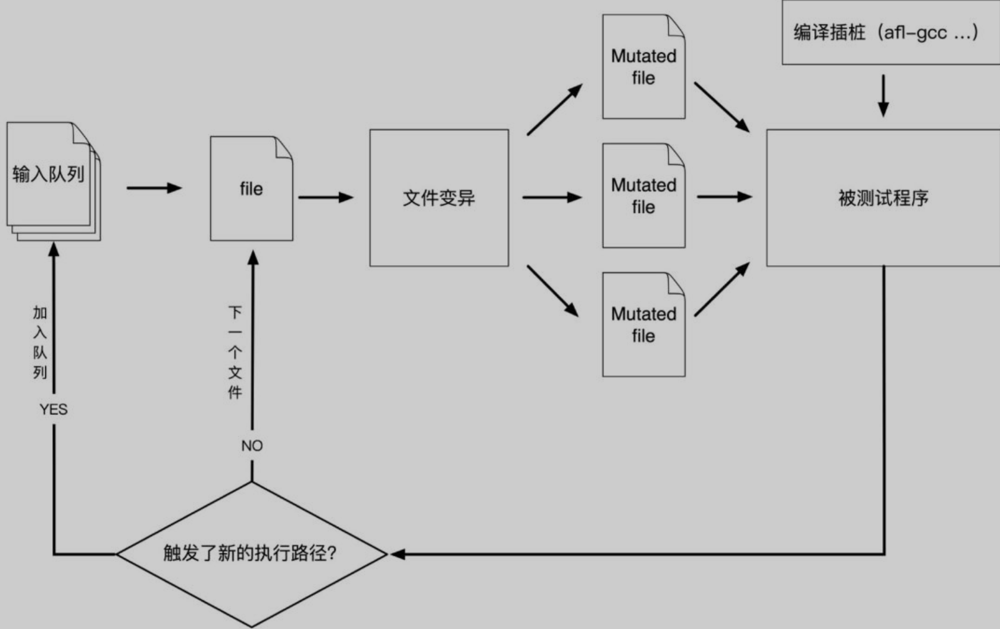
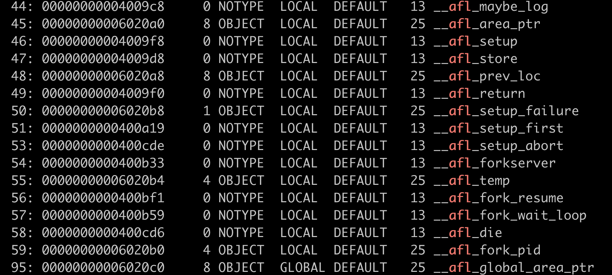
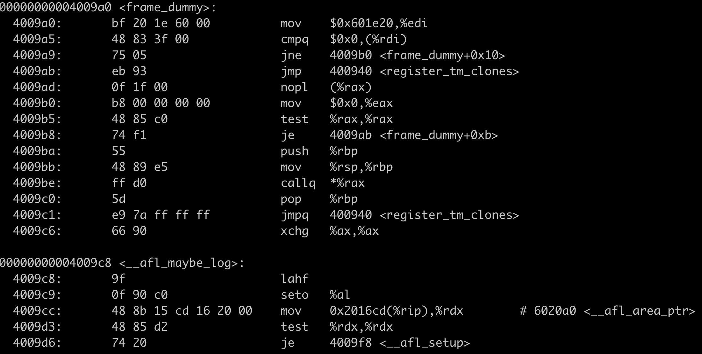
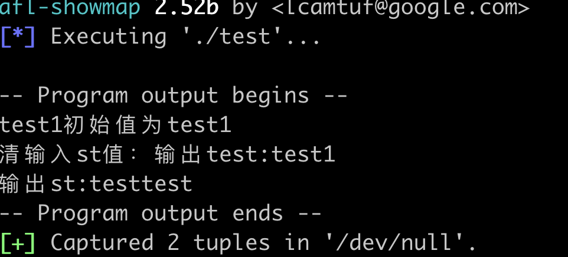
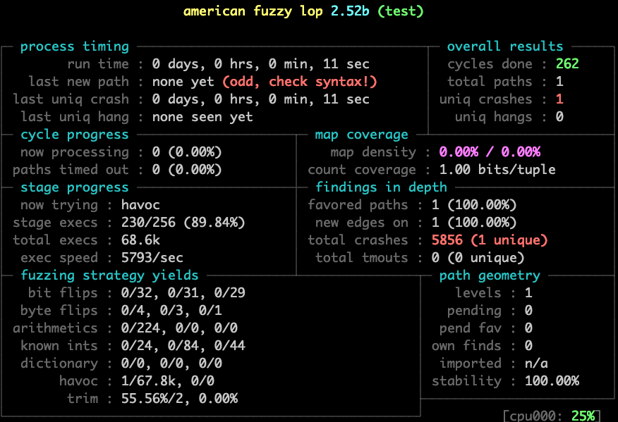
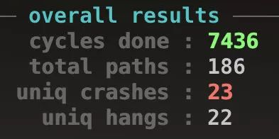
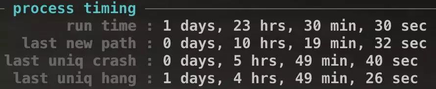

## Fuzz测试相关

[toc]

### Fuzz概念

Fuzz测试的关键思想是自动或半自动的生成随机数据输入到应用程序中，同时监控程序的异常情况，如崩溃、代码断言失败，以此发现可能的程序错误，如内存泄漏，越界等


#### Fuzz数据生成

##### 简单生成的Fuzz数据

```python
import random
def fuzzer(max_length=100, char_start=32, char_range=32):
    string_length = random.randrange(0, max_length + 1)
    out = ""
    for i in range(0, string_length):
        out += chr(random.randrange(char_start, char_start + char_range))
    return out
  
>fuzzer()
>'!7#%"*#0=)$;%6*;>638:*>80"=</>(/*:-(2<4 !:5*6856&?""11<7+% <%7,4.8,*+&,,$,."'
```


##### 基于变异的Fuzz

这种基于变异的方法对现有输入进行小的更改，这些更改可能仍使输入保持有效，但仍会表现出新的行为。

要对字符串形式的输入进行变异（Mutate），具体来说，就是执行随机插入字符、删除字符、修改字符等操作

```python

import random

class Mutator(object):

    def __init__(self):
        self.mutators = [
            self.delete_random_character,
            self.insert_random_character,
            self.flip_random_character
        ]

    def insert_random_character(self,s):
        """Returns s with a random character inserted"""
        pos = random.randint(0, len(s))
        random_character = chr(random.randrange(32, 127))
        return s[:pos] + random_character + s[pos:]

    def delete_random_character(self,s):
        """Returns s with a random character deleted"""
        if s == "":
            return self.insert_random_character(s)
        pos = random.randint(0, len(s) - 1)
        return s[:pos] + s[pos + 1:]

    def flip_random_character(self,s):
        """Returns s with a random bit flipped in a random position"""
        if s == "":
            return self.insert_random_character(s)
        pos = random.randint(0, len(s) - 1)
        c = s[pos]
        bit = 1 << random.randint(0, 6)
        new_c = chr(ord(c) ^ bit)
        return s[:pos] + new_c + s[pos + 1:]

    def mutate(self, inp):
        """Return s with a random mutation applied"""
        mutator = random.choice(self.mutators)
        return mutator(inp)

s = "good"
for i in range(1,100):
    print(Mutator().mutate(s))
    
>go3od
gnod
good]
goo
god
```


##### 基于生成的Fuzz

基于生成的模糊测试在生成新测试用例的时候，会考虑目标程序输入的文件结构、语法等因素，例如基于抽象语法树生成新的测试用例，基于生成的模糊测试能够比较容易地生成合法的测试用例，但是其可用性、可扩展性和可移植性都相对较低。

有时候基于语法生成的Fuzz用例也常会作用于基于突变的Fuzz的种子

语法树如下，为了简单，没有递归的语句

```python
Grammar = {
    "<start>":
        ["<expr>"],

    "<expr>":
        ["<term> + <term>", "<term> - <term>"],

    "<term>":
        ["<factor> * <factor>", "<factor> / <factor>", "<factor>"],

    "<factor>":
        ["+<digit>",
         "-<digit>",
         "(<digit>)",
         "<digit>.<digit>",
         "<digit>"],

    "<digit>":
        ["0", "1", "2", "3", "4", "5", "6", "7", "8", "9"]
}
```

基于语法生成Fuzz数据

```python
def nonterminals(expansion):
    return RE_NONTERMINAL.findall(expansion)

def simple_grammar_fuzzer(grammar, start_symbol= "<start>") -> str:

    term = start_symbol

    while len(nonterminals(term)) > 0:
        symbol_to_expand = random.choice(nonterminals(term))
        expansions = grammar[symbol_to_expand]
        expansion = random.choice(expansions)

        term = term.replace(symbol_to_expand, expansion, 1)

    return term

print(simple_grammar_fuzzer(grammar=Grammar))

>(8) * 0 - (9) / 8
>(7) * (6) + (1)
```


#### 灰盒Fuzz

有引导的突变fuzzing

AFL也是个灰盒fuzzer，这是由于AFL需要使用程序内部信息（即覆盖率）。AFL不是白盒，因为AFL没有对程序进行约束求解、程序分析之类的，只是简单获取了一个覆盖率。如果生成的样本能够提升覆盖率，那么就将这个样本添加进种子队列以供下次突变使用（这就意味着突变体有重复突变的可能）。

AFL计算覆盖率的方法，是通过在每个分支的跳转指令后执行一段标记代码。这样就可以做到，监控每个输入导致的激活分支，以及每个分支被激活的大概频率。注入代码这个环节通常在编译时完成。


#### 总结

Fuzzing 的方法是通过大量生成input，来找出被测程序的错误的方法。

Fuzzing的关键点之一在于input生成方法，其二在于input的排序方法，其三在于软件内部信息的获取和应用。

如果input完全是自己构建的，那么这种方法称之为generational fuzzing

如果input是通过原始种子略微修改后得到的，那么这种fuzzing为Mutational fuzzing。

如果Mutator可以经过一定的程序信息的引导，那么这叫做GrayBox Fuzzing，比如覆盖率引导的模糊测试


### radamsa

Radamsa 是一个开源的 fuzzing 工具，它可以基于用户指定的输入数据生成测试用例，通常用于测试程序对格式错误和潜在恶意输入的承受能力。Radamsa最大的卖点就是其准确性。GitLab上的开发者页面列出了这款模糊测试器在流行软件中发现的真实漏洞。它易于编写脚本，并且易于启动和运行

#### 安装

```shell
 $ git clone https://gitlab.com/akihe/radamsa.git
 $ cd radamsa
 $ make
 $ sudo make install # optional, you can also just grab bin/radamsa
 $ radamsa --help
```

#### 基本使用

```
 $ echo "aaa" | radamsa
 aaaa
```

radamsa 将从 /dev/urandom 获取一个随机种子，并且每次启动时通常会看到不同的结果，设定seed可以获取到固定值

```
 $ echo "Fuzztron 2000" | radamsa --seed 4
 Fuzztron 4294967296
```

fuzz文件生成

```
$ radamsa -o 1.txt 3.txt
```

#### 请求fuzz

对服务端进行http请求fuzz

准备一个http文本

```
GET / HTTP/1.1
Host: localhost:8080
User-Agent: test
Accept: */*
```

发送请求

```
radamsa -o 127.0.0.1:8080 http-request.txt
```

模糊参数

```
curl -G -v -d $(echo "test"|radamsa) http://127.0.0.1:8080
```

#### 响应fuzz

准备响应http文本

```
HTTP/1.1 200
Server: test
Date: Tue, 22 Mar 2022 17:35:27 GMT
Content-Type: text/html
Content-Length: 4
Connection: keep-alive
```

监听端口

```
radamsa -o :8888 resq.txt -n 100
```

测试

```
~ curl -v http://127.0.0.1:8888
*   Trying 127.0.0.1:8888...
* Connected to 127.0.0.1 (127.0.0.1) port 8888 (#0)
> GET / HTTP/1.1
> Host: 127.0.0.1:8888
> User-Agent: curl/7.77.0
> Accept: */*
>
* Mark bundle as not supporting multiuse
* HTTP 1.0, assume close after body
< HTTP/1.0 200
< Server: test
< Date: Tue, 22 Mar 2022 170141183460469231731687303715884105728:35:27 GMT
< Content-Type: text/html
< Content-Length: 4
* HTTP/1.0 connection set to keep alive!
< Connection: keep-alive
* Recv failure: Connection reset by peer
* Closing connection 0
curl: (56) Recv failure: Connection reset by peer
```


### AFL

AFL 全称为 American huzzy loop，是 Fuzzing 最高级的测试工具之一。这个工具对有源码和无源码的二进制程序均可以进行 fuzz 测试。

工作流程

1. 从源码编译程序时进行插桩，以记录代码覆盖率（Code Coverage）；
2. 选择一些输入文件，作为初始测试集加入输入队列（queue）；
3. 将队列中的文件按一定的策略进行“突变”；
4. 如果经过变异文件更新了覆盖范围，则将其保留添加到队列中;
5. 上述过程会一直循环进行，期间触发了crash的文件会被记录下来。




#### 安装

```
wget http://lcamtuf.coredump.cx/afl/releases/afl-latest.tgz
tar xvf afl-latest.tgz
cd afl-2.52b
make && make -C llvm mode CXX=g++ (如果不用llvm模式直接make)
make install
```


Afl-fuzz主要包含:

• afl-gcc 和afl-g++ 分别对应的是gcc 和g++ 的封装
• afl-clang 和afl-clang++ 分别对应clang 的c 和c++ 编译器封装。
• afl-fuzz 是AFL 的主体，用于对目标程序进行fuzz。
• afl-analyze 可以对用例进行分析，通过分析给定的用例，看能否发现用例中有意义的字段。
• afl-qemu-trace 用于qemu-mode，默认不安装，需要手工执行qemu-mode 的编译脚本进行编译
• afl-plot 生成测试任务的状态图
• afl-tmin 和afl-cmin 对用例进行简化
• afl-whatsup 用于查看fuzz 任务的状态
• afl-gotcpu 用于查看当前CPU 状态
• afl-showmap 用于对单个用例进行执行路径跟踪


#### 插桩

对于有源码的项目使用`afl-gcc`或者`afl-g++`，这是gcc的wraper(封装)，在编译前向一些关键节点进行插桩

>什么是插桩？简单来说，它就是在目标程序的代码中插入一些额外的代码，来通知fuzzer目标程序的运行情况。

> afl-gcc干了什么呢？其实我们从源码得到二进制程序，要经过从源代码到汇编代码，从汇编代码到机器码的过程。gcc(特指gcc编译器)能够把源代码变成汇编代码，而as(也是GNU编译器套件一部分)则将汇编码变成机器码。afl-gcc是gcc编译器的一个封装，它一方面调用gcc编译器进行编译，另一方面指定afl-as而非as进行汇编。afl-as也是as的一个封装，它一方面分析汇编代码，进行插桩操作比如识别jmp、call之类的跳转并插入跳板代码实现插桩，另一方面调用as将插桩后的汇编代码变成机器码。

```
CC=/path/to/afl/afl-gcc ./configure  # for C program
CXX=/path/to/afl/afl-g++ ./configure   # for C++ program
make clean all
```

比如使用readelf可以查看到afl的符号

```
readelf -s test |grep afl
```



使用objdump -d a.out，可以看到afl在汇编时做的插桩操作




在Fuzzing共享库时，可能需要编写一个简单demo，将输入传递给要Fuzzing的库（其实大多数项目中都自带了类似的demo）。这种情况下，可以通过设置LD_LIBRARY_PATH让程序加载经过AFL插桩的.so文件，不过最简单的方法是静态构建。


#### 使用

对于从 stdin 中获取输入的目标程序，使用以下方法进行测试：

```
./afl-fuzz -i testcase_dir -o findings_dir /path/to/program [...params...]
```


对于从文件中获取输入的目标程序，使用 ‘@@’ 作为输入文件的占位符，afl-fuzz 会自动使用测试样本目录下的文件进行替换。

```
./afl-fuzz -i testcase_dir -o findings_dir /path/to/program @@
```


#### 准备

##### 准备语料库

1. 使用项目自身提供的测试用例
2. 目标程序bug提交页面
3. 使用格式转换器，用从现有的文件格式生成一些不容易找到的文件格式：
4. afl源码的testcases目录下提供了一些测试用例
5. 其他开源的语料库

- afl generated image test sets
- fuzzer-test-suite
- libav samples
- ffmpeg samples
- fuzzdata
- moonshine


##### 精简语料库

网上找到的一些大型语料库中往往包含大量的文件，这时就需要对其精简，这个工作有个术语叫做——语料库蒸馏（Corpus Distillation）。AFL提供了两个工具来帮助我们完成这部工作——afl-cmin和`afl-tmin`。


**(1) 移除执行相同代码的输入文件——afl-cmin**

afl-cmin的核心思想是：尝试找到与语料库全集具有相同覆盖范围的最小子集。举个例子：假设有多个文件，都覆盖了相同的代码，那么就丢掉多余的文件。其使用方法如下：

```
$ afl-cmin -i input_dir -o output_dir -- /path/to/tested/program [params]
```

更多的时候，我们需要从文件中获取输入，这时可以使用“@@”代替被测试程序命令行中输入文件名的位置。Fuzzer会将其替换为实际执行的文件：

```
$ afl-cmin -i input_dir -o output_dir -- /path/to/tested/program [params] @@
```


**(2) 减小单个输入文件的大小——afl-tmin**

整体的大小得到了改善，接下来还要对每个文件进行更细化的处理。

afl-tmin有两种工作模式，instrumented mode和crash mode。默认的工作方式是instrumented mode，如下所示：

```
$ afl-tmin -i input_file -o output_file -- /path/to/tested/program [params] @@
```

如果指定了参数-x，即crash mode，会把导致程序非正常退出的文件直接剔除。

```
$ afl-tmin -x -i input_file -o output_file -- /path/to/tested/program [params] @@
```

afl-tmin接受单个文件输入，所以可以用一条简单的shell脚本批量处理。如果语料库中文件数量特别多，且体积特别大的情况下，这个过程可能花费几天甚至更长的时间！

```
for i in *; do afl-tmin -i $i -o tmin-$i -- ~/path/to/tested/program [params] @@; 
```


#### 测试

比如下面代码有个数组越界的问题，使用gets时，如果输入长度大于申请st的长度，会越界占用栈上的其它数据地址，尝试使用afl发现该漏洞

```
-- test.c

#include <stdlib.h>
#include  <stdio.h>

int main() {
    char test[] = "test1";
    printf("test1初始值为%s\n清输入st值：",test);
    char st[20];
    gets(st);
    printf("输出test:%s\n",test);
    printf("输出st:%s\n",st);
}
```


##### 编译源码

使用afl-gcc编译源码

```
afl-gcc -o test test.c
```

在执行afl-fuzz前，如果系统配置为将核心转储文件（core）通知发送到外部程序。 将导致将崩溃信息发送到Fuzzer之间的延迟增大，进而可能将崩溃被误报为超时，所以我们得临时修改core_pattern文件，core文件就可以生成在本地，方便分析

```
echo core >/proc/sys/kernel/core_pattern
```

准备语料库，这里测试随便输入一些内容，真正测试的时候需要对应程序业务找专门的语料库

```
mkdir input
echo "testtest" > input/case
```

##### 测试插桩

编译好程序后，可以选择使用afl-showmap跟踪单个输入的执行路径，并打印程序执行的输出、捕获的元组（tuples），tuple用于获取分支信息，从而衡量衡量程序覆盖情况

```
cat ./input/case |afl-showmap  -o /dev/null -- ./test
```




##### 执行fuzz

```
afl-fuzz -i ./input -o ./output test
```

遇到Suboptimal CPU scaling governor报错，按照提示执行

```
echo performance | tee /sys/devices/system/cpu/cpu*/cpufreq/scaling_governor
```

运行界面如下，total crashes中`unique crashes`，如果它的值不为0，表明已经有输入导致了程序崩溃，在output/crashes/文件夹里存有相应文件，可以用它复现

```
cat output/crashes/id:000000* | ./test
```



部分窗口解释

- Process timing:Fuzzer运行时长、以及距离最近发现的路径、崩溃和挂起经过了多长时间。
- Overall results：Fuzzer当前状态的概述。
- Cycle progress：输入队列的距离。
- Map coverage：目标二进制文件中的插桩代码所观察到覆盖范围的细节。
- Stage progress：Fuzzer现在正在执行的文件变异策略、执行次数和执行速度。
- Findings in depth：有关我们找到的执行路径，异常和挂起数量的信息。
- Fuzzing strategy yields：关于突变策略产生的最新行为和结果的详细信息。
- Path geometry：有关Fuzzer找到的执行路径的信息。
- CPU load：CPU利用率


##### 何时结束

检查afl-fuzz工作状态的目的是为何时停止测试提供依据，通常来说符合下面几种情况时就可以停掉了。

1. 状态窗口中"cycles done"字段颜色变为绿色该字段的颜色可以作为何时停止测试的参考，随着周期数不断增大，其颜色也会由洋红色，逐步变为黄色、蓝色、绿色。当其变为绿色时，继续Fuzzing下去也很难有新的发现了，这时便可以通过Ctrl-C停止afl-fuzz

   

2. 距上一次发现新路径或者崩溃已经过去很长时间，至于具体多少时间自己把握吧，比如长达一个星期或者更久估计大家也都没啥耐心了。

   


##### 输出内容

在output文件下存在以下目录

- queue：存放所有具有独特执行路径的测试用例
- crashes：导致目标接收致命signal而崩溃的独特测试用例
- crashes/README.txt：保存了目标执行这些crash文件的命令行参数
- hangs：导致目标超时的独特测试用例。
- fuzzer_stats：afl-fuzz的运行状态，
- plot_data：用于afl-plot绘图


##### 后台运行

一次Fuzzing过程通常会持续很长时间，如果这期间运行afl-fuzz实例的终端终端被意外关闭了，那么Fuzzing也会被中断。使用screen或tmux，可以后台运行，方便的连接和断开

```
screen -S fuzzer1
screen -R fuzzer1
```


#### 加速

AFL包含LLVM模块，可以使用afl-clang-fast可以加速Fuzzing

安装一些工具，依赖包和库

```
apt update && apt install vim wget unzip build-essential clang llvm-3.8 llvm-3.8-dev llvm-3.8-runtime -y
```

下载afl源码

```
wget http://lcamtuf.coredump.cx/afl/releases/afl-latest.tgz
```

解压

```
tar xvf afl-latest.tgz
```

编译afl

```
cd afl-2.52b && make
```

编译llvm模块

```
cd ./llvm_mode/ && LLVM_CONFIG=/usr/bin/llvm-config-3.8 make
```

编译安装afl

```
cd ../ && make install
```


#### Fuzz Nginx实践

对于nginx这种网络程序，需要将网络请求重定向到标准输入输出，可以使用preeny实现

https://github.com/zardus/preeny

##### 准备

准备测试目录

```
mkdier /root/nginxfuzz/
```

需要编译Nginx，安装一些依赖库

```
apt install zlib1g-dev libpcre3 libpcre3-dev libbz2-dev libssl-dev libini-config-dev
```


##### 安装preeny

~~下载最新版本preeny~~

~~`wget https://github.com/zardus/preeny/archive/master.zip`~~

最新版本不可用，需使用[74b2ce67b4](https://github.com/zardus/preeny/tree/74b2ce67b44a0cdb7e727a9117779f542c02a748)

```
wget https://github.com/zardus/preeny/archive/74b2ce67b44a0cdb7e727a9117779f542c02a748.zip
```

解压

```
unzip master.zip
```

编译

```
cd preeny-master && make
```

安装，只需要其中的`desock.so`库

```
cp preeny-master/src/desock.so /root/nginxfuzz/
```


##### Nginx 配置

需要实现Nginx请求一次测试就退出，快速进行后续测试，对Nginx源码和配置文件进行修改

在`src/os/unix/ngx_process_cycle.c`中增加几行代码

```
307     static volatile int run_count = 0;        // add
308     for ( ;; ) {
309         ngx_log_debug0(NGX_LOG_DEBUG_EVENT, cycle->log, 0, "worker cycle     ");
310
311         ngx_process_events_and_timers(cycle);
337         if (ngx_reopen) {
338             ngx_reopen = 0;
339             ngx_log_error(NGX_LOG_NOTICE, cycle->log, 0, "reopening logs");
340             ngx_reopen_files(cycle, (ngx_uid_t) -1);
341         }
342         if (run_count >= 1) exit(0);        // add
343         run_count += 1;        // add
344      }
```

在`conf/nginx.conf`中，做以下更改，而且Fuzzing过程中会产生大量日志，需关闭日志

```
master_process off;
daemon off;
error_log off;
events {
        worker_connections  1024;
        use select;
        multi_accept off;
    }
server {
        access_log off;
}
```


##### Nginx 编译

可以使用`afl-clang-fast`编译，安装在`nginx_fuzz`目录，这里使用afl-gcc

```
CC=afl-gcc ./configure --prefix=/root/nginxfuzz --with-select_module && make && make install
```

```
CC=afl-gcc  ./configure --prefix=/home/riversec/nginxfuzz2/nginx --with-select_module --without-http_rewrite_module
```


##### Nginx 测试

测试`desock.so`库和Nginx，输入输出

```
LD_PRELOAD=/root/nginxfuzz/desock.so /root/nginxfuzz/sbin/nginx
```

此时输入`GET /`可以得到`Welcome to nginx`的输出

>LD_PRELOAD是Linux系统的一个环境变量，它可以影响程序的运行时的链接（Runtime linker），它允许你定义在程序运行前优先加载的动态链接库。这个功能主要就是用来有选择性的载入不同动态链接库中的相同函数。通过这个环境变量，我们可以在主程序和其动态链接库的中间加载别的动态链接库，甚至覆盖正常的函数库。一方面，我们可以以此功能来使用自己的或是更好的函数（无需别人的源码），而另一方面，我们也可以以向别人的程序注入程序，从而达到特定的目的。


##### Fuzzing

准备好AFL，测试样例和Nginx，就可以开始了

```
LD_PRELOAD=/root/nginxfuzz/desock.so afl-fuzz -i /root/nginxfuzz/fuzz_in -o /root/nginxfuzz/fuzz_out /root/nginxfuzz/sbin/nginx
```


### go-fuzz


### 相关资料

https://www.freebuf.com/articles/system/191536.html

https://mp.weixin.qq.com/s?__biz=Mzg3MDAzMDQxNw==&mid=2247486113&idx=1&sn=2ed1e5082334428f46f01e73b5ffaaf6&chksm=ce95479ff9e2ce89f3dce6ce000425bc2e719a1ba2043c476338e3125736fd91d2885ece1d44&scene=21#wechat_redirect

https://afl-1.readthedocs.io/en/latest/quick_start.html


参考与转载于

https://blog.xlab.app/p/405227c7/

https://www.freebuf.com/articles/system/191543.html


一些开源的Fuzz测试工具：

1. American Fuzzy Lop（AFL）
2. Radamsa
3. Honggfuzz
4. libufuzzer
5. OSS-Fuzz
6. boofuzz
7. Bfuzz
8. PeachTech Peach Fuzzer
9. Microsoft Security Risk Detection
10. ClusterFuzz
11. Synopsys Defensics Fuzz Testing
12. Fuzzbuzz

