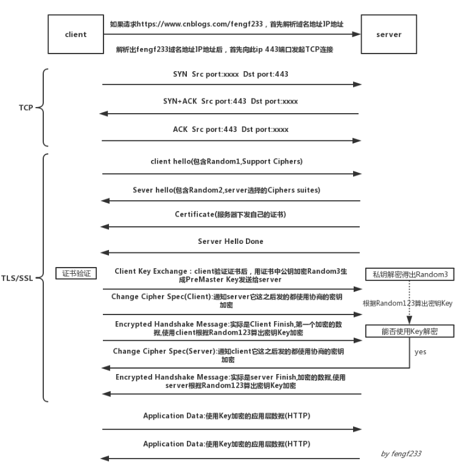

### HTTPS加密流程

由于HTTP的内容在网络上实际是明文传输，并且也没有身份验证之类的安全措施，所以容易遭到挟持与攻击

HTTPS是通过SSL(安全套接层)和TLS(安全传输协议)的组合使用，加密TCP载荷即HTTP报文内容，同时通过不对称密钥方式认证身份，保证传输的安全可靠

即：HTTP+加密+认证+完整性保护=HTTPS

#### 对称加密与非对称加密

对称加密:编/解码使用相同密钥的算法,一般是共享密钥

非对称加密:非对称加密算法需要两个密钥，公开密钥（publickey:简称公钥）和私有密钥（privatekey:简称私钥）。 公钥与私钥是一对，如果用公钥对数据进行加密，只有用对应的私钥才能解密。 因为加密和解密使用的是两个不同的密钥，所以这种算法叫作非对称加密算法

在HTTPS中，这两种加密方式混合使用

#### 数字证书认证

由于公钥在下发的时候也容易被替换劫持，所以需要个第三方认证机构确认公钥的正确性

CA：数字证书认证机构，是客户端服务端都认可的第三方机构，负责数字签名服务端公钥

数字签名：签名就是一种证明身份的机制，是一种校验机制（简单说是用私钥加密内容的hash,公钥解密对比hash判断内容是否完整）

数字证书：由一个可信的组织验证和签发的识别信息

HTTPS中数字认证流程如下

#### HTTPS握手过程

HTTPS在进行传输HTTP报文数据前，需要经过TLS握手，完成加密，大致流程如下：

- Client Hello:握手第一步是客户端向服务端发送 Client Hello 消息，这个消息里包含了一个客户端生成的随机数 Random1、客户端支持的加密套件（Support Ciphers）和 SSL Version 等信息
- Server Hello:第二步是服务端向客户端发送 Server Hello 消息，这个消息会从 Client Hello 传过来的 Support Ciphers 里确定一份加密套件，这个套件决定了后续加密和生成摘要时具体使用哪些算法，另外还会生成一份随机数 Random2。注意，至此客户端和服务端都拥有了两个随机数（Random1+ Random2），这两个随机数会在后续生成对称秘钥时用到。
- Certificate:这一步是服务端将自己的证书下发给客户端，让客户端验证自己的身份，客户端验证通过后取出证书中的公钥
- Server Hello Done:通知客户端 Server Hello 过程结束。
- Certificate Verify:客户端收到服务端传来的证书后，先从 CA 验证该证书的合法性，验证通过后取出证书中的服务端公钥，再生成一个随机数 Random3，再用服务端公钥非对称加密 Random3生成 PreMaster Key
- Client Key Exchange:上面客户端根据服务器传来的公钥生成了 PreMaster Key，Client Key Exchange 就是将这个 key 传给服务端，服务端再用自己的私钥解出这个 PreMaster Key 得到客户端生成的 Random3。至此，客户端和服务端都拥有 Random1 + Random2 + Random3，两边再根据同样的算法就可以生成一份秘钥，握手结束后的应用层数据都是使用这个秘钥进行对称加密。为什么要使用三个随机数呢？这是因为 SSL/TLS 握手过程的数据都是明文传输的，并且多个随机数种子来生成秘钥不容易被暴力破解出来。
- Change Cipher Spec(Client):这一步是客户端通知服务端后面再发送的消息都会使用前面协商出来的秘钥加密了，是一条事件消息
- Encrypted Handshake Message(Client):这一步对应的是 Client Finish 消息，客户端将前面的握手消息生成摘要再用协商好的秘钥加密，这是客户端发出的第一条加密消息。服务端接收后会用秘钥解密，能解出来说明前面协商出来的秘钥是一致的
- Change Cipher Spec(Server):这一步是服务端通知客户端后面再发送的消息都会使用加密，也是一条事件消息
- Encrypted Handshake Message(Server):这一步对应的是 Server Finish 消息，服务端也会将握手过程的消息生成摘要再用秘钥加密，这是服务端发出的第一条加密消息。客户端接收后会用秘钥解密，能解出来说明协商的秘钥是一致的。
- Application Data:到这里，双方已安全地协商出了同一份秘钥，所有的应用层数据都会用这个秘钥加密后再通过 TCP 进行可靠传输

#### 其它

还有一种双向认证的模式,即在Server Hello Done前发送Certificate Request ，它是服务端要求客户端上报证书，这一步是可选的，对于安全性要求高的场景会用到，这里不做详解

如果每次重连都要重新握手还是比较耗时的，所以可以对握手过程进行优化，可以在 Client Hello 消息里还附带了上一次的 Session ID，服务端接收到这个 Session ID 后如果能复用就不再进行后续的握手过程。

参考

1.《图解HTTP》

2.《HTTP权威指南》

3.  [SSL/TLS 握手过程详解](https://www.jianshu.com/p/7158568e4867)
